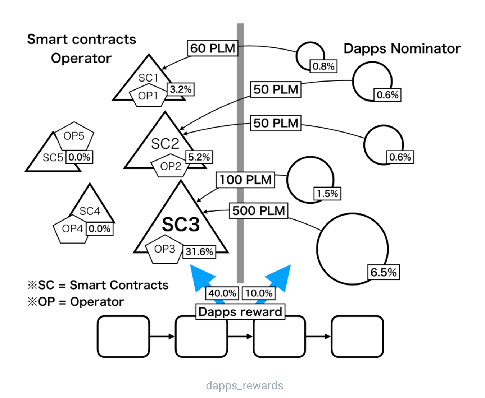

# DApps Reward 🍭

Dapps Rewards is a mechanism that rewards developers or administrators of smart contracts on an ongoing basis. 50% of Plasm Network's Staking reward goes to application developers who have enhanced the value of Plasm Network. The Plasm Network allows you to assign a smart contract administrator to a smart contract, and this administrator is called an "Operator". The user can also take smart contracts. This action is called Nominate, and the person who does it is called Dapps Nominator. As shown below, the operator of the smart contract receiving many nominates can receive the newly issued PLM token from the chain.

We will define how to distribute this reward to Operator and Nominator respectively. Define the following variables:

* $$Rewards_{nominate}$$  : The total rewards allocated to Nominator.
* $$Rewards_{contract}$$  : The total rewards allocated to smart contracts.
* $$Rewards_{nominate_{i,j}}$$  : The rewards allocated to the j-th Nomimate fro the i-th smart contract.
* $$Rewards_{contract_i}$$  : The rewards allocated to the operator of the i-th smart contract.
* $$n$$  : The number of smart contract.
* $$m_i$$  : The number of Nominate against the i-th smart contract.
* $$stake_{i,j}$$  : The amount of PLM staked by the j-th Nominate for the i-th smart contract.

Then, $$Nominate_ {i, j}$$ gives the following reward for this stake.

$$Rewards_{nominate_{i,j}}=Rewards_{nominate} \times \frac{\sum_{j}^{m_i}stake_{i,j}}{\sum_i^n\sum_j^{m_i}stake_{i,j}}$$

The nominator can get a reward proportional to the ratio of your stake amount to the total stake amount for the smart contract regardless of the smart contract selected. The operator of $$contract_i$$ who received Stake will get the following reward.

$$Rewards_{contract_i}=Rewards_{contract}\times\frac{stake_{i,j}}{\sum_i^n\sum_j^{m_i}stake_{i,j}}$$

On the other hand, the operator can get a reward proportional to the ratio of the stake of the smart contract owned by oneself to the stake of the smart contract. This creates an incentive for the nominator to stake on smart contracts that would simply increase the value of the token. Operators can also receive semi-permanent rewards by receiving stakes on smart contracts managed by themselves. We hope this will be an innovative solution to the difficult problem of monetizing application developers \(administrators\) on the chain.


**The operators and nominators have to wait to receive rewards.**


