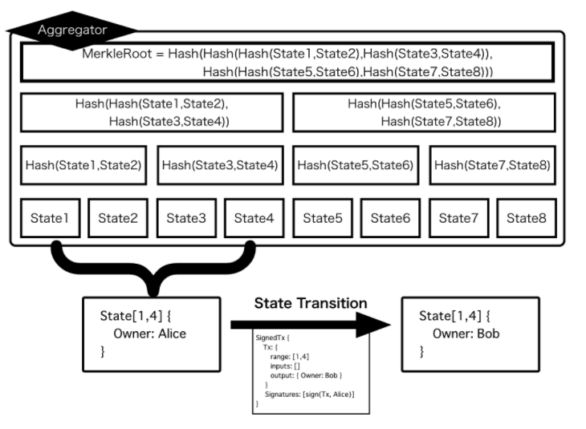

# Plasma

### Plasma概要

[Plasm Network](https://www.plasmnet.io/)にPlasmaが最初に実装された理由は、Plasmaがメインチェーンの処理性能に最も依存しないスケーリングソリューションだからです。Plasma では単一の Aggregator と呼ばれる運営者がサイドチェーンの運営を行います。つまり、合意形成プロセスの不要な中央集権的管理方法で多くのトランザクションを処理することができます。それは、既存の中央集権的システムで使われているスケーリングソリューションをそのまま転用できることを意味するため分散台帳では不可能な高い処理性能を実現することができます。Plasma のアプローチは全ての分散台帳に飛躍的な処理性能の向上を行えるためこの先、必要不可欠な技術になっていくと言えるでしょう。

### Plasmaの詳細

Plasma はブロックチェーンにおけるスケールソリューションの一つです。Plasma の基本的なアイディアは、チェーン外でトランザクションをマークルツリーで管理・高速に処理しマークルルートのみをブロックチェーンに刻むというものです。チェーン外の処理を行いブロックチェーンにハッシュを提出する責任者を Plasma の文脈で Aggregator と呼びます。

Plasm でサポートされている "Plasma" は Plasma-Cash をベースにしたものです。これはマークルツリーの葉でトランザクションではなく1つのNFTの状態を持ちます。状態の遷移を行うためのルールは後述する OVM によって定義できます。下図では状態として所有権を持つ NFT の状態遷移とそれに必要な Transaction の例を示します。

この場合、状態遷移をするためには 

1. "Owner" の署名があること 
2. 新たな状態を output に指定していること 
3. 状態がすでに別の方法で遷移されていないこと 

が必要です。これを Optimistic Virtual Machine（OVM）を用いて記述します。



ここで記述された論理を "Predicate" と呼びます。これは一階述語論理で記述されます。OVM が受理したトランザクションを受け取ったとき、状態を遷移しマークルルートを更新します。

Plasma において 単一の Aggregator がこれらのトランザクションの処理とマークルルートの提出を行います。仮にAggregatorが不正を働いた際にユーザの提出したトランザクションが改ざんされる可能性があります。Plasma ではそのような改ざんに対して先述した OVM と Predicate を用いてメインチェーン上でトランザクション、状態の正しさを紛争することができます。これにより Plasma は単一の Aggregator による高速なトランザクション処理能力とブロックチェーンの持つ強固なセキュリティの両方を兼ね備えることができます。

[Plasm Network](https://www.plasmnet.io/)はこの2つの問題を通して解決していきます。[Plasm Network](https://www.plasmnet.io/) では Predicate を正しく記述できるように標準規格を設けてライブラリ化します。そして最終的に複数のコンポーネントを簡単にデプロイできるためのクラウドサービスを構築します。[Plasm Network](https://www.plasmnet.io/) が提供するプロダクトを通して開発者がアプリケーションを開発する過程を手助けします。

質問があれば、[Tech Chat](https://discord.gg/Cyjnrxv)の日本語チャネルでご質問ください。

