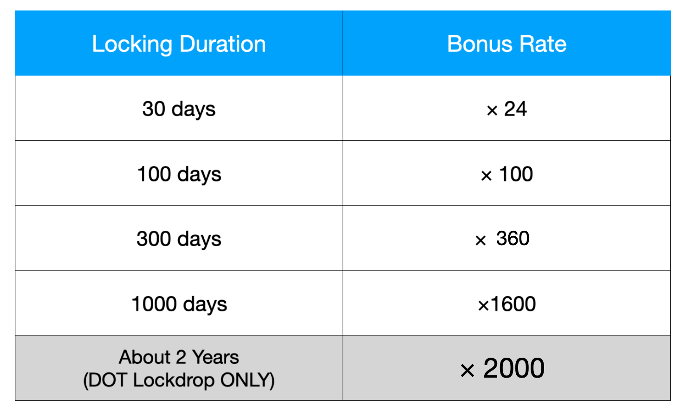

# Lockdrop 🔒

## **Para participantes do Lockdrop, você pode reivindicar o token PLM de 👇**

[https://lockdrop.plasmnet.io/\#/lock-form](https://lockdrop.plasmnet.io/#/lock-form)

## **Introdução**

O [Lockdrop](https://blog.edgewa.re/full-details-on-the-edgeware-lockdrop) é um novo mecanismo de incentivo econômico de baixo risco, no qual utiliza os custos de oportunidade e não o curso legal \(ou ativos\) como garantia. A [Plasm Network](https://www.plasmnet.io/) usa esse mecanismo para emitir tokens com valor monetário. Nesta seção, explicaremos o mecanismo de emissão de tokens da [Plasm Network](https://www.plasmnet.io/). O conceito de um lockdrop foi concebido pela [Edgeware](https://edgewa.re/), e o usado para a [Plasm Network](https://www.plasmnet.io/) é uma expansão de seu mecanismo original. O token nativo usado na Plasm Network é gravado em PLM e pronunciado como "PLUM". O PLM calculará apenas a partir da 15ª casa decimal e truncará qualquer número abaixo disso. Para mais informações sobre o papel do Token, consulte a seção Economia do Token PLM.



## **Visão geral Lockdrop**

Para o nosso primeiro lockdrop, usaremos o custo de oportunidade da Ethereum. Portanto, outras seções assumirão que o token bloqueado é ETH. No entanto, o próprio lockdrop é um algoritmo que pode ser implementado em qualquer cadeia que suporte o TimeLock. A figura abaixo mostra um exemplo de como o bloqueio funcionará na [Plasm Network](https://www.plasmnet.io/).

Um lockdrop irá funcionar pelo seguinte processo.

1. O detentor do token Ethereum enviará seu ETH e decidirá a duração do bloqueio como uma transação para o LockContract que reside dentro da blockchain Ethereum.
2. Para todos os detentores de tokens que participaram do bloqueio, o número de PLM calculado pelo `total de ETH × bônus de bloqueio por duração × α` será registrado no bloco de gênese da Plasm Network.
3. A equipe Plasm receberá o valor `total emitido × 15%` de PlasmTokens do bloco de gênese.
4. Após a duração do bloqueio especificado pelo detentor do token, o número exato de bloqueio ETH será retornado ao participante após o bloqueio.

Nossa suposição é que o custo de oportunidade do detentor do token Ethereum é proporcional ao número de tokens bloqueados e à duração do bloqueio. O PLM é capaz de gerar valor usando esses custos de oportunidade como garantia. Além disso, o fornecimento final de tokens não está decidido. Isso é para garantir justiça aos tokens emitidos a partir de bloqueios pós-gênese. 15% do total de tokens que circulam no bloqueio serão direcionados à equipe Plasm como parte da taxa de desenvolvimento. Para elaborar, os tokens serão distribuídos várias vezes pelo método a seguir.

## Multi-Lockdrop

O bloqueio múltiplo é um mecanismo no qual repetimos o bloqueio anterior mencionado várias vezes. A Plasm Network fará isso em um total de 3 vezes. Por esse motivo, o suprimento total de tokens da Plasm Network não será concretizado na gênese. Os tokens serão emitidos a cada 3º bloqueio, e tokens adicionais serão utilizados através da utilização da função "Staking", que será explicada posteriormente em detalhes.  



Há duas razões principais pelas quais decidimos dividir o pano de fundo em várias vezes.

Primeiro, é evitar a distribuição desigual de tokens, como se o número de participantes precoces fosse baixo, é possível que haja alguém que detenha a maioria do suprimento total. Além disso, se iniciarmos uma reversão para o estado do bloco anterior para corrigir esse problema, a integridade da rede em si poderá ser danificada. Em uma blockchain, é importante estabelecer uma regra antes do lançamento, devemos evitar qualquer situação em que formos contra as regras predefinidas. Para resolver esse problema, desenvolvemos um algoritmo que não define o fornecimento total de tokens no gênesis.

O segundo motivo é criar espaço para experimentos, para que a equipe possa garantir que a Plasm Network seja escalável e descentralizada sem soluços. A forte segurança e integridade de uma blockchain dependem da distribuição de nós e titulares de token. Não é desejável manter a segurança após o lançamento oficial na estaca. Com isso, repetir o bloqueio três vezes nos permite entender a distribuição de tokens entre os detentores antecipadamente, o que também leva a reduzir os custos de manutenção para corrigir esses problemas e evitar os riscos que são seguidos por essa correção. Isso está alinhado com nosso objetivo de tornar a Plasm Network um blockchain público completo.

Além disso, a Plasm Network aceitará os seguintes tokens para o 1º, 2º e 3º bloqueio.

* 1st: ETH
* 2nd: ETH, BTC
* 3rd: ETH, BTC, DOT

### **Definições**

Definimos a quantidade de PLM \( $$TotalPLM^{genesis}$$ \) distribuído desde o primeiro bloqueio como o seguinte.

$$
TotalPLM^{genesis} = 500,000,000
$$

O valor total será distribuído aos participantes do bloqueio, de acordo com a taxa de emissão de tokens \(IssueRatio\). O IssueRatio é proporcional ao número de tokens bloqueados, à taxa de câmbio em dólares dos tokens bloqueados no momento do bloqueio e ao número de dias multiplicado por 1.0005 à potência dos dias. O valor de 1.0005 é baseado na taxa de juros da Polkadot. Para elaborar, por padrão, a Polkadot define sua taxa média de juros anual máxima em 20% \(referência\). Convertendo isso em taxas de juros diárias com juros compostos, obtemos um valor aproximado de 0,05%.

Os usuários têm a opção de escolher a duração do bloqueio das seguintes opções 4 + 1. O valor será determinado pela duração do bloqueio que ocorre diretamente após a avaliação do valor dos tokens bloqueados em dólares.


A opção 2 anos está disponível apenas para bloquear tokens DOT. Além disso, os bloqueios DOT são especiais, pois só podem ser bloqueados por 2 anos. Mais informações podem ser encontradas na seção Lockdrop dos leilões Polkadot


**Com base nas informações mencionadas acima, o IssueRatio será definido da seguinte maneira.**

The IssueRatio will be defined as follows:

* $$Locked_{token}$$ **é o número de tokens bloqueados para o bloqueio**
* $$DolalrRate_{token}$$  **é o valor para 1 token em dólares**
* $$LockBonus_{days}$$  **é a quantidade de bônus que o usuário receberá de acordo com os dias bloqueados**

$$IssueRatio = Locked_{token} \times DollarRate_{token}\times LockBonus_{days} (token \in \{ETH,BTC,DOT\})$$

O número de tokens a serem adquiridos pelo participante do Lockdrop é determinado com base no IssueRatio calculado. O algoritmo para determinar a quantidade de distribuição de token é o seguinte.

* $$n$$  é o número de participantes do Lockdrop.
* $$IssueRatio_i$$ is $$IssueRatio$$ for user $$i$$.
* Definimos 15% \(3/20\) do total de tokens emitidos como custos de desenvolvimento que mantemos.
* $$PLM_i$$ is the amount of tokens user $$i$$ can get.

$$PLM_{i}=TotalPLM^{genesis} \times \frac{17}{20} \times \frac{IssueRatio_i}{\sum_{j=0}^{n}IssueRatio_j}$$

PLM will be distributed by the ratio of your $$IssueRatio$$ to the total $$IssueRatio$$ At this time, 75,000,000 PLM, which is 3/20 as development cost, will be used. Here, we define $$TotalIssueRatio$$ which is the sum of $$IssueRation$$

$$TotalIssueRatio=\sum^{n}_{j=0}{IssueRatio_j}$$

Also, $$α_1$$ is the amount of PLM issued per unit $$IssueRatio$$ in the first Lockdrop. This is an important value to determine the amount of PLM issued in the second and subsequent Lockdrops.

$$\alpha_1 = \frac{PLM_{i}}{IssueRatio_i} = TotalPLM^{genesis} \times \frac{17}{20} \times \frac{1}{TotalIssueRatio}$$

Define the number of PLM issues per unit $$IssueRatio$$ for the second and third times to satisfy $$α_2$$ and $$α_3$$ the following equation.

$$\alpha_1:\alpha_2:\alpha_3 = 6:5:4$$

From the above, the amount of PLM distributed to the second and third times $$i$$ is as follows.

$$\alpha_j \times IssueRatio_i\:\:\:\:(j=2,3)$$

This allows the user to get the amounts of tokens proportional to $$IssueRatio$$ on the second and subsequent Lockdrops. This will ensure a robust distribution of PLM.

The following figure shows an example of how the token distribution changes in multiple Lockdrops. $$DollarRate$$ is fixed.

