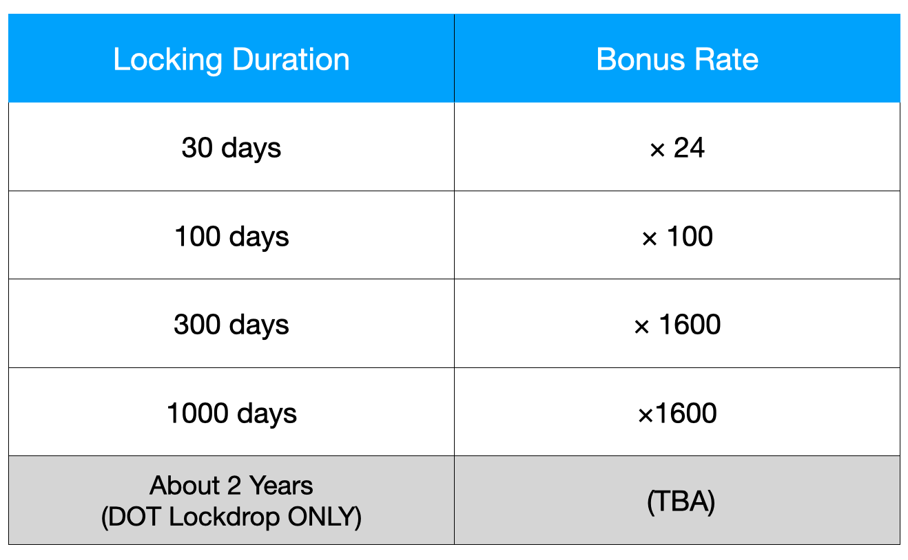

# Lockdrop

## Lockdrop participants can claim PLM token here 👇

[https://lockdrop.plasmnet.io/\#/lock-form](https://lockdrop.plasmnet.io/#/lock-form)

## Introduction

[Lockdrop](https://blog.edgewa.re/full-details-on-the-edgeware-lockdrop) is a new low-risk economic incentivization mechanism, using opportunity costs rather than legal tender \(or assets\) as collateral. [Plasm Network](https://www.plasmnet.io/) uses this mechanism to issue tokens with monetary value. This section explains the [Plasm Network](https://www.plasmnet.io/) token issuance mechanism. Lockdrop was first conceived by [Edgeware](https://edgewa.re/), and the implementation on the [Plasm Network](https://www.plasmnet.io/) is an expansion of this. The native token used on the [Plasm Network](https://www.plasmnet.io/) is symbol: PLM and pronounced "PLUM". PLM will only calculate from the 15th decimal place and truncate any numbers below that. For more information regarding the role of PLM, please refer to the PLM Token Economics section.



## Lockdrop Overview

The first lockdrop issued will be using Ethereum's opportunity cost. Examples will make the assumption that the locked token is ETH. Lockdrop is an algorithm that can be implemented on any chain that supports TimeLock. The figure below shows how the lockdrop will work on the [Plasm Network](https://www.plasmnet.io/).

The Lockdrop Work Flow:

1. Ethereum token holder will send ETH and decide the duration of the lock as a transaction to the LockContract that on the Ethereum blockchain.
2. The number of PLM calculated by `total locked ETH × Lock bonus per duration × α` will be recorded on the [Plasm Network](https://www.plasmnet.io/) genesis block for each participant.
3. The Plasm Team will mint `total issued amount × 15%` PlasmTokens from the genesis block.
4. Once the lock duration that the token holder specified has passed, all ETH will be returned back to the participant.

The assumption is that the Ethereum token holder's opportunity cost is proportional to the number of tokens locked and the duration of the lock. PLM is able to generate value using those opportunity costs as collateral. The final token supply is not decided. This ensures fairness to tokens issued from post-genesis lockdrops. 15% of the total tokens minted from the first lockdrop will go to the Plasm team as a fee. Multiple distributions will occur to maintain healthy token supplies.

## Multi-Lockdrop

Multi-Lockdrop is a lockdrop mechanism iterated multiple times. [Plasm Network](https://www.plasmnet.io/)'s total token supply will not be set at genesis. Tokens will be issued every 3rd lockdrop, and additional tokens will be minted utilizing the "Staking" function, discussed later.



Multiple lockdrop iterations have two advantages:

It prevents uneven token distribution and discourages 'whales' if initial offering purchases are low. Rolling back the blockchain to fix this ruins the integrity of the network. In a blockchain must establish a rule before the launch, thoughtfully. We solve this with a variable token supply algorithm at genesis.

Second, it allows for code results to be observed so that the team can ensure that the [Plasm Network](https://www.plasmnet.io/) can scale and be decentralized. The security and integrity of a blockchain rely on the distribution of nodes and token holders. It is not desirable to hold the security after the official launch at Stake. Repeating the lockdrop three times allows us to understand the distribution of tokens among the holders, also reducing maintenance costs for fixing issues and further risks that follow. This aligns with our goal of making [Plasm Network](https://www.plasmnet.io/) a complete public blockchain.

Plasm Network will accept the following tokens for the 1st, 2nd and 3rd lockdrop.

* 1st: ETH
* 2nd: ETH, BTC
* 3rd: ETH, BTC, DOT

### Definitions

We define the amount of distributed PLM \( $$TotalPLM^{genesis}$$ \) from the first lockdrop to be as the following.

$$
TotalPLM^{genesis} = 500,000,000
$$

The total amount will be distributed to the lockdrop participants in accordance with the token issue rate \(IssueRatio\). The IssueRatio is proportional to the number of locked tokens, the exchange rate in dollars $$DollarRate_{token}$$ of the locked tokens at the time of the lockdrop and the number of days multiplied by 1.0005 to the power of days $$Days * 1.0005^{Days}$$ . The value of 1.0005 is based on Polkadot's interest rate. \([reference](https://research.web3.foundation/en/latest/polkadot/Token%20Economics.html)\). Converting this into daily interest rates with compound interest gives us an approximate value of 0.05%.

Users have the option to choose the lockdrop duration from the following 4 + 1 options. The $$IssueRatio$$ will be determined by the duration of the lock after evaluating the value of the locked tokens in Dollars.


The 2-year option is only available for locking DOT tokens. The DOT lockdrops are special in that they are only allowed to lock for 2 years. More information can be found in the **Polkadot auctions Lockdrop** section.


The IssueRatio will be defined as follows:

* $$Locked_{token}$$ is the number of locked tokens for the lockdrop
* $$DolalrRate_{token}$$ is the value for 1 token in Dollars
* $$LockBonus_{days}$$ is the amount of bonus the user will receive according to the locked days

$$IssueRatio = Locked_{token} \times DollarRate_{token}\times LockBonus_{days} (token \in \{ETH,BTC,DOT\})$$

The number of tokens to be awarded to the lockdrop participant is determined by the calculated IssueRatio.

* $$n$$ is the number of Lockdrop participant.
* $$IssueRatio_i$$ is $$IssueRatio$$ for user $$i$$.
* We define 15% \(3/20\) of the total issued tokens as development costs we hold.
* $$PLM_i$$ is the amount of tokens user $$i$$ can get.

$$PLM_{i}=TotalPLM^{genesis} \times \frac{17}{20} \times \frac{IssueRatio_i}{\sum_{j=0}^{n}IssueRatio_j}$$

PLM will be distributed by the ratio of your $$IssueRatio$$ to the total $$IssueRatio$$ At this time, 75,000,000 PLM, which is 3/20 as development cost, will be used. Here, we define $$TotalIssueRatio$$ which is the sum of $$IssueRation$$

$$TotalIssueRatio=\sum^{n}_{j=0}{IssueRatio_j}$$

Also, $$α_1$$ is the amount of PLM issued per unit $$IssueRatio$$ in the first Lockdrop. This is an important value to determine the amount of PLM issued in the second and subsequent Lockdrops.

$$\alpha_1 = \frac{PLM_{i}}{IssueRatio_i} = TotalPLM^{genesis} \times \frac{17}{20} \times \frac{1}{TotalIssueRatio}$$

Define the number of PLM issues per unit $$IssueRatio$$ for the second and third times to satisfy $$α_2$$ and $$α_3$$ the following equation.

$$\alpha_1:\alpha_2:\alpha_3 = 6:5:4$$

From the above, the amount of PLM distributed to the second and third times $$i$$ is as follows.

$$\alpha_j \times IssueRatio_i\:\:\:\:(j=2,3)$$

This allows the user to get the amounts of tokens proportional to $$IssueRatio$$ on the second and subsequent Lockdrops. This will ensure a robust distribution of PLM.

The following figure shows an example of how the token distribution changes in multiple Lockdrops. $$DollarRate$$ is fixed.

