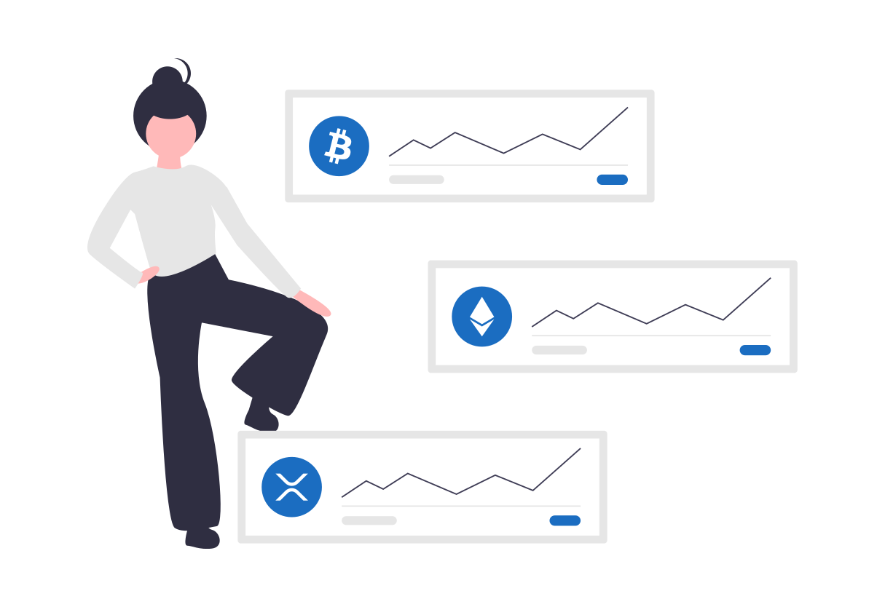

# Operator Trading

Operator Trading is a mechanism to buy and sell Plasma applications. This is similar to M&A. With the dApps Rewards mechanism, operators have the potential to benefit greatly. A developer may want to assign an operator for chain maintenance and administration or other various use cases. Operators will give their rights to opponents who give a value that seems reasonable to the value given to them. Those who have been granted the rights of the operators can receive the buyout. This mechanism assumes that new off-chain markets will be created.



