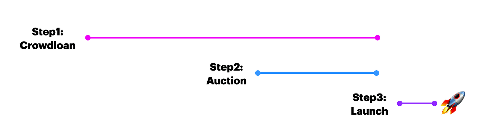

# Parachain Lease Offering

Parachain Lease Offering a.k.a PLO consists of **Parachain Slots Auction** and **Parachain Crowdloans**. In this section, we are going to explain how to make a Kusama/Polkadot address, crowdloan, and auction.











First of all, the following figure shows the timeline.

**Step1 Crowdloan:** A crowdloan campaign is started before the first auction. Crowdloan mechanism allows people to contribute by agreeing to lock up their own KSM until the end of the lease. We reward their contributors after winning the auction. Crowdloan participants can get more rewards than auction participants.

**Step2 Auction:** Parachain slot auctions follow a modified [candle auction](https://wiki.polkadot.network/docs/en/learn-auction#mechanics-of-a-candle-auction) format, where the exact endpoint of the auction is unknown by participants in order to prevent auction sniping  for more accurate price discovery.

**Step3 Launch:** After winning Parachain auction, we will launch Shiden/Plasm  Network as a Parachain.

### **Reference**: 









