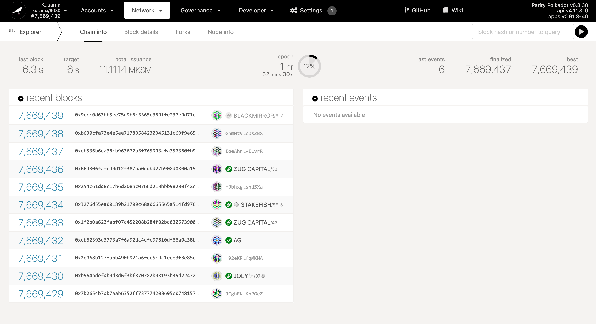
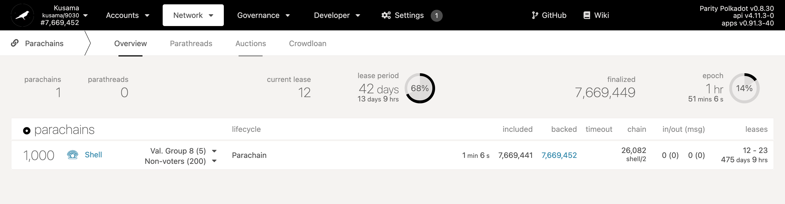
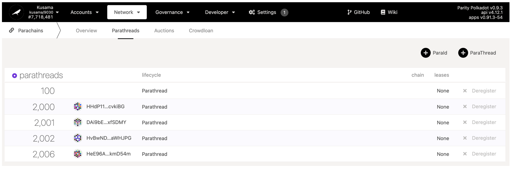
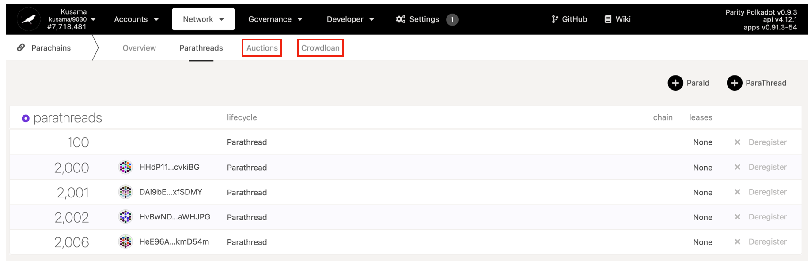

# Joining from Polkadot.js

If you don't have a Polkadot.js account, please make one!


[polkdotjs.md](../../build/polkdotjs.md)


## Step1: Access to Polkadot.js Kusama Page!

First of all, please visit [https://polkadot.js.org/apps/#/explorer](https://polkadot.js.org/apps/#/explorer) and open the Kusama Network page.&#x20;

To join our crowdloan or auction, please click **"Network"** → **"Parachains"**

Once you open the above page, you can see "Parathread",  "Auction", and  "Crowdloan" on the  top. To become a Parachain, Shiden Network is registered as a Parathread **(Our Parachain ID is 2007)** first and conduct a crowdloan and auction.&#x20;


[auction.md](auction.md)



[crowdloan.md](crowdloan.md)



[shiden-parachain-auction-strategy.md](shiden-parachain-auction-strategy.md)



**As we have described in the Shiden Parachain Auction Strategy section, only crowdloan participants can get the bonus rate. And, the earlier you join our crowdloan, the more SDN tokens you can get.**


## Step2 Join Our Crowdloan

Shiden's ParaID  (Parachain ID) is 2,007. Once the auction is started, you can see Shiden on this page. To join our Crowdloan or auction,  click "Auction" or "Crowdloan" emphasized below.


**"Crowdloan" and "Auction" are two different things. Shiden starts its crowdloan 7 days before the auction. From the user's point of view, there are two options: join the auction or join the crowdloan.  In the case of Shiden, only crowdloan participants can receive additional bonus.**


.png>)

When you are on the page "Crowdloan", you will find Shiden in the list of ongoing. Just click on "Contribute" and follow the steps on your screen. "Sign & Submit" and you are done.

Shiden Token will be distributed once we win the auction and KSM token will be returned after expiring the lease period.

We noticed a Ledger’s problem on Chrome. You can solve it by adding Ledger directly to Polkadot.js.
