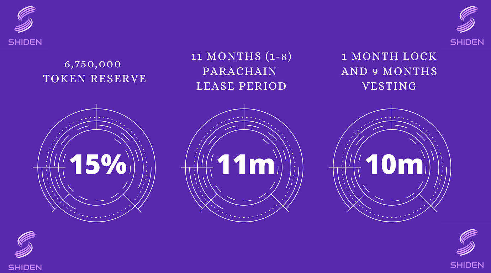

# Shiden Parachain Auction Strategy

## Shiden Network

Shiden Network is a multi-chain decentralized application layer on Kusama Network. Kusama Relaychain does not support smart contract functionality by design - Kusama Network needs a smart contract layer. This is where Shiden Network comes in. Shiden supports Ethereum Virtual Machine, WebAssembly, and Layer2 solutions from day one. The platform supports various applications like DeFi, NFTs and more.

## Kusama Parachain Lease Offering Strategy

Shiden Network is one of the Kusama Parachain candidates \(2021-05-14\). Parachains connect to the Relaychain by leasing a slot via permissionless auction. In other words, we need to win the slot auction to lease a Parachain slot. After the start of the lease period, we deploy our mainnet on the acquired slot.

To collect KSM tokens as fast as possible, **we choose to crowdfund our slot lease using Kusama’s crowdloan mechanism, allowing KSM holders to contribute by locking up their own KSM tokens for 11 months.** We will reward their contributions by providing SDN tokens.

The PLO consists of “Crowdloan” and “Auction”. We are going to conduct our crowdloan before the auction. We highly encourage KSM holders to join our crowdloan as soon as possible if they participate in the PLO. The corrected KSM  will be used for the Parachain auctions. 

**After 11 months, KSM tokens will be returned.** Hence, this is neither an ICO nor a direct investment. This is a “staking”.





We use 15% of the total supply \(6,750,000 SDN\) and bid for 1-8 periods \(7days×6weeks×8periods=336 days\). Shiden is a community-driven project and we are proud of distributing 65% for the community members in total.

After locking KSM tokens, slot auction participants will receive SDN tokens **automatically**. The receiving tokens will be calculated by the following formula. Keep in mind that the SDN tokens will be delivered 1month after winning the auction under the 9 months vesting \(Token will be distributed at once. The token cannot be sent to another address while it is being vested. However, you can stake the token on Shiden's collators\).

\[Formula comes here\]  
  
Tokens will be locked for **one** month and have **nine** months of vesting. During the vesting period, token holders can stake SDN tokens to the network so that they can earn staking rewards. 

In addition to  that, we introduce a new incentive scheme and recommend joining our crowdloan as early as we start the campaign. The earlier you participate, the higher the bonus rate you can get.

\[Graphic comes here\]

### Advanced Information

Shiden Network is a fork of Plasm Network. [We use \#3,000,000 block \(2021-05-05 04:43:30 +UTC\) ](https://plasm.subscan.io/block/3000000) for the snapshot. \(Some parameters are adjusted.\)   

