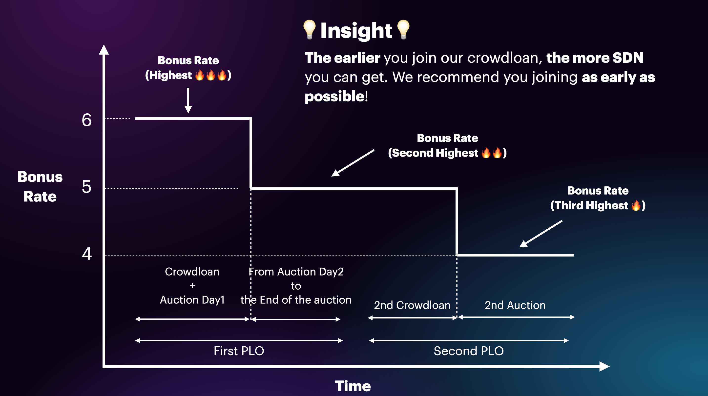

# Shiden Parachain Auction Strategy

## Shiden Network

Shiden Network is a multi-chain decentralized application layer on Kusama Network. Kusama Relaychain does not support smart contract functionality by design - Kusama Network needs a smart contract layer. This is where Shiden Network comes in. Shiden supports Ethereum Virtual Machine, WebAssembly, and Layer2 solutions from day one. The platform supports various applications like DeFi, NFTs, and more.

## Kusama Parachain Lease Offering Strategy

Shiden Network is one of the Kusama Parachain candidates \(2021-05-14\). Parachains connect to the Relaychain by leasing a slot via permissionless auction. In other words, we need to win the slot auction to lease a Parachain slot. After the start of the lease period, we deploy our mainnet on the acquired slot.

To collect KSM tokens as fast as possible, **we choose to crowdfund our slot lease using Kusama’s crowdloan mechanism, allowing KSM holders to contribute by locking up their own KSM tokens for 11 months.** We will reward their contributions by providing SDN tokens.

The PLO consists of “Crowdloan” and “Auction”. We are going to conduct our crowdloan before the auction. We highly encourage KSM holders to join our crowdloan as soon as possible if they participate in the PLO. The collected KSM  will be used for the Parachain auctions. 

**After 11 months, KSM tokens will be returned.** Hence, this is neither an ICO nor a direct investment. This is a “staking”.





\[insert the graph\]


**💡Important  Insight💡：Only crowdloan has an additional bonus. If you join our auction directly, you won't be able to receive the bonus.** 


Though the graphic above includes several auctions, we don't join the N th auction if Shiden Networks wins the N-1 th auction.  


**We will officially start the crowdloan campaign once Web3 Foundation announces the date of the auction.**


### Advanced Information

Shiden Network is a fork of Plasm Network. [We use \#3,000,000 block \(2021-05-05 04:43:30 +UTC\) ](https://plasm.subscan.io/block/3000000) for the snapshot. \(Some parameters are adjusted.\)   

The number of SDN tokens you can get is calculated  by the following formula.

`C_i` : Bonus obtained by contributing to the Crowdloan before the start of the i th auction.  
`KSM_i,j` : KSMs in the j th contribution before the start of the i th auction  
`SDN_i,j` : SDNs that can be obtained from the j th contribution before the start of the i th auction.  
`n` : The number of Kusama Parachain auctions held before Shiden Network won the auction.  
`m_i`: Number of contributions before the i th auction

$$
SDN_{a,b} = \frac{KSM_{a,b}C_a}{\sum_{i=0}^{n}{\sum_{j=0}^{m_i}KSM_{i,j}C_i}}\times6,750,000
$$

The number of tokens you are going to receive is slightly different since we have an additional bonus for waitlist registrants.

