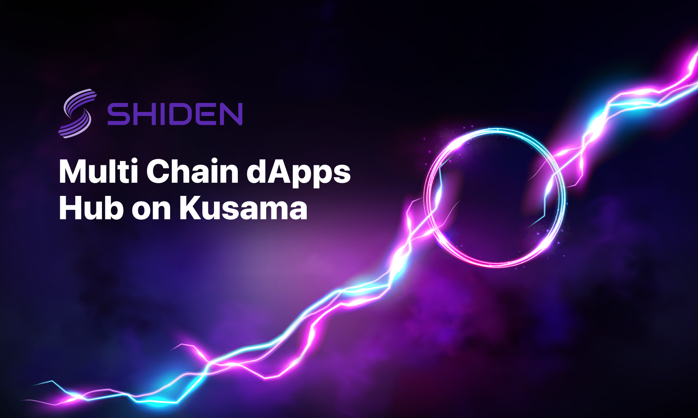

# Shiden Parachain Auction Strategy

## Shiden Network

Shiden Network is a multi-chain decentralized application layer on Kusama Network. Kusama Relaychain does not support smart contract functionality by design - the protocol needs a smart contract layer. This is where Shiden Network comes in. Shiden supports Ethereum Virtual Machine, WebAssembly, and Layer2 solutions from day one. The platform supports various applications like DeFi, NFTs, and more.

## Kusama Parachain Lease Offering Strategy

Shiden Network is one of the Kusama Parachain candidates \(2021-05-14\). Parachains connect to the Relaychain by leasing a slot via permissionless auction. In other words, Shiden needs to win a slot auction to lease a Parachain slot. After the start of the lease period, Shiden will deploy its mainnet on the acquired slot.

To collect KSM tokens as fast as possible, **Shiden team has chosen to crowdfund its slot lease using Kusama’s crowdloan mechanism, allowing KSM holders to contribute by locking up their own KSM tokens for 11 months.** The network will reward their contributions by providing SDN tokens.

The PLO consists of both a “Crowdloan” and an “Auction”. Shiden Network will conduct its crowdloan before the auction. The team highly encourages KSM holders to join the crowdloan as soon as possible if they would like to participate in the PLO. The collected KSM  will be used for the Parachain auctions. 

**After 11 months, KSM tokens will be returned. Hence, this is neither an ICO nor a direct investment. This is more similar to “staking” with a lockup.** 





The network will use 22% of the total supply \(15,400,000 SDN\) and bid for 0-7 periods \(7days×6weeks×8periods=336 days\). Shiden is a community-driven project and the team is proud to distribute 65% for the community members in total. If Shiden loses the first auction, the network will bid for the second slot.


20% of the total supply will be distributed under the rule written below. 2% out of 22% is used for bonus \(will be announced\).‌


After locking KSM tokens, slot auction participants will receive SDN tokens automatically. The receiving tokens will be calculated by the formula in the advanced information section below. Tokens will be locked for one month and have ten months of vesting. During the vesting period, token holders can stake SDN tokens to the network, allowing them to earn staking rewards. \(Keep in mind that the SDN tokens will be delivered 1month after winning the auction under the ten months vesting. Token will be distributed at once.\)‌

In addition to that, Shiden has introduced a new incentive scheme rewarding early participation. The earlier participants contribute , the higher the bonus rate they can get.

**6 \(Highest Bonus Rate\) :** The crowdloan participants who join the crowdloan from the beginning to the auction day2 get this bonus rate.

**5 \(Second Highest Bonus Rate\) :** The crowdloan participants who join the crowdloan from the auction day3 to the beginning of the 2nd auction get this bonus rate.

**4 \(Third Highest Bonus Rate\):** The crowdloan participants who join the crowdloan from the 2nd auction to the beginning of the 3rd auction get this bonus rate.


**💡Important  Insight💡：Only crowdloan has an additional bonus. If you join our auction directly, you won't be able to receive the bonus.** 


Though the graphic above includes several auctions, we don't join the N th auction if Shiden Networks wins the N-1 th auction.  


**We will officially start the crowdloan campaign once Web3 Foundation announces the date of the auction.**


### Example

1. If you lock 1KSM for Shiden Network, you are going to receive X SDN after winning the auction. Let's assume **600,000 KSM \(About $300M\)** are locked during the PLO. In this case, **X is 25.6 SDN** \(15,400,000 SDN / 600,000 KSM\).  
2. However, since Shiden's crowdeloan has a bonus rate, you can get around  **30.8 SDN** \(6/5 × 25.6 SDN\)  if you join the crowdloan before the day3 of the auction. On the other hand, if you join our crowdloan later, your SDN will be less than **25.6 SDN**.
3. The insight we can get here is that the earlier you join the crowdloan, you can receive more SDN. 

Here is another example from our forum!



### Advanced Information

Shiden Network is a fork of Plasm Network. [We use \#3,000,000 block \(2021-05-05 04:43:30 +UTC\) ](https://plasm.subscan.io/block/3000000) for the snapshot. \(Some parameters are adjusted.\)  Since the team has chose the block \#3,000,000, [the total supply is finalized](https://forum.plasmnet.io/t/finalizing-shidens-parameters-for-the-launch/1198%20). 

The number of SDN tokens participants can get is calculated  by the following formula.

`C_i` : Bonus obtained by contributing to the Crowdloan before the start of the i th auction.  
`KSM_i,j` : KSMs in the j th contribution before the start of the i th auction  
`SDN_i,j` : SDNs that can be obtained from the j th contribution before the start of the i th auction.  
`n` : The number of Kusama Parachain auctions held before Shiden Network won the auction.  
`m_i`: Number of contributions before the i th auction

$$
SDN_{a,b} = \frac{KSM_{a,b}C_a}{\sum_{i=0}^{n}{\sum_{j=0}^{m_i}KSM_{i,j}C_i}}\times15,400,000
$$

The number of tokens you are going to receive is slightly different since we have an additional bonus for waitlist registrants.

