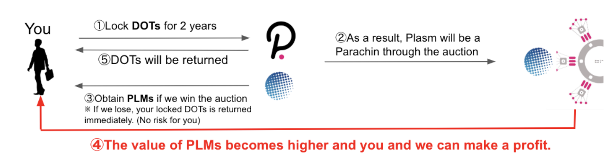

# Polkadotのパラチェーン戦略

Polkadotのパラチェーンとなるためには、Polkadotのパラチェーンオークションに勝利する必要があります。Polkadotには分散ガバナンスシステムがあり、これによって接続されるブロックチェーンのスロット（数）が決定されます。



このスロットはオークション期間にスロットにロックされたDOTの数によって、ロックされたDOTが多いプロジェクトが獲得をすることができます。そのためにこのセクションではPlasm Networkがどのようにしてスロットを獲得するのかを記載します。

### Polkadot Auction Lockdrop

Polkadot Auction Lockdrop は前章で説明した Lockdrop のうち、DOT を用いた Lockdrop を指します。このPlasm NetworkのLockdropはPolkadot Auction期間中に開催されます。



DOTによるLockdropは1回目、2回目のLockdrop とは独立しており、特殊な役割を持っています。DOTの保有者はPlasm Networkがスロットを獲得しパラチェーンになるためにDOTをスロットにロックします。DOT のロック期間は約2年であり、その間は Plasm Network はパラチェーンとして活動します。ロックをした対価としてPLMをよいレートで得ることができます。


留意点として、パラチェーンに入るかどうかの決定はオークションで行うため、この Lockdrop は失敗する可能性があります。もし失敗した際は DOT はロックされず返却され、PLM は得られません。成功した場合は DOT はロックされ、PLM トークンを取得することができます。


質問があれば、[Tech Chat](https://discord.gg/Cyjnrxv)の日本語チャネルでご質問ください。

