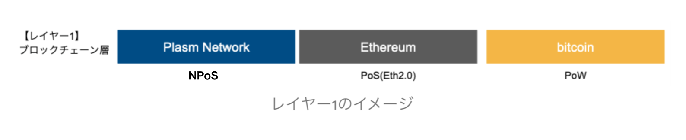
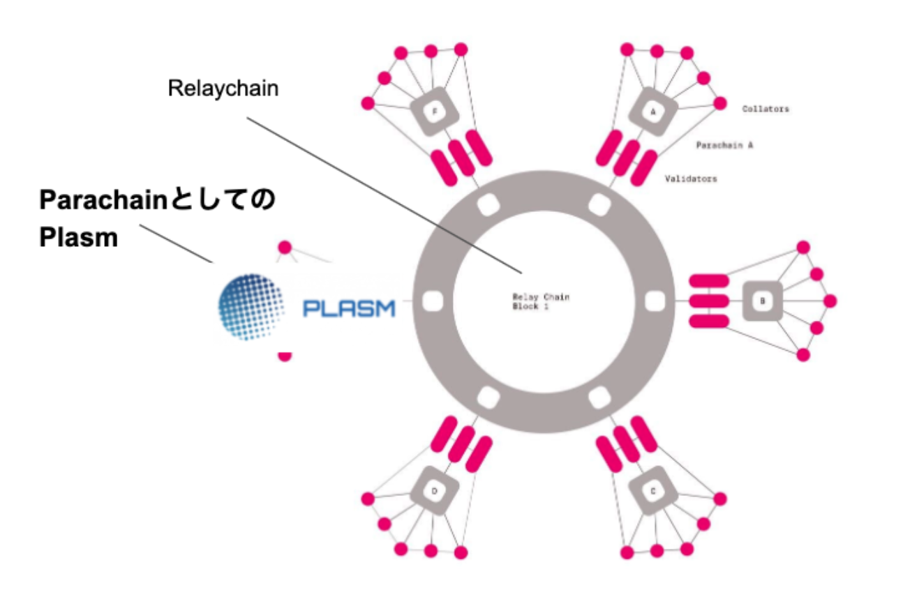
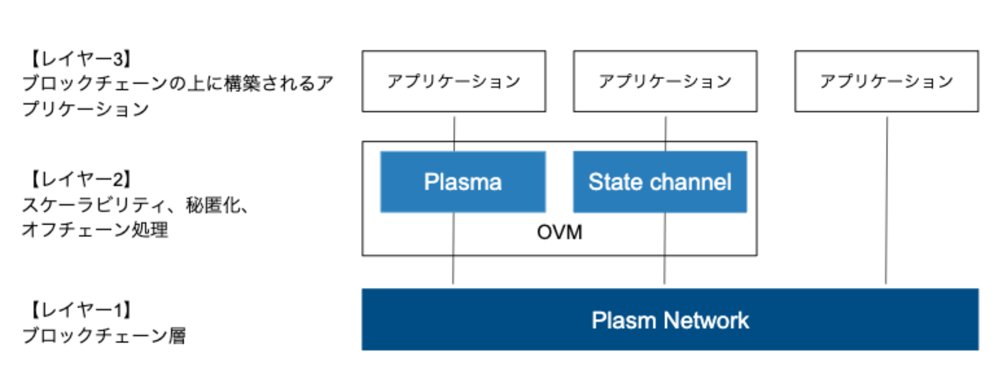

# Plasm Networkの概要

**Plasm Networkは、Polkadotのパラチェーンとして接続できるレイヤー2スケーラビリティソリューションを実装しているパブリックブロックチェーンです。**

### **パブリックブロックチェーンとしてのPlasm Network**

[Plasm ****Network](https://www.plasmnet.io/)はEthereumやBitcoinなどのブロックチェーンと同じレイヤー1層のブロックチェーン基盤です。ブロックチェーン基盤なので他のブロックチェーンと同様にスマートコントラクトをレイヤー1にデプロイすることもできます。PLM（プラム）というトークンを持ち、コンセンサスアルゴリズムはソフトローンチ時ではPoA（Proof of Authority）であり、最終的にNPoS\(Nominated Proof-of-Stake\)にすることで分散性を段階的に担保します。

### Plasm NetworkとPolkadot

**Plasmは、Polkadotのパラチェーンとして稼働可能なレイヤー2スケーラビリティソリューションを実装しているパブリックブロックチェーンです。**

Polkadotは、異なるブロックチェーンのインターオペラビリティ（相互運用性）を実現するブロックチェーンです。レイヤー1のブロックチェーンは様々ありますがそれぞれのブロックチェーンは独立して動いており、数が増えれば増えるほどサイロ化していきます。Polkadotは、各自で独立して動いているブロックチェーンの相互連携を可能にします。

Polkadotにはリレーチェーンいう唯一のチェーンと、パラチェーンというリレーチェーンに接続する複数のチェーンがあります。



パラチェーンになることによって、リレーチェーンのセキュリティを利用することができます。そして、リレーチェーンを通してインターオペラビリティを実現し様々なブロックチェーンと接続可能になります。

### Plasm Network上のレイヤー2スケーリングソリューション

[Plasm Network](https://www.plasmnet.io/)はパブリックブロックチェーンであり、[Plasm Network](https://www.plasmnet.io/)上にスケーラビリティソリューションが実装されています。具体的にはOVM\(Optimistic Virtual Machine\)というプロトコルを実装することによってレイヤー2ソリューションが実装可能となります。


OVMはブロックチェーンにおけるLayer2アプリケーションのロジックを統一的に記述するためのプロトコルです。OVMによって記述された内容はそれぞれアプリケーションロジックとしてLayer1/2向けのコードとしてそれぞれコンパイルされます。Plasm NetworkではOVMをスマートコントラクトと切り離してモジュールとして容易することでより簡潔に便利にOVMを利用できるようにします。 \(Plasm Networkホワイトペーパーより\)


**OVMで実際に実現できるソリューションにはPlasma、State channel、Optimistic Rollup**があります。

質問があれば、[Tech Chat](https://discord.gg/Cyjnrxv)の日本語チャネルでご質問ください。

