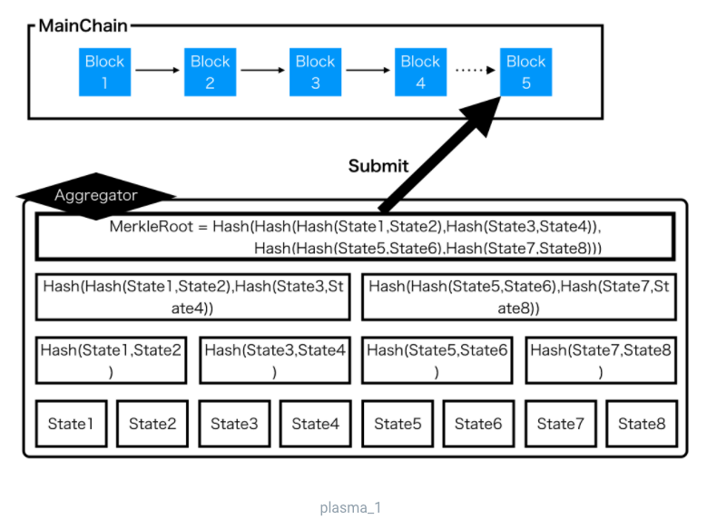
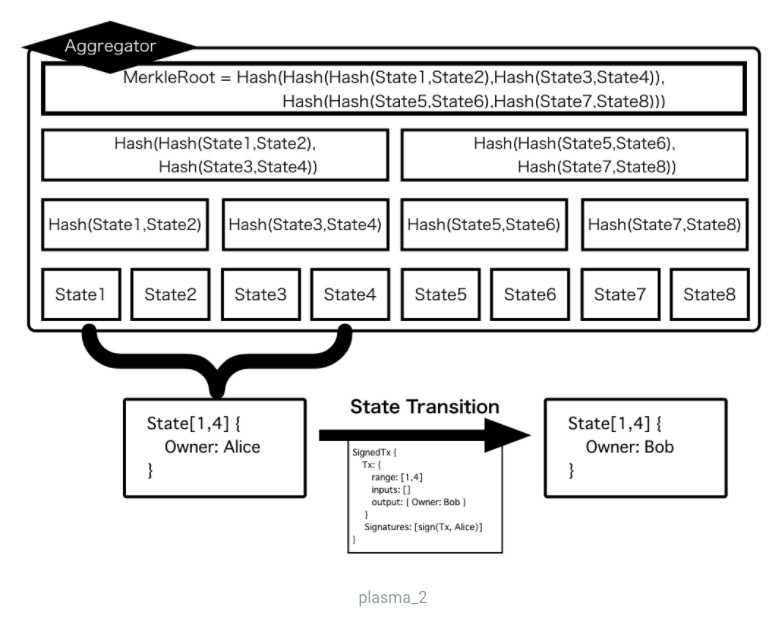

# Plasm Overview 🔮

We will walk through the basic functions of Plasma on this page.

Plasma is one of the blockchain scaling solutions invented by Joseph Poon and Vitalik Buterin. 

[White paper](https://plasma.io/plasma.pdf)

Plasma is a framework to make a side chain and connect it to a main chain \(e.g. Ethereum\). The side chain and the main chain communicate each other.

## Why Plasma?

Blockchains are slow and expensive by design. Blockchains can't be an infrastructure of the world without an high scalability. We, Plasma implementors try to make it fast and cheap without sacrificing safety and decentralization so that everyone can use blockchains.

## In the Plasm Network

Plasma is one of the scale solutions in the blockchain. The basic idea of ​​Plasma is to manage and process transactions in a Merkle tree outside the chain at high speed, and engrave only the Merkle root on the blockchain. The person responsible for performing the off-chain processing and submitting the hash to the blockchain is called an Aggregator in the context of Plasma.

Plasm Network supports "Plasma" which is based on Plasma-Cash. It has one NFT state not a transaction, at the leaves of the Merkle tree. Rules for performing state transition can be defined by Optimistic Virtual Machine \(OVM\) as described later. 



The below figure shows an example of an NFT state transition that has ownership as a state and the necessary Transaction.

In this case, in order to make a state transition, 

1. It must be signed by "Owner"   
2. A new state must be specified for output   
3. A state must not have already been transitioned in another way, this is described using OVM. The logic described here is called "Predicate". It is described in first-order logic. When OVM receives the accepted Transaction, it changes the state and updates the Merkle route.

In Plasma, a single Aggregator handles these transactions and submits the Merkle route. If the Aggregator cheats, the transaction submitted by the user may be falsified. Plasma can dispute the correctness of transactions and states on the main chain using OVM and Predicate described above for such tampering. This allows Plasma to combine both the fast transaction processing power by a single Aggregator and the strong security of the blockchain.

