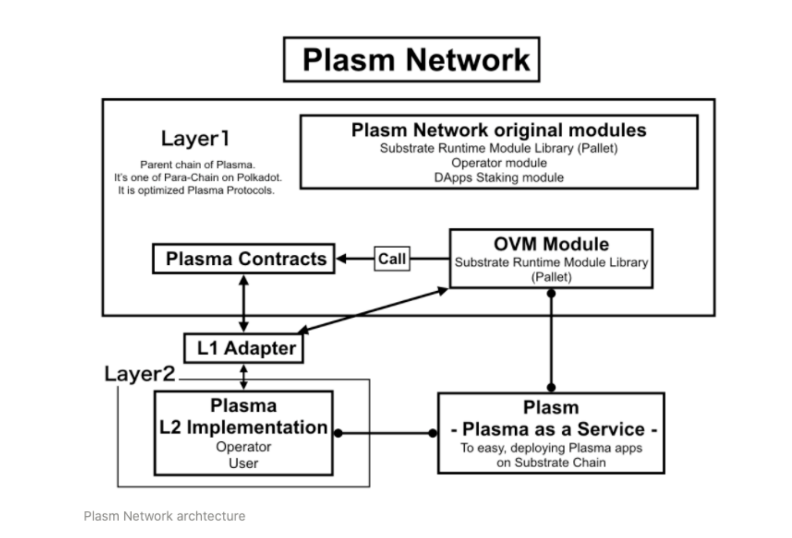

# Estrutura Plasm 🏯

A Plasm Network fornece métodos de desenvolvimento de aplicativos escalonáveis para todos os desenvolvedores. Tornamos possível através dessa arquitetura.  

A Plasm Network é uma blockchain pública de Layer 1 baseada no Substrate da Parity. No topo do Substrate, a equipe Plasm está desenvolvendo o módulo OVM, o módulo Plasma e funções próprias para criar um Dapps escalável. Além disso, a Plasm Network deveria ser a primeira blockchain Plasma / OVM que pode ser um futuro Polkadot Parachain.  

Alguma pergunta? Não hesite em perguntar-nos no [Discord Tech Channel.](https://discord.gg/Z3nC9U4)

