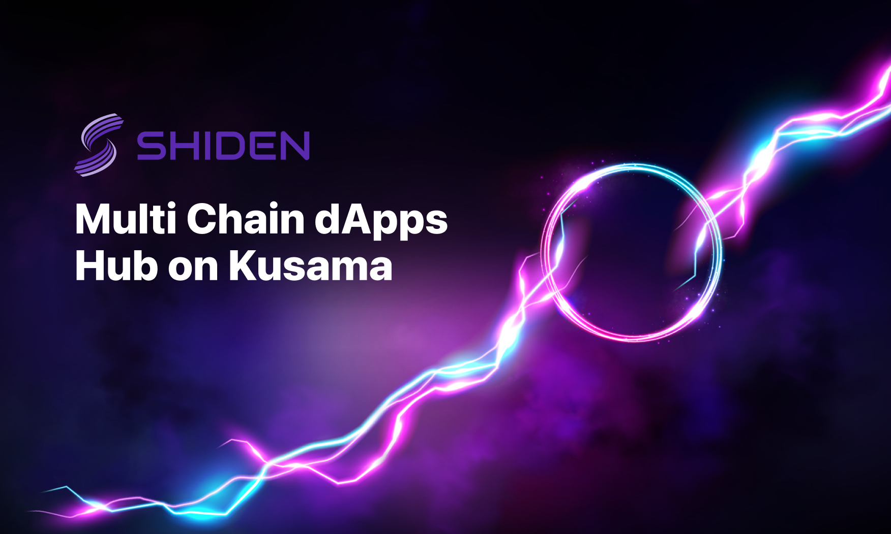

# Shiden Network 平行链竞拍策略

## Shiden Network \(紫电网络\)

Shiden Network 是基于 Kusama 的多链去中心化应用层。Kusama 中继链在设计上并不支持智能合约 - 因此 Kusama 需要支持智能合约并具有优越性能的 DApp 平台。我们致力于成为 Kusama 上的 DApp 中心枢纽。Shiden Network 原生支持以太坊虚拟机（EVM）、WebAssembly 和 Layer2 扩容方案。Shiden Network 上支持着包括 DeFi、NFT、游戏在内多种应用。

## Kusama 平行链竞拍策略

Shiden Network 是 Kusama 平行链候选者之一。平行链通过拍卖来租赁插槽，从而连接到中继链。换句话说，我们需要赢得插槽拍卖才能租用平行链插槽。租赁期开始后，我们将会把主网部署在获得的插槽上。

为了在拍卖早期收集 KSM 代币，**我们选择使用 Kusama 的众筹机制对插槽租赁进行众筹，KSM 持有者可以通过锁定自己的 KSM 代币 11 个月来帮助 Shiden Network 获得插槽。**我们将通过提供 SDN 代币来奖励他们的贡献。

**11 个月后，锁定的 KSM 代币将被返回。**因此，这既不是 ICO，也不是直接投资。这是一种质押。

我们将使用 **SDN 代币供应总量的 22%，共计 9,900,000 枚 SDN**，竞拍第 1-8 周期的平行链插槽（7天×6周×8个周期=336天）。作为一个社区驱动的项目，Shiden Network 的 SDN 代币供应总量的 65% 都被公开分发给社区成员。


SDN 代币供应总量的 20% 会按照如下规则分发。总量 22% 中剩下的 2% 会作为额外奖励（即将公布）。


在锁定 KSM 代币后，平行链插槽拍卖参与者将会**自动收到 SDN 代币**，具体数量将会在按照“深度信息“内的公式计算。参与 PLO 获得的 SDN 代币将会有**一个月的锁仓期和十个月的释放阶段**，处于释放阶段的 SDN 代币（包括未释放部分）都能够在 Shiden Network 上进行质押并获得质押收益。（请注意 SDN 代币将会在一个月锁仓期内后发放到用户地址并在接下来十个月进行释放。SDN 代币将会一次性完成发放。）

此外，我们引入了新的激励机制，使得在早期参加我们的平行链筹的社区成员能够获得更佳丰厚的回报。**越早加入我们的平行链众筹，SDN 代币激励比例越高。**


**💡重要提示💡：只有提前开始的平行链众筹有额外 SDN 奖励。直接参与平行链拍卖除标准 SDN 回报外没有额外 SDN 奖励。**


‌上图内容包含多次拍卖的情况，如果我们成功拍得第 N 个 Kusama 平行链插槽，我们将不会参加接下来的插槽拍卖。


**我们将在 Web3 基金会正式宣布拍卖日期后开启平行链众筹（crowdloan）。**


### 深度信息 

‌Shiden Network 是 Plasm Network 的 fork。我们对[前 3,000,000 个区块 \(2021-05-05 04:43:30 +UTC\)](https://plasm.subscan.io/block/3000000)进行了快照（部分参数有进行调整）。

在 Kusama PLO 中，用户获得的 SDN 代币将使用如下公式计算。

`C_i` : 第 i 个插槽拍卖前，用户通过提前锁定 KSM 代币获得的 SDN 额外奖励。  
`KSM_i,j` : 第 i 个插槽拍卖前，第 j 次 KSM 代币贡献锁定的 KSM 代币  
`SDN_i,j` : 第 i 个插槽拍卖前，第 j 次 KSM 代币贡献获得的 SDN 代币数量。  
`n` : 在 Shiden Network 拍卖成功前 Kusama 拍卖的插槽数量。  
`m_i`: 在第 i 个插槽拍卖前的 KSM 代币贡献次数。

$$
SDN_{a,b} = \frac{KSM_{a,b}C_a}{\sum_{i=0}^{n}{\sum_{j=0}^{m_i}KSM_{i,j}C_i}}\times6,750,000
$$

获得的代币数量将会有细微差别，因为waitlist提前注册成员将会有少量额外奖励。

