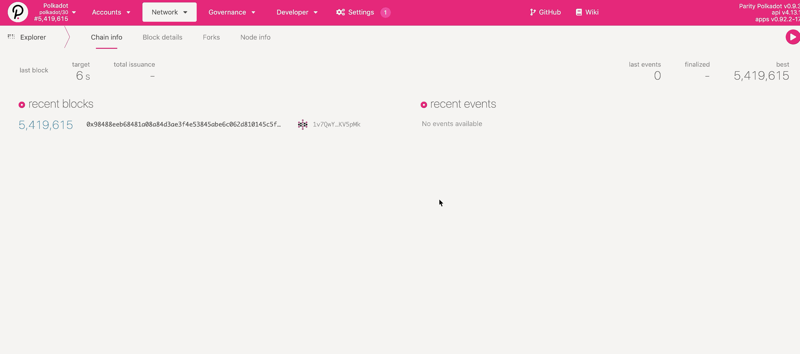

# Polkadot.js 准备教程

## 第一步: 访问 Polkadot.js 的 Kusama 页面并创建新地址 

首先，请通过 [https://polkadot.js.org/apps/\#/explorer](https://polkadot.js.org/apps/#/explorer) 链接访问 Polkadot.js。 

然后，切换到 Kusama 网络页面：点击左上角“Polkadot“旁小三角 —&gt; 在侧边栏中选择“Kusama” —&gt; 点击“Switch"。

最后，创建新地址：点击上方“Accounts“ —&gt; 选择“Add account“ —&gt; 谨慎保存助记词 —&gt; 设定账户名称和密码 —&gt; 确认信息并创建账户

## 第二步: 复制 Kusama 地址，并通过中心化交易所提币提取到新地址 

点击账户标志，自动复制账户地址

将新地址粘贴到中心化交易所（如币安、火币）的提币地址中，并确认提取。

