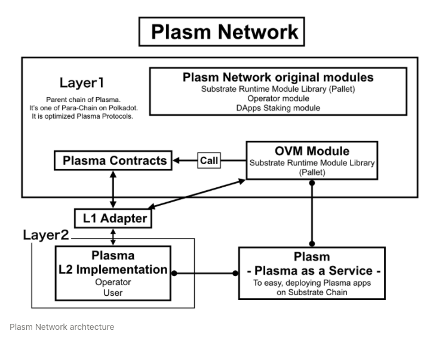

# Plasm Networkの構造

[Plasm Network](https://www.plasmnet.io/) はすべての開発者にスケーラブルな分散アプリケーションの開発メソッドを提供するためのプロジェクトです。私達はこれを以下のアーキテクチャにより実現します。

[Plasm Network](https://www.plasmnet.io/) は Substrate を用いて構築されたレイヤー1のパブリックブロックチェーンです。その上にスケーラブルな Dapps を乗せるための独自の機能と、OVM のモジュール、そして Plasma アプリケーションに必要なスマートコントラクトの標準実装が搭載されています。また、これは Plasma Defauct Standard Chain として機能するPolkadotのパラチェーンになることができます。一般に Plasmaアプリケーションをデプロイする時のデフォルトチェーンとして [Plasma Network](https://www.plasmnet.io/) が選ばれます。[Plasm Network ](https://www.plasmnet.io/)はランタイムに独自の機能を搭載することで Plasma アプリケーションに新たな可能性と快適なユーザビリティを提供します。また、[Plasm Network](https://www.plasmnet.io/) では革新的なトークン発行アルゴリズムを用いてUser/Developerファーストなトークンエコノミーを設計しています。

質問があれば、[Tech Chat](https://discord.gg/Cyjnrxv)の日本語チャネルでご質問ください。

