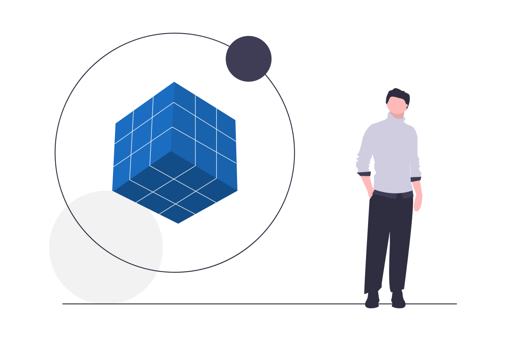

# The Problems Plasm Solves

[Plasm Network](https://www.plasmnet.io/) is a layer1 blockchain that solves prominent issues: scalability and interoperability.

## Scalability

Blockchains do not scale by design because of the decentralized consensus mechanism. TPS \(Transaction Per Second\) is much smaller than a centralized database and there is an upper limitation of data that can be stored in every block. Therefore, users across the network may notice their transactions sit unconfirmed or pending for long periods of time, creating a poor user experience.

Scalability on the [Plasm Network](https://www.plasmnet.io/) is addressing the followings topics:

* More Transaction Per Second \(TPS\)
* Cheaper transaction cost
* Faster finality

## Interoperability

Many different blockchains exist but few have interoperability as a feature. To move "value" from Bitcoin to Ethereum, we need a centralized exchange. Polkadot is a sharded protocol that enables blockchain networks to operate together seamlessly.

[Plasm Network](https://www.plasmnet.io/) is compatible with Polkadot. By connecting [Plasm Network](https://www.plasmnet.io/) to Polkadot, we will have true interoperability.



Any questions? Feel free to ask us on [Discord Tech Channel](https://discord.gg/Z3nC9U4).

