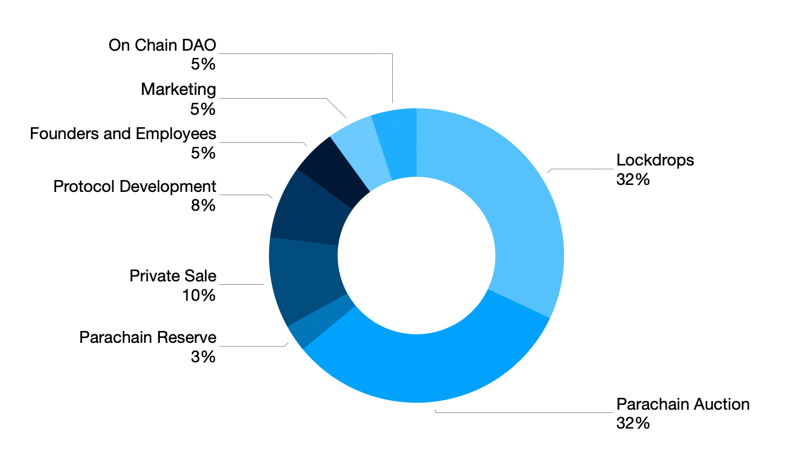

# Token Allocation

In this section, we will explain our token allocation and the usage.

| % | Title | Detail |
| :--- | :--- | :--- |
| 32 | Lockdrop | Tokens distributed to Lockdrop\#1 and \#2 participants.  |
| 32 | Parachain Auction \(PLO\) | Tokens to be used for the upcoming Parachain Auction. This allocation is subject to vesting. This fund is allocated to ensure that our Parachain slot is funded for 2 years.   |
| 3 | Parachain Reserve | Tokens to be used to ensure that Plasm Network becomes a Polkadot Parachain permanently. |
| 10 | Private Sale | Token will  be distributed once Plasm Network  becomes a Polkadot Parachain. |
| 8 | Protocol Development | Grants, operation costs, and incentives to build on Plasm Network. |
| 5 | Founders and Employees | Founders and Stake Technologies employees. Subject to 2 years vesting from the network launch. |
| 5 | Marketing | Tokens will be  distributed to our key partners and advisors. Subject  to 2 years vesting. |
| 5 | On Chain DAO | The goal of Plasm Network is to make a DAO. We will use this allocation for operation costs after closing Stake Technologies. |

