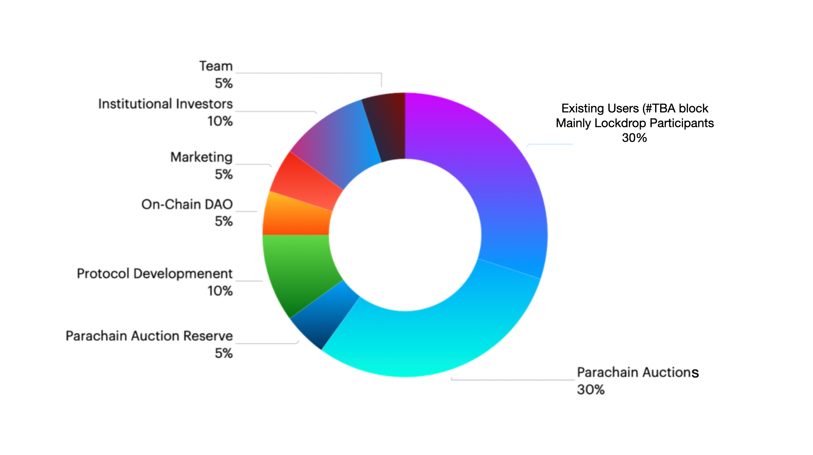

# $ASTR Allocation

| Title | % | Detail |
| :--- | :--- | :--- |
| Users \(\#TBA\) | 30 | We have done 2 lockdrops with ETH. More than 150,000 ETH had been locked on our smart contract in 2 months. We issued tokens based on the opportunity cost and operation costs. **Our lockdrop is NOT an ICO or investment but a sort of staking.** |
| Parachain Auctions | 30 | To become a Polkadot Parachain, we collect DOTs from the community and issue Astar tokens as a reward. 30% is prepared for the crowdloans for Parachain Lease Offering.  |
| Parachain Auction Reserve | 5 | Funds to be used for future parachain Lease Offerings. \(Additional funds\) |
| Protocol Development | 10 | Funds to be used for protocol developments and a grant program \(TBA\) |
| On-Chain DAO | 5 | Funds for the on-chain treasury that our community decides how to use.  |
| Marketing | 5 | Funds to be used for marketing purposes. |
| Institutional Investors | 10 | Token will be transferred once  Plasm/Shiden Network becomes a Parachain.  |
| Team | 5 | Incentive pool for employees.  |

We have updated the economics from the draft we published on Jun 21st because we declared that 65% for the community and 35% for the foundation before the 2nd lockdrop.  

