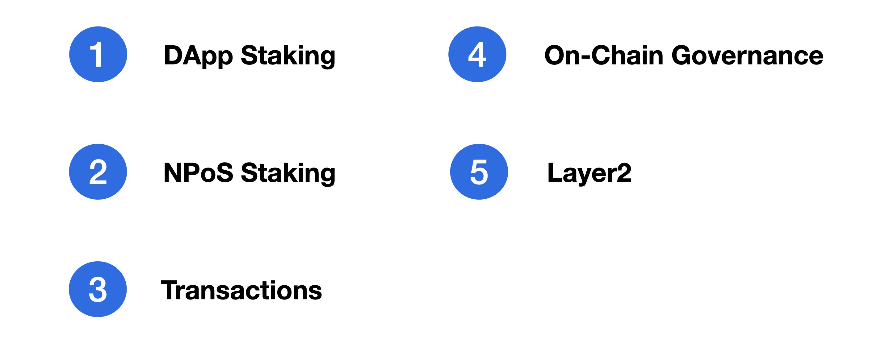

# About Astar and Shiden Tokens

Astar Token is the utility token for Astar Network that has the following 5 roles.&#x20;

## **dApps Staking**

DApps Staking is an original scheme that Astar Network core team invented and only the Astar ecosystem supports this feature in the Polkadot ecosystem. Astar Network aims to be the leading dApps hub on Polkadot Network. Hence, we prepared incentives for dApps developers to make smart contracts on Astar Network.&#x20;


[Broken link](broken-reference)


dApps Staking is a simple but strong mechanism. Astar token holders can stake Astar tokens on dApps as well as on the network. By doing so, the staker can earn Astar tokens from block rewards. In addition to that, dApps developers can also get rewards based on the nomination. In general, application developers on Astar Network receive Astar tokens by making smart contracts or infrastructure for Astar Network community. We intend to make it a  sustainable and decentralized grant mechanism.&#x20;

## NPoS Staking

Astar token holders also have an option to stake Astar's on the network (Astar Network validators or collators). By doing so, the staker receives the nomination reward and the network becomes more decentralized.

## Transactions

Every on-chain transaction takes fees.

## &#x20;On-Chain Governance

We plan to make on-chain governance and Astar token is used for facilitating the governance activities such as voting and referenda.

## Layer2

Astar Network is a layer1 platform that supports layer2 implementations. Layer2 application developers make a deposit on their layer1 smart contract and create layer2 applications.&#x20;
