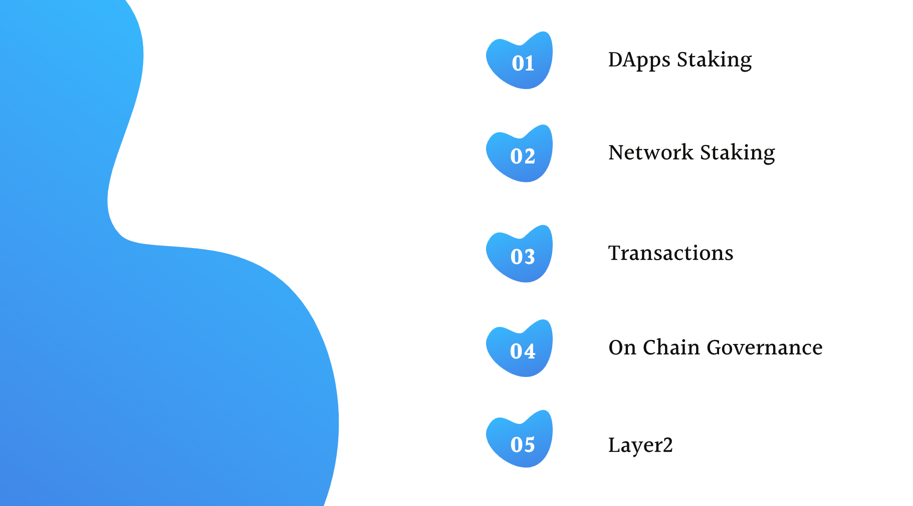

# About PLM Tokens

PLM \(Plum\) Token is the utility token for Plasm Network that has  the following 5 roles. 

## **DApps Staking**

DApps Staking is an original scheme that Plasm Network core team invented and only Plasm supports this feature in the Polkadot ecosystem. Plasm Network aims to be the leading DApps hub on Polkadot Network. Hence, we need incentives for DApps  developers to make smart contracts on Plasm Network. 



 

