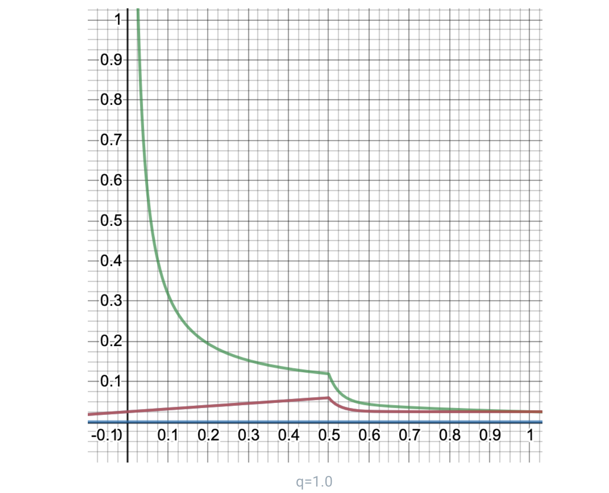

# Token Economics 📈


This include advanced contents.


[Plasm Network](https://www.plasmnet.io/)'s token ecosystem is built in to Polkadot. Therefore, this document includes the same formula and values as Polkadot. The token name of Plasm Network is PLM pronounced "PLUM".

PLM has four main roles:

1. Staking for consensus, rewards for validators and nominators
2. Transaction fee used to prevent harmful behaviors
3. Block rewards for dApp operators; sustainable reward designed for applications
4. Good / bad voting, dApp operators

PLM is intended to be used as a liquidity token. Tokens are issued through multiple Lockdrops to prevent zero-value collateral and increase the number of token holders. PLM tokens are expected to be operated at the ratio of $$1:1 = Staking:Liquidity$$.

$$
1:1 = Staking: Liquidity
$$

## Inflation Model

In the previous chapter, we defined the algorithm that determines the issue amount and distribution method when issuing new Plasm Network tokens. The Plasm Network is structured that the new token issuance fee is shared with dApp Rewards and a reward for securing the chain. The consensus algorithm of the Plasm Network is expected to be NPoS. Thereby, there are two types of Staking actions: Staking \(NPoS\) for Validator and Staking \(dApp Rewards\) for smart contracts. Both rewards from each staking are equally proportional to the amount of staking. Users who stake on validators / smart contracts are collectively called nominators. The ideal ratio of Staking for validators and Staking for smart contracts is:   

$$Staking_{validators}$$ represents the action of staking on validators.

 $$Staking_{contracts}$$ represents the action of staking on smart contracts.  

Then, the below formula is the expected ratio between Staking for validators and Staking for smart contracts.  

$$
5:1 = Staking_{validators} : Staking_{contracts}
$$

Rewards paid to Operators are dApp Rewards. Operator rewards increase in proportion to the inflation rate due to Staking. dApp Rewards rewards 50% of the total reward when meeting the ideal $$q$$ from quote the dApp Rewards chapter. The rewards given to the Operator at that time is maximized. To show the specific reward distribution, we introduce the following variables:

* $$Rewards_{operators}$$ is the total amount of reward got by the Operator.
* $$Rewards_{stakers_{validators}}$$ is the total amount of rewards got by staking a validator.
* $$Reards_{stakers_{contracts}}$$ is the total amount of reward got by staking smart contracts.
* $$t$$ is a coefficient that represents how many times the total amount of rewards earned by the operator is greater than the rewards earned by taking a smart contract.

$$t= 4$$ from quote the dApp Rewards chapter and 50% of the total reward for meeting the ideal $$q$$ will go to the dApp Rewards reward. Therefore, the ideal distribution ratio of remuneration is determined as follows.

$$
\begin{aligned}
    Rewards_{stakers_{validators}}:Rewards_{stakers_{contracts}}:Rewards_{operators} & = 5:1:4
\end{aligned}
$$

Also, the percentage of Staking and the percentage of reward are equal as follows:

$$
Staking_{validators}:Staking_{contracts}=Rewards_{stakers_{validators}}:Rewards_{stakers_{contracts}}
$$

PLM tokens use the same NPoS as Polkadot. This nominator and validator can operate the token at a certain annual interest rate for Staking. Also, token rewards will be paid to the PLM dApp operator's Nominator and Operator as well. Plasm Network's inflation model is defined as follows: First, follow the Polkadot inflation model and define the following variables:

* $$x$$ is the total amount of staking divided by the total amount of tokens issued.
* $$X_{ideal}$$ is the ideal value of $$x$$. $$Staking: Liquidity = 1: 1$$, so $$X_ideal = 0.5$$.
* $$q$$ is the amount of staking to the validator divided by the total amount of staking. $$q=\frac{Staking_{validators}}{Staking_{validators}+Staking_{contracts}}$$.
* $$Q_{ideal}$$ is the ideal value of $$q$$ . From $$5:1 = Staking_{validators} : Staking_{contracts}$$ , the ideal value of $$q$$ is $$Q_{ideal} = 5/6$$.
* $$i(x,q)$$ is the average annual interest getting by Staker. It is a monotonically decreasing function of $$x$$, $$| Q_{ideal} -q |$$ \(difference from the ideal ratio\). To make both $$x$$, $$q$$ close to the ideal value, when $$x$$, $$| Q_{ideal} -q |$$ is low, raise the interest rate as an incentive to increase the amount of stake. When $$x$$, $$| Q_{ideal} -q |$$ is high, lower interest rates as an incentive to reduce stake.
* $$i_{ideal}$$ is the average annual interest rate of Staker $$i (x, q)$$ when both $$x$$ and $$q$$ are ideal values. in other words, $$i_{ideal} = i (X_{ideal }, Q_{ideal})$$.
* $$I_{Staking}$$ is the inflation rate by Staking. $$I_{Staking}$$, a bivariate function involving $$x$$ and $$q$$, draws a three-dimensional convex function. Expressing Staking total amount x interest rate = inflation rate and expressing it as $$x * i (x, q) = I_{Staking}$$ Also, this value is maximized when $$x$$, $$q$$ is the ideal value from the reward design of $$i (x, q)$$. The ideal state equation can be expressed as $$X_{ideal} * i (X_{ideal}, Q_{ideal}) = Maxmium I_{Staking}$$
* $$I_0$$ is the lower limit of inflation rate. When $$x = 1 or x = 0$$, converge to the lower limit. $$I_0$$ is equivalent to the operating cost of the validator. The reason is that if you do not secure at least the incentive to operate the validator, the chain will break, so I\_0 = 0.025 is recommended here.
* $$d$$ is an adjustable decay rate for each $$x$$. Each time $$x$$ is $$d$$ more than $$X_{ideal}$$, $$I_{Staking}$$ is reduced by 50%. In other words, $$I_{Staking} (X_{ideal} + d, Q_{ideal}) \ge I_{Staking} /2$$.We recommend d = 0.02.
* $$g$$ is an adjustable decay rate on $$q$$. Each time $$q$$ is $$g$$ away from $$Q_{ideal}$$, $$I_{Staking}$$ is reduced by 50%. In other words, $$I_{Staking} (X_{ideal}, Q_{ideal} \ pm e) \ge I_{Staking} / 2$$. We recommend g = 0.15.
* $$i_{staking}$$ is the average annual interest earned by the nominator through Staking. This can be determined by dividing inflation by the Staking ratio. In other words, $$i_{staking} = \frac{I_{Staking}}{x}$$.
* $$I_{operators}$$ is the inflation rate due to the rewards that the Operator can get. This is t times the ratio \(1-q\) of Staking to Operator in I_{Staking}._ 

\_\_

\_\_$$Staking_{validators}:Staking_{contracts} = Rewards_{stakers_{validators}}:Rewards_{stakers_{contracts}}$$ __

$$ Rewards_{stakers_{validators}}:Rewards_{stakers_{contracts}}:Rewards_{operators} = y:1:t$$ 

$$Rewards_{staking_{validators}}(y+1) = (Rewards_{staking_{contract}}+Rewards_{staking_{validators}})y$$ 

                                                   $$q =\frac{Staking_{validators}}{Staking_{validators}+Staking_{contracts}}$$ 

                                          $$=\frac{Rewards_{stakers_{validators}}}{Rewards_{stakers_{validators}}+Rewards_{stakers_{contracts}}}$$ 

                                                         $$=y/(y+1)$$ 

                                                         $$(y+1)q  =y$$ 

                                                            $$y =q/(1-q)$$ 

 $$Rewards_{stakers_{validators}}:Rewards_{stakers_{contracts}}:Rewards_{operators} =q/(1-q):1:t $$ 

                          $$Rewards_{stakers}:Rewards_{operators} =q/(1-q)+1:t $$ 

Here, the ratio of the amount of reward and the ratio of the inflation rate are equal.

$$
\begin{aligned}
    I_{Staking}:I_{operators}& =q/(1-q)+1:t \\\\ 
    I_{operstors}(q/(1-q)+1)& =I_{Staking}t \\\\ 
    I_{operators}& =\frac{tI_{Staking}}{\frac{q}{1-q}+1} \\\\ 
    & = \frac{tI_{Staking}}{\frac{q}{1-q}+\frac{1-q}{1-q}} \\\\ 
    \frac{tI_{Staking}}{\frac{1}{1-q}}=t(1-q)I_{Staking} 
\end{aligned}
$$

* represents the average \(based on the amount staken\) interest rate of the operator's reward. From the auxiliary formula, $$i_{operators}=\frac{I_{operators}}{x(1-q)}$$.
* $$I$$ is the overall inflation rate. This is $$I = I_{Staking} + I_{operators}$$, which is the sum of the reward for Staking and the inflation rate due to the reward for Operator.

$$I_{Staking}$$ is follows the below formula.

$$I_{Staking} = \begin{cases} I_0 + x(i_{ideal} - \frac{I_0}{X_{ideal}})\cdot2^{-|q-Q_{ideal}|/g} & (0 \lt x \le X_{ideal}) \\ I_0 + (i_{ideal} \cdot X_{ideal} - I_0) \cdot 2^{(X_{ideal}-x)/d-|q-Q_{ideal}|/g} & (X_{ideal} \lt x \le 1) \end{cases}$$

The below figure is a graph simulating the inflation rate when each parameter is set as follows.

$$
\begin{aligned}
    i_{ideal}=0.2 \\\\
    X_{ideal}=0.5 \\\\
    Q_{ideal}=5/6 \\\\
    I_0=0.025 \\\\
    d=0.02 \\\\
    g=0.15 \\\\
    t=4 \\\\
\end{aligned}
$$



The above graph is fixed at $$q = Q_{ideal}$$. Here, the upper green line is the average annual interest rate \($$i_{operators}$$\) for the operator's staking amount, the lower green line is the average annual interest rate of the staking \($$i_{staking}$$\), and the red line is the overall inflation rate \( $$I$$\), the upper blue line indicates the inflation rate due to Staking reward \($$I_{Staking}$$\), and the lower blue line indicates the inflation rate due to Operator reward \( $$I_{Operator}$$ \). The inflation rate when both $$x$$ and $$q$$ are ideal values ​​is 0.166 ... \(1/6\) at maximum. Next, the graph when $$q = 0.2$$ is shown in the below figure. When $$q = 0.2$$, the Staking percentage is $$1: 5 = Staking_{validators}: Staking_{contracts}$$, and the reward percentage is as follows:

$$Rewards_{stakers_{validators}}:Rewards_{stakers_{contracts}}:Rewards_{operators}=1:5:20$$

Then, although the ratio of the operator's reward is increasing, the upper green line representing the average annual interest rate for the operator's staking amount is low because $$q$$ is far from the ideal value. As a result, even if the ratio of Staking to smart contracts increases, the reward paid to Operators is not much different from the ideal state. Also, the lower green line, which represents the average annual interest rate of Staking rewards, has been reduced, giving the incentive for Staker to take validators to Stake in order to maintain balance. As an extreme example, The below figure shows a graph when $$q = 1.0$$. At this time, no one has taken Staking for the smart contract, and the reward will be as follows.

$$Rewards_{stakers_{validators}}:Rewards_{stakers_{contracts}}:Rewards_{operators}=1:0:0$$

The green line that represents the average annual rate of reward for Staking is lower than ideal because the reward that the Operator gets is zero and $$q$$ is far from ideal. In this case, too, Staker creates an incentive to take Stakes on smart contracts to maintain balance. Note that the red line that represents the overall inflation rate and the blue line that represents the inflation rate due to the Staking reward overlap, making the latter invisible. Also, note that these graphs meet the following closings:

* The average annual interest functions $$i_{staking}, i_{operator}$$ are monotonic with respect to x.
* The average annual interest functions $$i_{staking}, i_{operator}$$ maximize when q is an ideal value.
* $$I_{Staking}, I_{Operator}, I$$ maximize when $$x and q$$ are both ideal values.
* $$I_0$$ is the lower limit of the inflation rate.
* Always satisfy $$Rewards_{staking}: Rewards_{operator} = 5 + 1: 4 = 6: 4 = 3: 2$$ when $$q$$ is the ideal value. In other words, when $$q$$ is the ideal value, it satisfies $$I_{staking}: I_{operator} = 3: 2$$.

By adding the above-inflation model, we will adjust the incentives of Plasm users and encourage the actions expected of Plasm Network.

Any questions? Feel free  to ask us on [Discord Tech Channel](https://discord.gg/Z3nC9U4).

