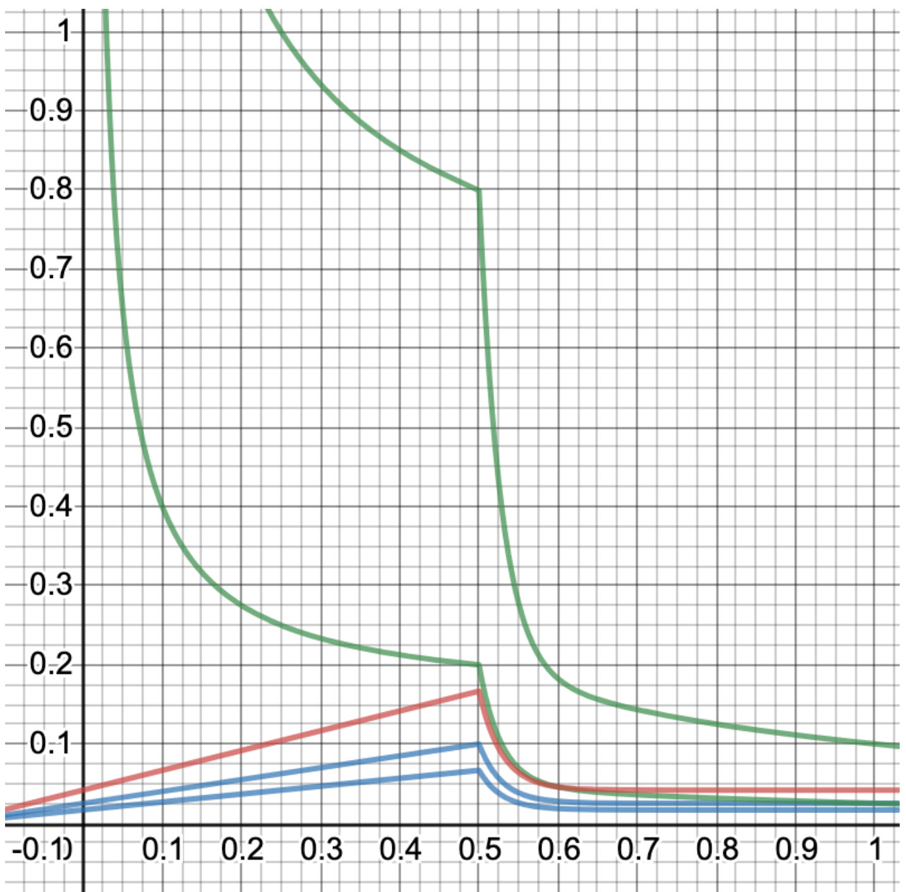
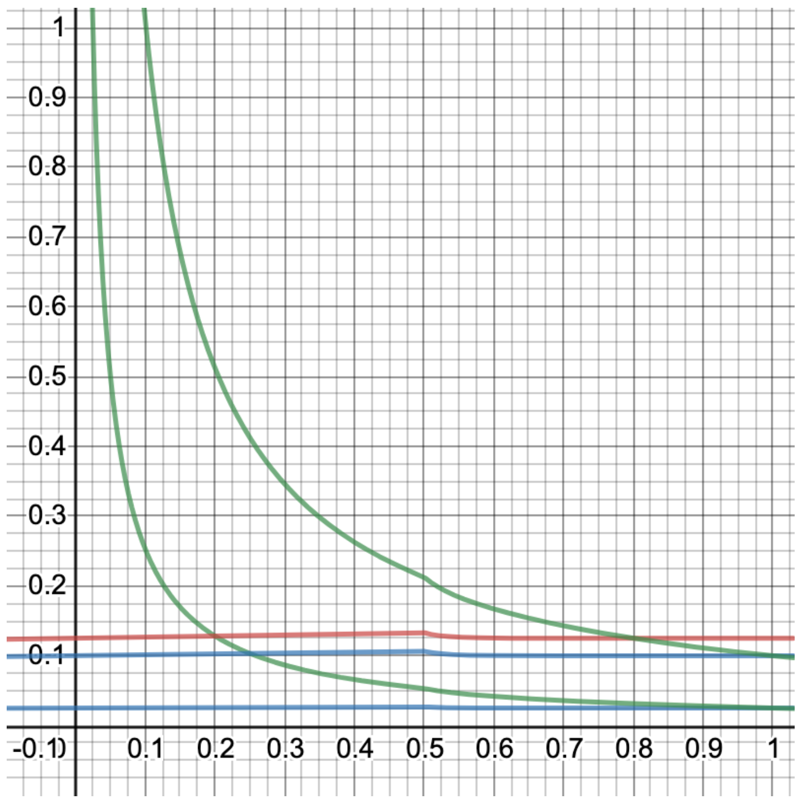
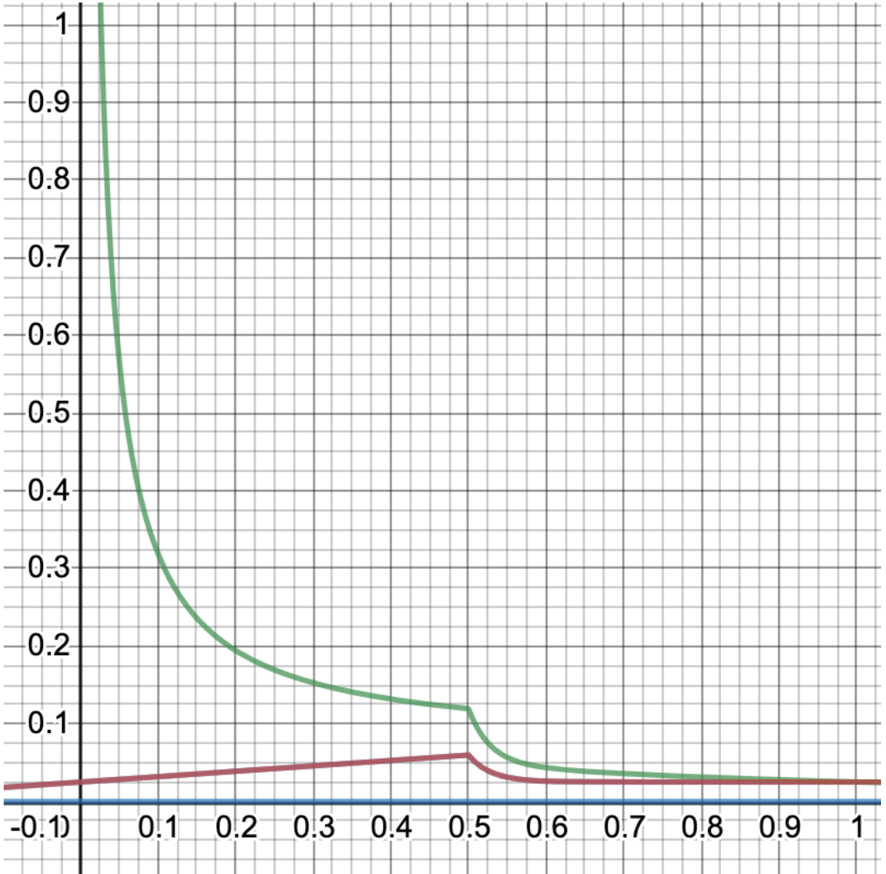

# もっと詳しく


このページは発展的な内容を含んでいます。


Plasm NetworkのトークンエコノミクスはPolkadotを参照にしています。従って、このセクションにはPolkadotのトークンエコノミクスも含まれます。

Plasm Networkにおけるトークンの名前はPLMといい、"PLUM（プラム）"と発音します。

 PLMには主に4つの役割が存在しています。

1. コンセンサスのためのステーキング、ValidatorとNominatorへの報酬
2. 悪意ある攻撃を防ぐためのトランザクション手数料
3. DApps開発者へのブロック報酬
4. ガバナンス

PLMにおいて意図されているステーキングに使われるPLMと流動性に使用されるPLMの割合は1:1となるように設計しています。

$$
Staking ： Liquidity＝ 1:1
$$

### インフレーションモデル

Plasm Networkの新規トークンを発行する際の発行額や配布方法を決定するアルゴリズムを定義します。Plasm Networkは、新規トークン発行額をDapps Rewardsと共有し、ブロックチェーン上の価値を高める行為に対してリワードを付与するという構造になっています。ブロックチェーンのコンセンサス・アルゴリズムは最終的にNPoSになります。これにより、Stakingのアクションには2種類のタイプがあります。ValidatorのためのStaking \(NPoS\)と、スマートコントラクトのためのStaking \(Dapps Rewards\)です。それぞれのStakingによる報酬は、どちらもStakingの量に等しく比例します。



Validatorやスマートコントラクトにステークをするユーザーを総称してノミネーターと呼びます。ValidatorのStakingとスマートコントラクトのStakingの理想的な比率は以下の通りです。

$$
5:1 = Staking_{validator}: Staking_{contrracts}
$$

また、ここで Dapps Rewards における Operator に支払う報酬について考えます。Operator 報酬は Staking によるインフレ率に比例して増加します。Dapps Rewards の章より理想的な $$q$$ を満たすときに報酬全体の50%が Dapps Rewards の報酬に当てられます。



またそのときにに Operator の得られる報酬は最大化します。具体的な報酬の配分を示すために、以下の変数を導入します。

* $$Rewards_{operators}$$ ： Operator が得る報酬の総量
* $$Rewards_{stakers_{validators}}$$ ：バリデータに対する Staking によって得る報酬の総量
* $$Reards_{stakers_{contracts}}$$ ：スマートコントラクトに対する Staking によって得る報酬の総量
* $$t$$ ： Operator が得る報酬の総量がスマートコントラクトに対する Staking によって得る報酬の何倍かを表す係数

Dapps Rewards の章より t=4であり、理想的な $$q$$ を満たすときの報酬全体の50%が Dapps Rewards の報酬に当てられます。そのため、理想的な報酬の配分比率を以下のように定めます。



$$
Rewards_{stakers_{validators}}:Rewards_{stakers_{contracts}}:Rewards_{operators}=5:1:4\\t=4
$$

また、Staking の割合と報酬の割合は以下のように等しくなります。

$$
Staking_{validators}:Staking_{contracts}=Rewards_{stakers_{validators}}:Rewards_{stakers_{contracts}}
$$

PLM トークンは Polkadot と同じ NPoS を起用します。このノミネータとバリデータは Staking に対してある年利でトークン運用を行うことができます。また、PLM Dapps operator のノミネータとOperatorにも同様にトークン報酬が支払われます。Plasm Network のインフレーションモデルは下記のように定義されます。まず、Polkadot のインフレーションモデルを踏襲して以下のような変数を定義します。

* $$x$$ ：全体の Staking 量をトークンの総発行量で割ったもの
* $$X_{ideal}$$ ：$$x$$ の理想的な値です. $$Staking : Liquidity = 1 : 1$$ なので $$X_ideal=0.5$$ 
* $$q$$ ：バリデータへの Staking 量を全体の Staking 量で割った値

$$
q=\frac{Staking_{validators}}{Staking_{validators}+Staking_{contracts}}
$$

* $$Q_{ideal}$$ ： $$q$$ の理想的な値。上記の式より、 $$q$$ の理想値は $$Q_{ideal} = 5/6$$ になります。 
* $$i(x,q)$$ ：Staker が得られる平均的な年利。 $$x$$ , $$q$$ を共に理想値に近づけるために、 $$x$$ , $$|Q_{ideal}-q|$$ \(理想的な比率との差分\)について単調減少関数です。 $$x$$ , $$|Q_{ideal}-q|$$ が低い時は Stake 量を増やすインセンティブとして金利を上げます。 $$x$$ ,  $$|Q_{ideal}-q|$$ が高い時は Stake 量を減らすインセンティブとして金利を下げます。 
* $$i_{ideal}$$ ： $$x$$ , $$q$$ が共に理想値であるときの Stakerの平均年利 $$i(x,q)$$ 。言い換えると $$i_{ideal}= i(X_{ideal}, Q_{ideal})$$ です。 
* $$I_{Staking}$$ ： Staking によるインフレーションレート。 $$x$$ , $$q$$ を含む二変数関数であるは $$I_{Staking}$$ 三次元の凸関数を描きます。 $$Staking 総量 \times 金利 = インフレ率$$ と表わせ数式にすると $$x \times i(x,q) = I_{Staking}$$ と表現できます。また、この値は $$i(x,q)$$ の報酬設計から $$x$$ , $$q$$ が理想値である時に最大化します。理想状態の式は $$X_{ideal} \times i(X_{ideal}, Q_{ideal}) = Maxmium I_{Staking}$$ と表すことが出来ます。 
* $$I_0$$：インフレーションレートの下限値。 $$x = 1$$ or $$x = 0$$ の時、下限値に収束するようにします。 $$I_0$$ はバリデータの 運用コストと同値です。なぜなら最低限バリデータの運用インセンティブを確保しなければ、チェーンが途絶えてしまうからです.ここでは $$I_0=0.025$$ を推奨します。 
* $$d$$ はそれぞれ $$x$$ にかかる調整可能な減衰率です。 $$x$$ が $$X_{ideal}$$ より $$d$$ 増加するごとに $$I_{Staking}$$ が50%減少します。言い換えると $$I_{Staking}(X_{ideal}+d, Q_{ideal})\ge I_{Staking}/2$$ です。 $$d=0.02$$ を推奨します。 
* $$g$$ は $$q$$ にかかる調整可能な減衰率です。 $$q$$ が $$Q_{ideal}$$ より $$g$$ 離れるごとに $$I_{Staking}$$ が50%減少します。言い換えると $$I_{Staking}(X_{ideal}, Q_{ideal}\pm e)\ge I_{Staking}/2$$ です。 $$g =0.15$$ を推奨します。 
* $$i_{staking}$$ ：ノミネータが Staking により得られる平均的な年利。これはインフレ率をStaking比率で割ることで求めることができます。言い換えると $$i_{staking} = \frac{I_{Staking}}{x}$$ と表現できます。 
* $$I_{operators}$$ は Operator が得られる報酬によるインフレ率です。これは $$I_{Staking}$$ における Operator への Staking が占める割合 $$(1-q)$$ を $$t$$ 倍したものです。上記より、 $$I_{operator}=t(1-q)I_{Staking}$$ と表すことができます。

$$
Staking_{validators}:Staking_{contracts}=Rewards_{stakers_{validators}}:Rewards_{stakers_{contracts}}
$$

$$
Rewards_{stakers_{validators}}:Rewards_{stakers_{contracts}}:Rewards_{operators}=y:1:t
$$

$$
Rewards_{stakers_{validators}}:(Rewards_{stakers_{contract}}+Rewards_{stakers_{validators}})=y:(y+1)
$$

$$
Rewards_{staking_{validators}}(y+1)=(Rewards_{staking_{contract}}+Rewards_{staking_{validators}})y
$$

$$
q=\frac{Staking_{validators}}{Staking_{validators}+Staking_{contracts}}=\frac{Rewards_{stakers_{validators}}}{Rewards_{stakers_{validators}}+Rewards_{stakers_{contracts}}}\\=y/(y+1)
$$

$$
q=y/(y+1)\\(y+1)q=y\\yq+q=y\\q+q/y=1\\q/y=1-q\\y=q/(1-q)
$$

$$
Rewards_{stakers_{validators}}:Rewards_{stakers_{contracts}}:Rewards_{operators}=q/(1-q):1:t
$$

$$
Rewards_{stakers}:Rewards_{operators}=q/(1-q)+1:t
$$

ここで、報酬の量の比率とインフレ率の比率は等しい。

$$
I_{Staking}:I_{operators}=q/(1-q)+1:t
$$

$$
I_{operstors}(q/(1-q)+1)=I_{Staking}t
$$

$$
I_{operators}=\frac{tI_{Staking}}{\frac{q}{1-q}+1}\\\frac{tI_{Staking}}{\frac{q}{1-q}+\frac{1-q}{1-q}}\\\frac{tI_{Staking}}{\frac{1}{1-q}}\\=t(1-q)I_{Staking}
$$

* $$i_{operators} $$ は Operator が得られる報酬の平均的な\(Stake された量に対する\)利率を表します。上記の式より $$i_{operators}=\frac{I_{operators}}{x(1-q)}$$ です。 
* $$I$$ は全体のインフレーション率です。これは Staking に対する報酬と Operator に対する報酬によるインフレ率を足し合わせたもので $$I=I{Staking}+I{operators}$$ です。 

$$I_{Staking}$$ の式は $$x$$ について場合分けして以下のようになります。

$$
I_{Staking} = \begin{cases} I_0 + x(i_{ideal} - \frac{I_0}{X_{ideal}})\cdot2^{-|q-Q_{ideal}|/g} & (0 \lt x \le X_{ideal})\\ I_0 + (i_{ideal} \cdot X_{ideal} - I_0) \cdot 2^{(X_{ideal}-x)/d-|q-Q_{ideal}|/g} & (X_{ideal} \lt x \le 1) \end{cases}
$$

以下の図はそれぞれ各パラメータに以下を設定したときのインフレーション率をシミュレーションしたグラフです。

$$
i_{ideal}=0.2 \\X_{ideal}=0.5\\Q_{ideal}=5/6\\I_0=0.025\\d=0.02\\g=0.15\\t=4
$$

上記のグラフは $$q=Q{ideal}$$ __で固定した際のグラフです。ここで、上の緑線が operator のstaking量に対する平均年利_\(_ $$i{operators}$$ _\),_ 下の緑線が staking の平均年利_\(_ $$i{staking}$$ _\),_ 赤い線が全体のインフレ率_\(_ $$I$$ _\),_ 青い上の線が Staking 報酬によるインフレ率_\(_ $$I{Staking}$$ _\),_ 青い下の線が Operator 報酬によるインフレ率_\(_ $$I{Operator}$$ _\)_を意味します_。_ $$x$$ _,_ $$q$$ __共に理想値のときのインフレ率は最大で 0.166..._\(1/6\)_ となります。次に __$$q=0.2$$ __であるときのグラフを以下の図に示します。_$q=0.2$_ のとき、Staking の割合が __$$1:5 = Staking{validators} : Staking_{contracts}$$ であり、報酬の割合は以下のようになります。

$$
Rewards_{stakers_{validators}}:Rewards_{stakers_{contracts}}:Rewards_{operators}=1:5:20
$$

このとき Operator 報酬が占める割合が増えているものの、 $$q$$ が理想値から離れているため operator のstaking量に対する平均年利を表す上の緑線が低いことが分かります。結果としてスマートコントラクトに対する Staking の割合が増加したとしても Operator に支払われる報酬は理想状態と大きく変わりません。また、Staking による報酬の平均年利を表す下の緑線も低下するためStakerはバランスを保つためにバリデータにStakingするインセンティブが生まれます。次に極端な例として、 $$q=1.0$$ のときのグラフを以下に示します。このとき、誰もスマートコントラクトに対する Staking をしていない状態であり、報酬は以下のようになります。

$$
Rewards_{stakers_{validators}}:Rewards_{stakers_{contracts}}:Rewards_{operators}=1:0:0
$$

Opeator が得られる報酬がゼロであり、$$q$$ が理想値から離れているため Staking に対する報酬の平均年利を表す緑線が理想状態に比べて低下しています。この場合もまた、Stakerはバランスを保つためにスマートコントラクトにStakingするインセンティブが生まれます。このとき全体のインフレ率を表す赤い線とStaking 報酬によるインフレ率を表す青い線が重なっているため後者が視認できないことに気をつけてください。また、これらグラフは以下の成約を満たしていることを注目してください。

* 平均年利を表す関数 $$i_{staking}, i_{operator}$$ は $$x$$ について単調増加です。
* 平均年利を表す関数 $$i_{staking}, i_{operator}$$ は $$q$$ が理想値である時に最大化します。
* $$I_{Staking}, I_{Operator}, I$$ は $$x, q$$ が共に理想値である時に最大化します。
* $$I_0$$ はインフレーションレートの下限値です。
* $$q$$ が理想値である時に $$Rewards_{staking} : Rewards_{operator} = 5 + 1 : 4 = 6 : 4 = 3 : 2$$ を常に満たします。言い換えると $$q$$ が理想値である時に $$I_{staking} : I_{operator} = 3 : 2$$ を満たします。

上記のインフレーションモデルを追加することで、Plasm Networkユーザのインセンティブを調整し Plasm Netowork にとって期待される行動を促します。

質問があれば、[Tech Chat](https://discord.gg/Cyjnrxv)の日本語チャネルでご質問ください。

