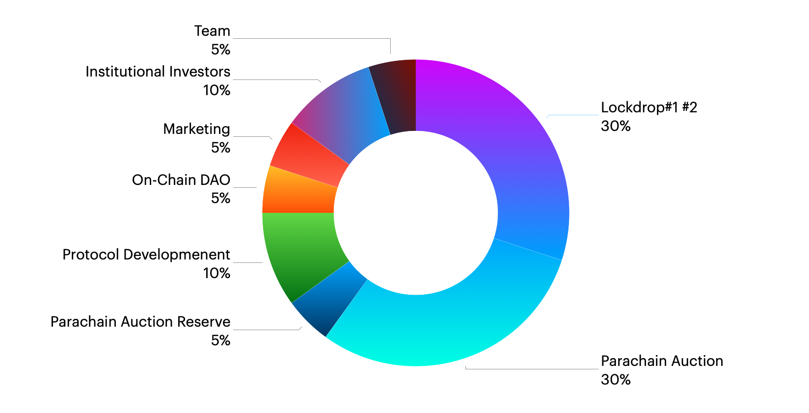

# トークンアロケーション

| 名前 | % | 詳細 |
| :--- | :--- | :--- |
| Lockdrop \#1 and \#2 | 30 | ETHを使ったロックドロップを2回行いました。2ヶ月間で15万ETH以上がスマートコントラクトにロックされていました。私たちは機会費用に基づいてトークンを発行しました。私たちのロックドロップはICOや投資ではなく、一種のステーキングです。 |
| Parachain Auction | 30 | Polkadot/Kusamaのパラチェーンになるために、コミュニティからDOT/KSMを集め、報酬としてPLM/SDNを発行します。30%はパラチェーンPLOのためのクラウドローンのために準備されています。 |
| Parachain Auction Reserve | 5 | 将来のパラチェーンPLOに利用されます。 |
| Protocol Development | 10 | プロトコルの開発やグラントプログラムなどに利用されます\(詳細未定\) |
| On Chain DAO | 5 | オンチェーンTreasury分です。コミュニティが使用方法を決定します。 |
| Marketing | 5 | マーケティング目的で利用されます |
| Institutional Investors | 10 | Plasm/Shiden Networkがパラチェーンになり次第、トークンは移転されます。  |
| Team | 5 | 開発等を行うメンバーへのインセンティブ |

2020年6月21日に発表した草案ではコミュニティに65％、財団等に35％と宣言していたので、アロケーションを更新しました。

