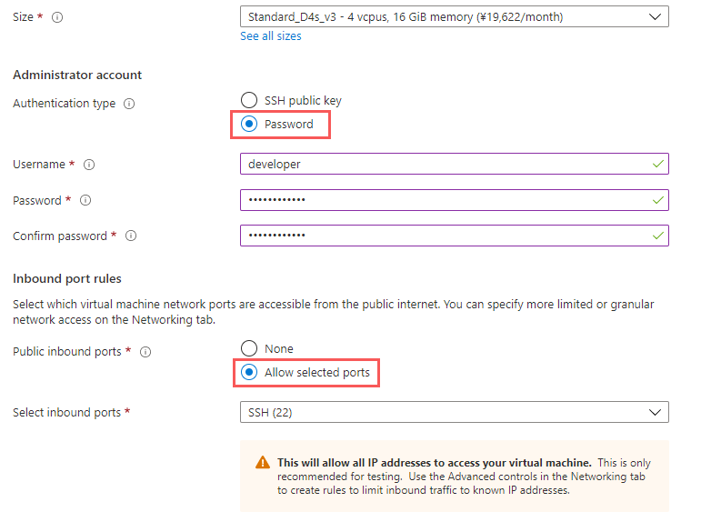
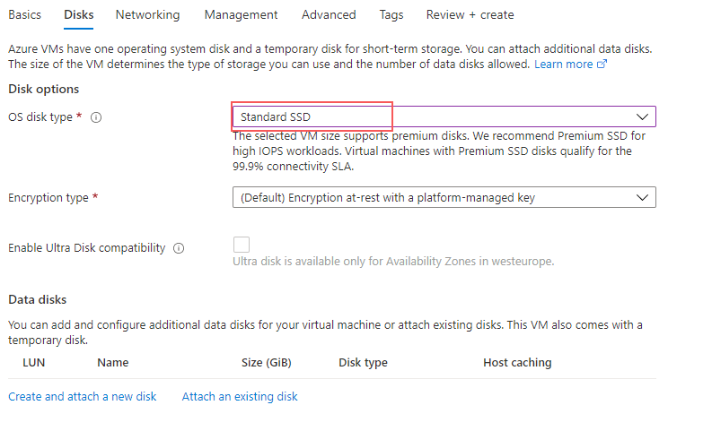

# Create Your Environnement

This setup is based on Azure cloud provider service but is also possible with other providers.

### System requirements

A validator usually deploys nodes on cloud servers. You can choose your preferred VPS service provider and operating system. We recommend Ubuntu 18.04 and Azure.

### Hardware requirements

We will provide a basic configuration for reference, which guarantees that all blocks can process in time. If the hardware is inferior to that, there will be malfunctions.

#### Basic testnet configuration:

* System: Linux (macOS possible)
* CPU: at least 2 cores
* Memory: at least 8 GB
* Hard disk: at least 80 GB (storage space will increase with time)

#### Mainnet minimum configuration:

* System: Linux (macOS possible)
* Bare Metal server dedicated to the collator node
* CPU: 8 physical cores
* Memory: 16 GB
* Hard Disk: 250 GB SSD NVMe (storage space will increase with time)

### Installation

This part is the modified version of [pathrock](https://pathrock-70243.medium.com/plasm-azure-validator-program-758205408117) guide using Azure.

1. First, you need to go to [https://portal.azure.com/](https://portal.azure.com/#home) and login with your credentials. This should take you to the _Default Directory_.
2. Create your virtual machine

* Resource group: ...
* Virtual machine name: \<YOURNAME>
* Region: Choose a region
* Image: Ubuntu Server 20.04 LTS

* Size: See our recommendations


Later in the tutorial, we will add ECDH SSH key security over Curve25519 with SHA2 and change the SSH port.


**Next**:&#x20;

* Networking (no changes)
* Management (no changes)
* Advanced (no changes)
* Tags (no changes)
* Preview + Create

.png>)

### Resize disk space

Now that our server is created we have to finetune our setup. First, stop your server!

The default disk size at the moment is 30 GiB, this is not enough for our validator. You need to increase the size to 128 GiB:

* In the menu left, click on _Disks_
* Click on the disk name
* In the menu left, click on _Size + performance_
* Choose 128 GiB minimum and click on resize


Not possible to resize? Did you stop your server?


* Start your virtual machine
