# Dapps Rewards Tutrial

Dapps Rewardsに関しての説明はこちらをご覧ください。



## 準備



に従って、コントラクトをデプロイするところまでやってみましょう。サイドバーから _**DappsStaking**_ を選択して以下のような状態であれば準備完了です。

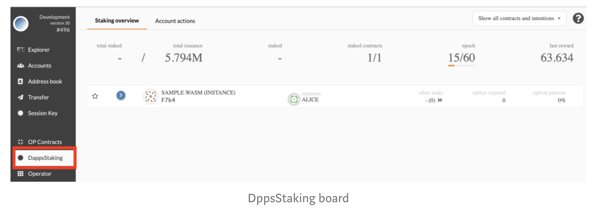

## Dapps Rewards を体験する 

Dapps Rewards の大まかな流れはざっくりと以下のようになっています。

1. スマートコントラクトを選んで Staking する。\(これを Nominate といいます。\)
2. Staking 量に応じて Nominate した人\(以下、ノミネータ\)と Nominate されたスマートコントラクトのオペレータは報酬が与えられます。

では、実際にやってみてましょう。

### ① スマートコントラクトに Nomiante する 

_**DappsStaking -&gt; Account actions**_ を選択します。まだ Stake していない場合、下のような画面が表示されます。ここで右上の _**+ New stake**_ と書かれたボタンを押します。

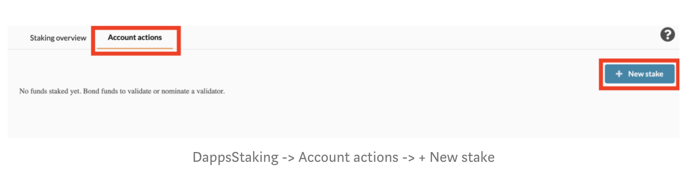

すると以下のような画面が現れるため、以下の4つの項目を埋めます。

* **Stash account**：誰の持っているトークンを扱うかを指定します。”**口座”**のようなものです。
* **Controller account**：どのアカウントの権限で操作するかを指定します。セキュリティ的には Stash account と Controller account は別のアカウントを使うことが好ましいです。今回はデモなので同一のアカウント\(BOB\)を使います。
* **Value bonded**：Stake に利用するトークン量を指定します。
* **Payment destination**：Rewards の振込先を指定します。

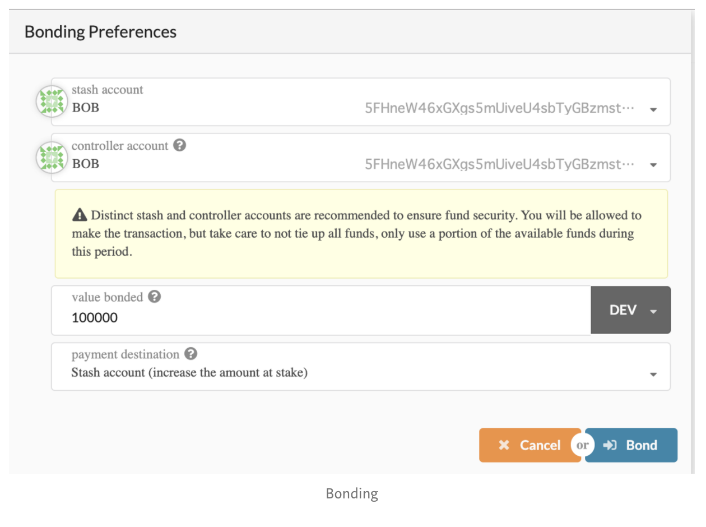

入力を終えたら、_**Bonding -&gt; Sign and Submit**_ を押してトランザクションを発行します。すると下のように先程指定した項目が反映された内容のカードが表示されます。

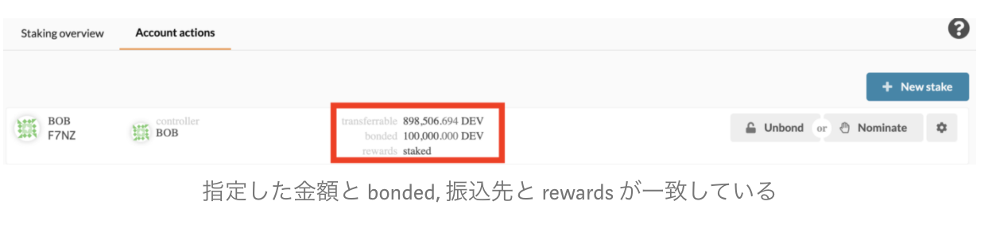

これで、トークンをロックすることに成功しました。しかし、これだけでは Nominate したことになりません。続いてカードの右側の _**Nominate**_ ボタンをクリックします。

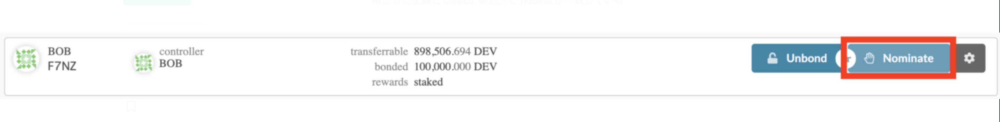

すると、以下のようなポータルが現れます。ここでは Nominate する対象のスマートコントラクトを選ぶことができます。[前回](https://medium.com/stake-technologies/%E9%81%8A%E3%81%BC%E3%81%86-plasm-testnet-v3-%E2%91%A0-operator-trading-64323fa2d4fd)のデモでアップロードした “SAMPLE.WASM” を選びましょう。この時、コントラクトの _**canBeNominate**_ のパラメータを Yes にしているコントラクトしか選ぶことができないことに注意しましょう。

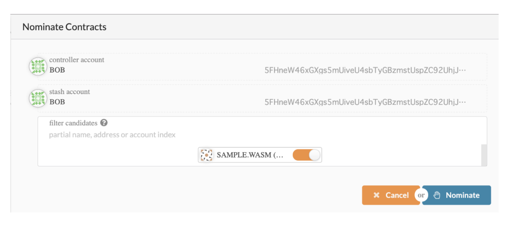

_**Nominate -&gt; Sign and Submit**_ でトランザクションを発行します。しばらくすると以下のようにカードに _**Nominating**_ という項目が現れ、先程 Nominate したスマートコントラクトが表示されます。

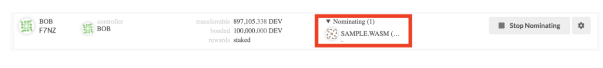

これで、スマートコントラクトへの Nominate が完了しました。

### ② Dapps Rewards を受け取る 

これはとても簡単です。待ちましょう！Dapps Rewards は **Era** と呼ばれる特定の周期おきに発行されます。各 **Era** の最後に [Plasm Network](https://www.plasmnet.io/)では以下の処理を行います。

1. Staking が有効化されたノミネータとスマートコントラクトのオペレータに報酬を支払います。
2. この Era 中に新たに追加された Nominate 情報から Staking を有効化します。

つまり、Era1 での Nominate は Era1 終了時に有効化され、Era2 終了時に報酬を受け取ることができます。

この **Era** の間隔はデフォルトで約1時間程度です。つまり、長くても2時間ほど待てば報酬を貰えるでしょう。

Local Node を使った場合、この Era を強制的に動かすことで待たずに報酬を貰う過程までをスキップできます！以下ではそのやり方を説明します。

サイドバーから _**Extrinsics**_ を選び、ルートユーザである ALICE から以下のトランザクションを発行します。**Sudo\(forceNewEra\(\)\)。**

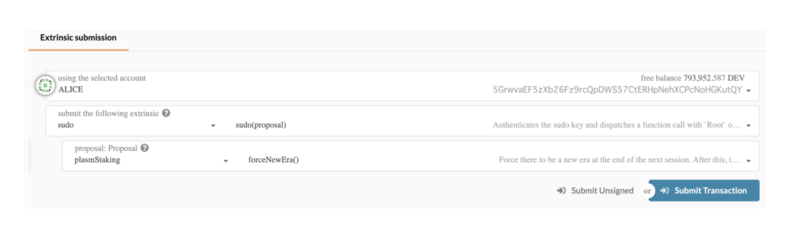

このトランザクションを発行することで、一度だけ Era を強制的にすすめる事ができます。Era が更新されたかどうかは _**Chain state**_ から確認することができます。_plasmStaking_ の _forceEra\(\)_ を参照して _**ForceNew**_ であれば Era が更新されておらず、_**NotForcing**_ であれば Era が更新されています。

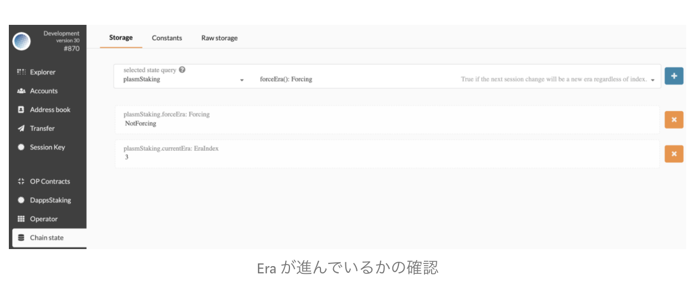

数分ほど待つと Era が更新されるため、_**DappsStaking -&gt; Staking overview**_ を表示すると以下のように SAMPLE.WASM に先程の Nominate が有効化されていることが確認できます。

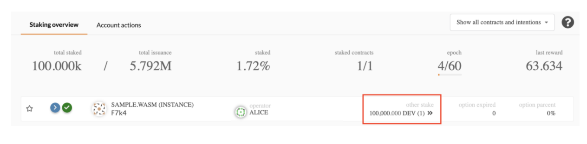

また、サイドバーの _**Accounts**_ からこの時点での ALICE と BOB のトークン量を確認してみてください。

再度、 前述した方法で Era を強制的に進めてみましょう。そしてもう一度 ALICE と BOB のトークン量を確認すると…

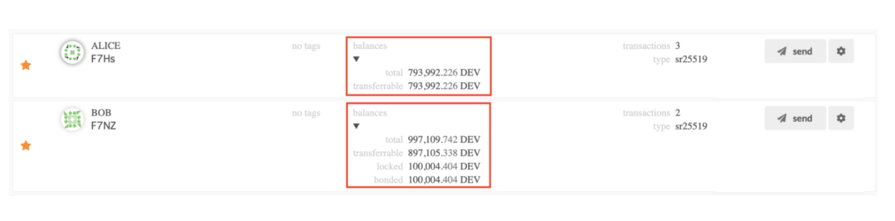

少々見づらいですがトークンが増えている事がわかります

ちなみに、どのようなアルゴリズムでトークンの増量が決まるかについて知りたい方は[こちら](https://medium.com/stake-technologies/dapps-%E9%96%8B%E7%99%BA%E8%80%85%E3%81%8C%E3%83%9E%E3%83%8D%E3%82%BF%E3%82%A4%E3%82%BA%E3%81%99%E3%82%8B%E3%81%9F%E3%82%81%E3%81%AE%E3%83%96%E3%83%AD%E3%83%83%E3%82%AF%E7%94%9F%E6%88%90%E5%A0%B1%E9%85%AC%E3%81%A8%E3%81%AF-1062a0925909)の記事をご覧ください。大雑把には Staking した/された量に比例した報酬がもらえます。そして、ノミネータよりもオペレータのほうが多く報酬をもらえます。

以上で今回のデモを終わります！お疲れさまでした！

質問があれば、[Tech Chat](https://discord.gg/Cyjnrxv)の日本語チャネルでご質問ください。

