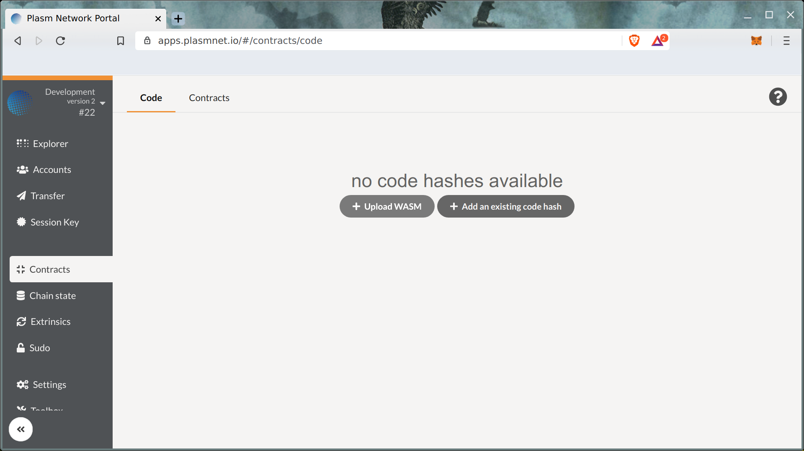

# デプロイ

[Plasm Network](https://www.plasmnet.io/)のメインネットにデプロイする前に、自身のローカルチェーンとDusty Networkにデプロイすることがおすすめされています。これは安全な開発を行なうためであり、ローカル環境とDusty Network上でテストを行なうことでデプロイするスマートコントラクトの動作を確認することができます。

### ローカルチェーンへのデプロイ

ローカルノードへのデプロイをするためには、ローカルでノードを動かす必要があります。「ローカルでノードを動かす」のセクションに従ってノードを動かしてください。



次に、[Plasm Network](https://www.plasmnet.io/)の[Plasm Network Portal](https://apps.plasmnet.io/)を開きましょう。

上部左のロゴをクリックすることで以下の画面に推移します。

今回はローカルチェーンにデプロイするため、"Local Node"を選択します。（※ Dusty Network、Plasm Networkにデプロイしたい場合はそれぞれのロゴをクリックします。）

続いて、画面左端の"Contracts"タブをクリックし "Upload WASM"を選択します。WASMとはWebAssemblyの略語であり、ink!などの言語で書かれたスマートコントラクトがコンパイルされた状態を指します。

