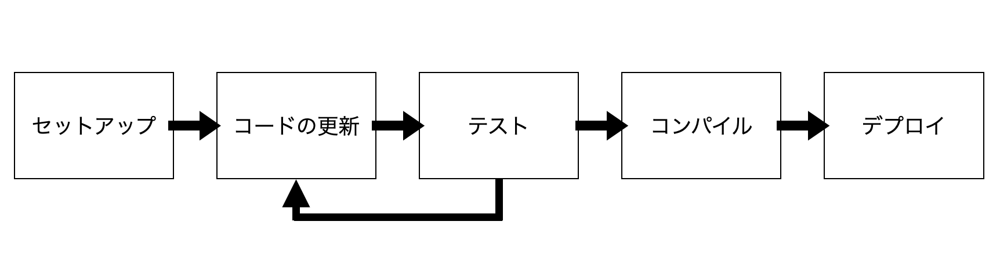

# 開発の全体像

Plasm NetworkではWebAssemblyで記述されたコントラクトをデプロイすることができます。ここでは、RustのEmbedded DSLとして提供されるink!を利用して、Plasm Network上のコントラクトを開発する手順について説明をします。


Plasm Networkには現在、上記ink!に加え、Solidityで書かれたコントラクトもコンパイルしデプロイすることができます。




ink!/Solidiryを利用したコントラクト開発の全体像は以下の図のようになります。

1. **セットアップ：** ink!/Solidityの環境構築およびプロジェクトディレクトリのセットアップを行います
2. **ink!/Solidityコードの更新：** 開発したいコントラクトに応じてink!/Solidityコードの更新を行います
3. **テスト：** 記述したコントラクトが意図通りの挙動をとるかテストを行います
4. **コンパイル：**ink!コード\(Rust\)/Solidityコードをwasmバイナリに変換します
5. **ローカルのブロックチェーンにデプロイ：**ローカルのブロックチェーンノードにwasmバイナリをデプロイします
6. **ローカルのブロックチェーンの動作確認**
7. **Dusty Networkにデプロイ：**Dusty Networkノードにwasmバイナリをデプロイします
8. **Dusty Networkの動作を確認**
9. **Plasm Networkにデプロイ：**Plasm Networkノードにwasmバイナリをデプロイします
10. **Plasm Networkの動作確認とUI開発**

