# Operator Trading Tutrial

Operator Tradingに関しての説明はこちらをご覧ください。



## 準備

PLMのテストネットトークンをまだ持っていな方は [Discord](https://discord.gg/UmVqZm) の **\#faucet** チャンネルにてトークンを貰ってください。またトークンを貰わず、独自でいろいろ試したい方は開発者向けに Local Node で動かすこともできます。

> Local Nodeは [Docker](https://hub.docker.com/repository/docker/staketechnologies/plasm-node) を用いることで以下のコマンドで簡単に起動することができます。

```text
$ docker pull stakedtechnologies/plasm-node:0.7.0
$ docker run -p 9944:9944 staketechnologies/plasm-node:0.7.0 --dev --ws-external
```

そして、[https://apps.plasmnet.io/](https://apps.plasmnet.io/) にアクセスし、**Settings** から リモートノード・エンドポイントで **Local Node** を選択してください。\(デフォルトでは Plasm Testnet v3 が選択されています。\)

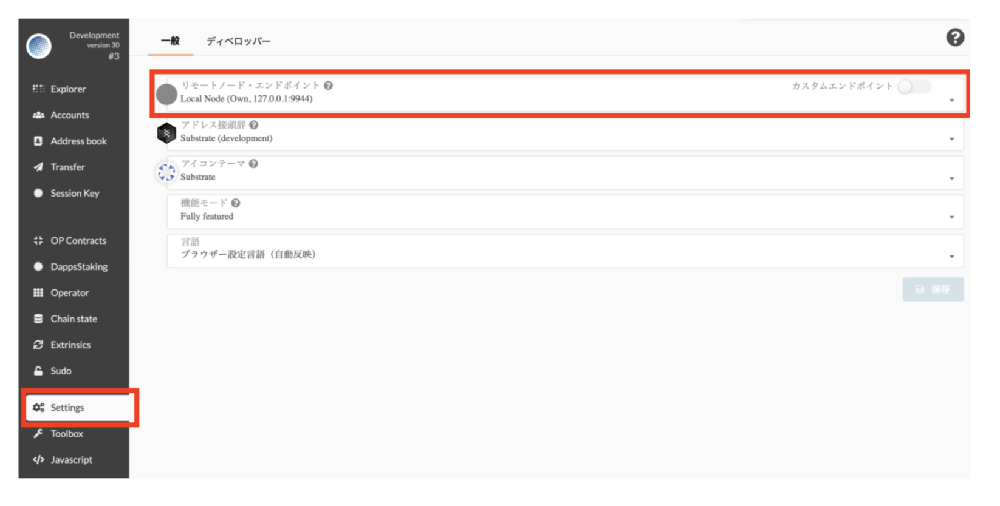

> その他の方法で plasm-node を動かしたい方は Readme を参照してみてください。また、分からないことがあれば [Discord](https://discord.gg/UmVqZm) でお気軽に聞いてください。

## Operator Trading を使ってみ

まずは [https://apps.plasmnet.io/](https://apps.plasmnet.io/) にアクセスしましょう_。_

### ① コントラクトをアップロードする <a id="1d31"></a>

兎にも角にも、コントラクトをアップロードしないことには始まりません。まずは、サイドバーから _**OP Contracts**_ を選択します。\(これは Operated Contracts の略です。\)。

### コントラクトを自分でアップロードする場合 <a id="c8fe"></a>

まだ、コントラクトを1つもアップロードしていない場合以下のような画面を見ることができます。

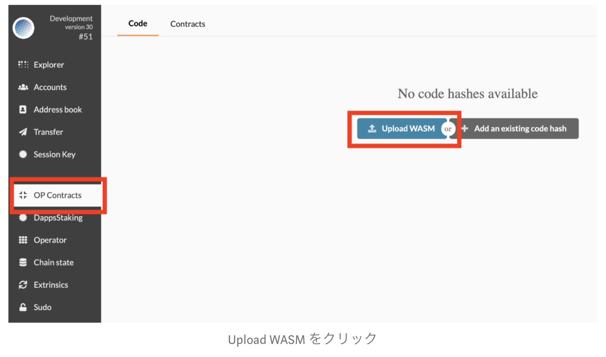

ここで、 Upload WASM を選択すると以下のようなモーダルウィンドウが現れます。

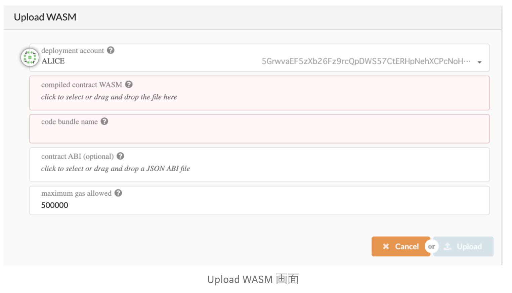

ink! Contract をコンパイルした WASM ファイルと ABI の JSON ファイルをここで入力します。もちろん、自分でスマートコントラクトを開発してアップロードすることも可能です。

今回は、[ink-playground](https://ink-playground.com/) を使って簡単にサンプルコントラクトを用意します！このink! playgroundは[Stake Technologies](https://stake.co.jp/)が作成してものであり[Web3 Foundationより助成金を獲得しています](https://medium.com/web3foundation/wrap-up-for-winter-with-our-wave-four-grant-recipients-52c27b831a6e)。

### **Example をダウンロードしてくる** <a id="b295"></a>

[https://ink-playground.com/](https://ink-playground.com/) にアクセスします。すると以下のようにサンプルのコードとエディタが表示されるので _**COMPILE CODE**_ を押してサンプルコードをコンパイルします。

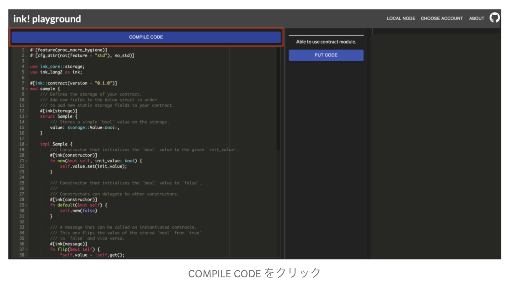

しばらく待つと、右側に以下のようなメッセージとボタンが現れます。 _**WASM**_ と _**METADATA**_ と書かれたボタンをクリックすることで WASM ファイル と METADATA ファイルをダウンロードすることができます。それぞれのファイル名は “sample.wasm” と “metadata.json” です。

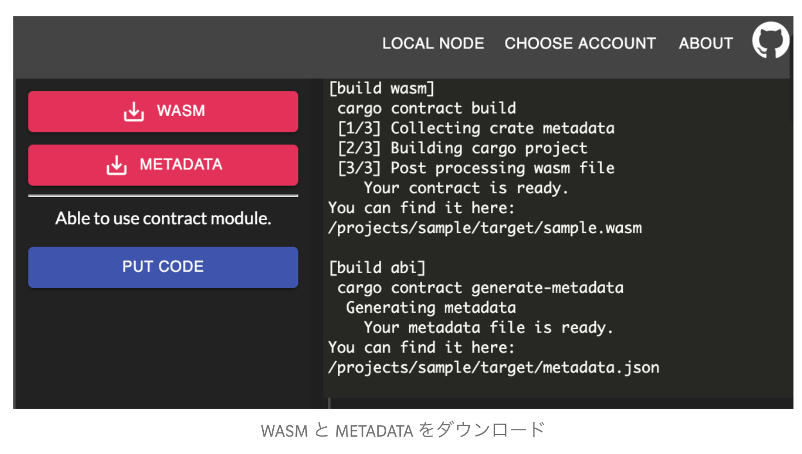

ダウンロードした “sample.wasm” ファイルを _**compiled contract WASM**_ に “metadata.json”ファイルを _**contract ABI**_ にアップロードします。すると、以下のようにパラメータが表示されます。

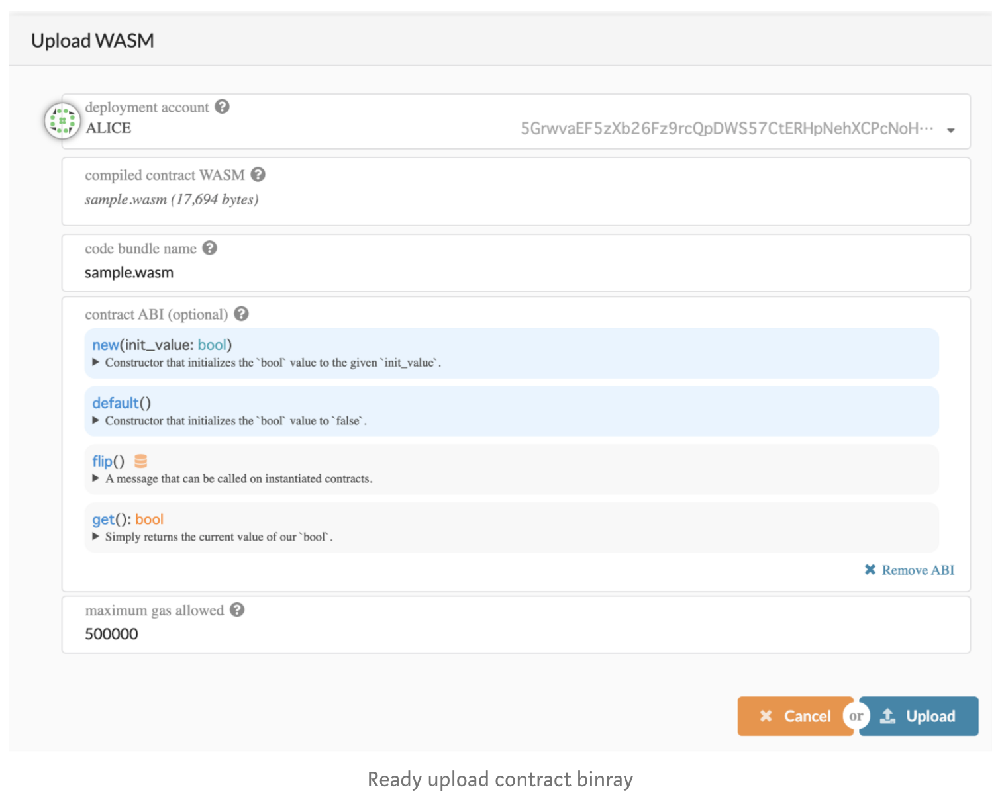

あとは、 _**Upload -&gt; Sign and Submit**_ を押すと下のようにアップロードしたコントラクトコードが表示されます。

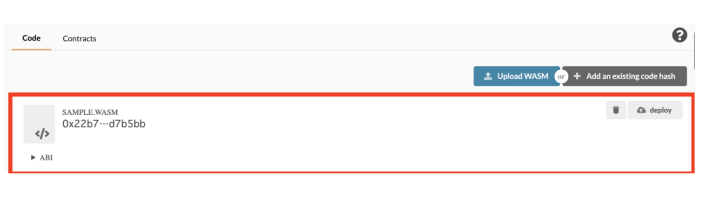

これで、コントラクトのアップロードが完了しました。お疲れさまです。

### すでにアップロードされているコントラクトを読み込む場合 <a id="6284"></a>

Local Node ではなく Plasm Testnet v3 のノードを利用する場合、前述した sample.wasm は既にアップロードされています！_**OpCotracts -&gt; Add an existing code hash**_ から以下のハッシュを _**code hash**_ の項目にコピペしてください。

```text
0x22b781155b1a9df69ea97ac5ec8f35af8e90f5dc7173439dcab50aafdcd7b5bb
```

そして、”metadata.json” を contract ABI に入力することで既にアップロードされているコントラクトを読み込むことができます。

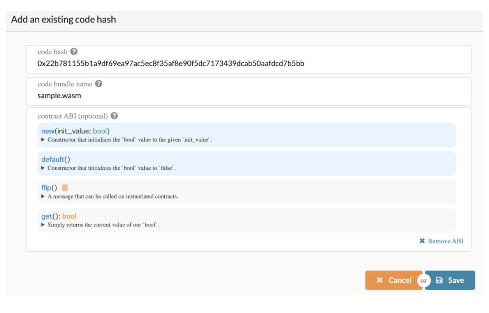

### ② コントラクトをデプロイする <a id="f6ec"></a>

Plasm ではコントラクトをアップロードしただけでは、使う事ができません。アップロードしたコントラクトをデプロイすることで初めてスマートコントラクトとしてチェーン上で動かす事ができるようになります。これは同一の処理をするコントラクトで初期値だけ変更したい時などに、同じコントラクトコードを使い回せるようにするためです。

デプロイの方法は簡単です！先程アップロードしたコントラクトの右上に _**deploy**_ と書かれたボタンがあります。これをクリックして現れたポータルから適当に値を入力し _**Deploy -&gt; Sign and Submit**_ をクリックすることでデプロイできます。


_**テストネットでコントラクトをデプロイするには約1000PLM程度必要になります。トランザクションが失敗する方は保有しているトークンの量を確認し足りない場合は Discord でトークンを貰ってください。\(追記：2020/1/1\)**_


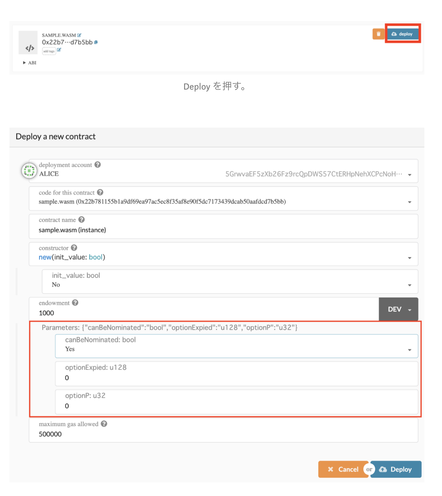

ここで、すでにSubstrate の既存の機能を使ってスマートコントラクトをアップロードした経験がある方は「おや？」と思うかもしれません。上記のポータルにある赤枠で囲われた _**Parameters**_ とは何でしょうか？

Plasm では Contract ごとに特殊なパラメータを追加で設定することができます。これは前述した別の Plasm のオリジナル機能である「**DappsRewards**」において非常に大きな役割を担います。しかしながら、Operator Trading ではこのパラメータを特に使わないので、ひとまず_**canBeNominated**_ の項目のみを _**Yes**_ に設定してアップロードしましょ

コントラクトのデプロイが完了すると、以下のようにデプロイしたコントラクトとそのオペレータが表示されます。最初のオペレータは、Deploy したアカウント\(今回は local 環境なので ALICE\)と同じになっています。

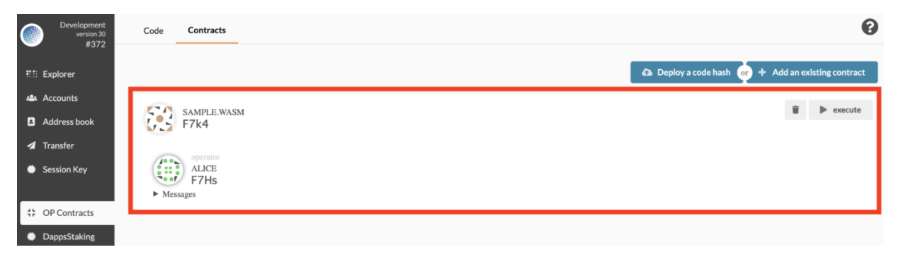

このように Plasm ではコントラクトの**所有者**という概念が存在します。そしてコントラクトの**所有者**をオペレータ\(Operator\)と呼びます。

### ③ オペレータを変更する <a id="e82a"></a>

最後にオペレータを変更してみまし。これもとても簡単です。サイドバーから _**Operator**_ という項目をクリックしてください。

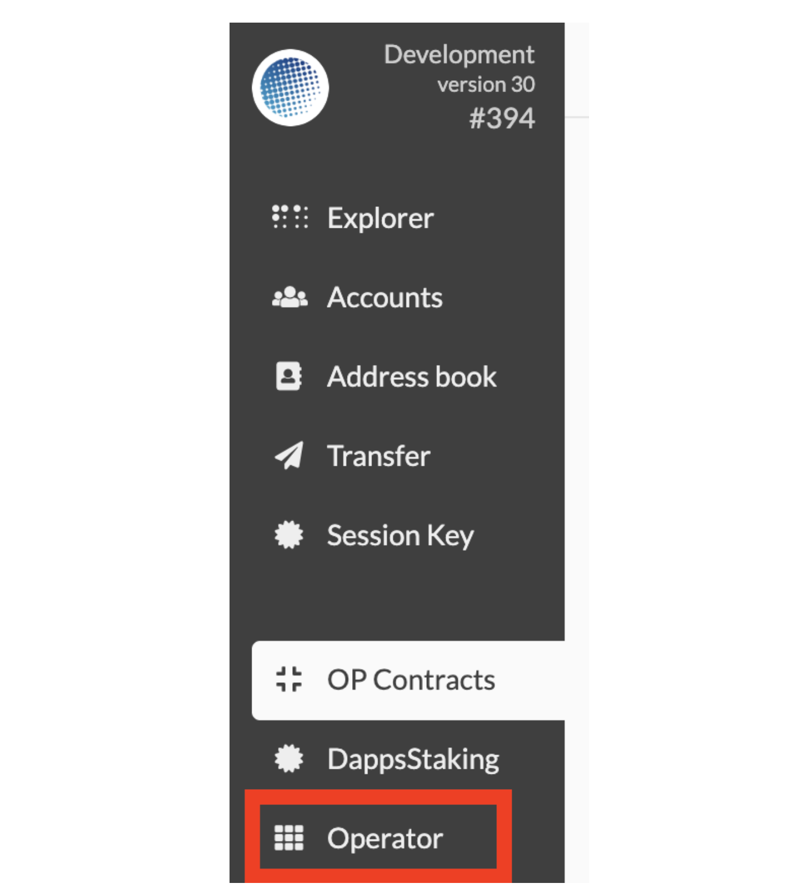

すると、以下のようなモーダルが現れます。オペレータを選択するとそのオペレータが保有してるコントラクトのリストが表示されるので、オペレータを変更したいコントラクトを選択してください。そして、新たなオペレータを選択してみましょう。今回は ALICE から BOB に SAMPLE.WASM コントラクトの所有権を移譲します。

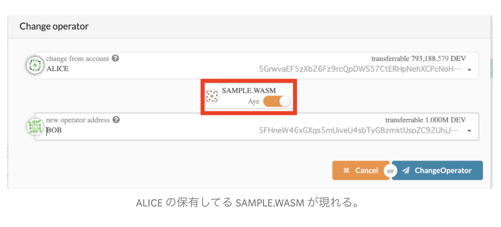

_**Change Operator -&gt; Sign and Submit**_ を押してしばらく待つと以下のようにコントラクトのオペレータが ALICE から BOB に変更されていることが確認できます。

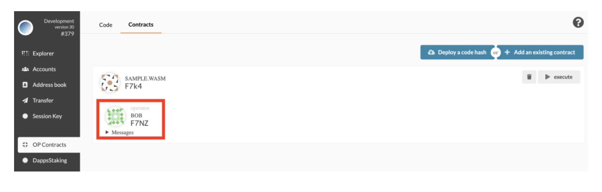

これでコントラクトを作りその所有権を受け渡すデモが終了しました。

{% embed url="https://medium.com/stake-technologies/%E9%81%8A%E3%81%BC%E3%81%86-plasm-testnet-v3-%E2%91%A0-operator-trading-64323fa2d4fd" %}

質問があれば、[Tech Chat](https://discord.gg/Cyjnrxv)の日本語チャネルでご質問ください。

