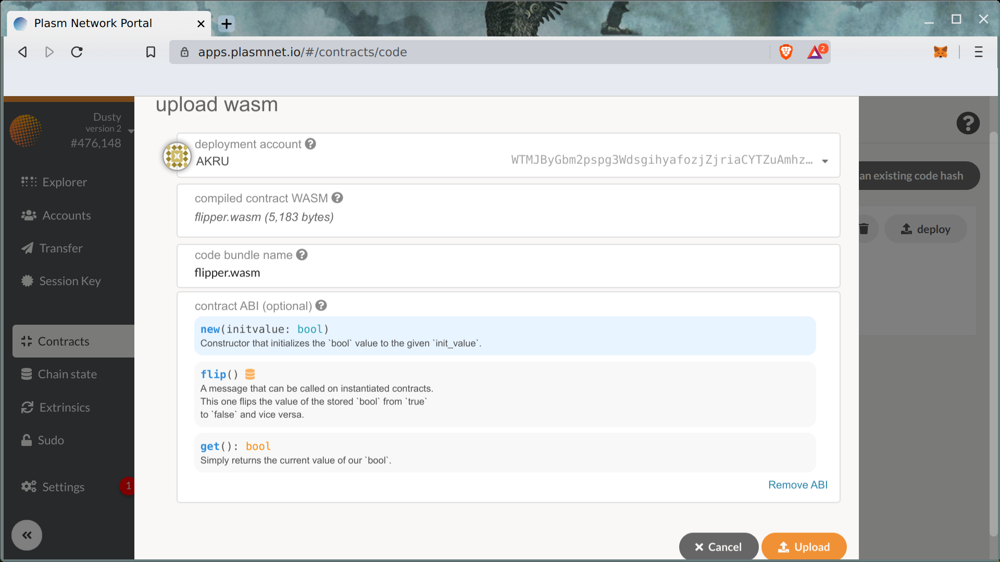
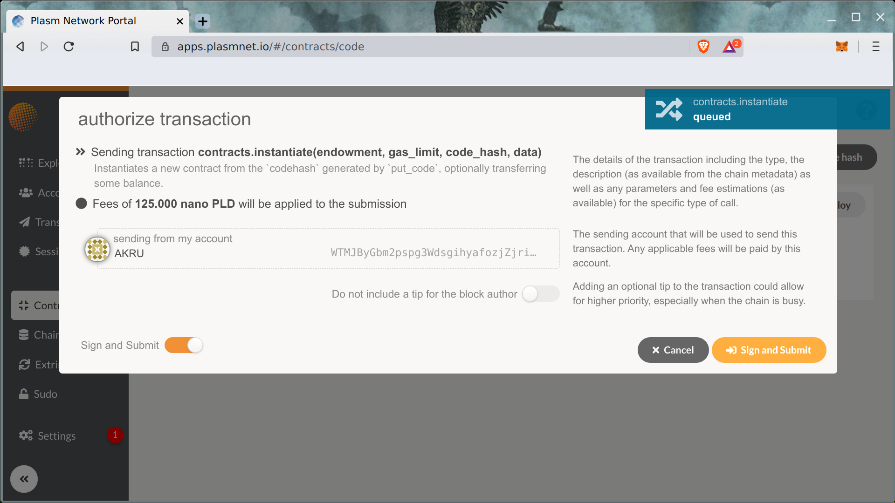
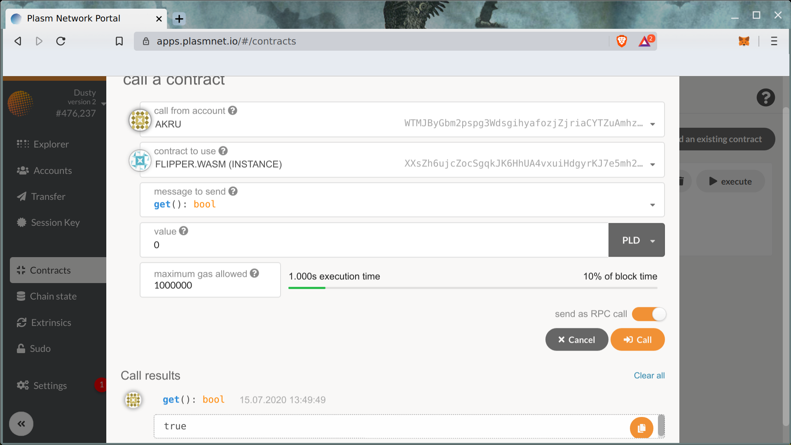
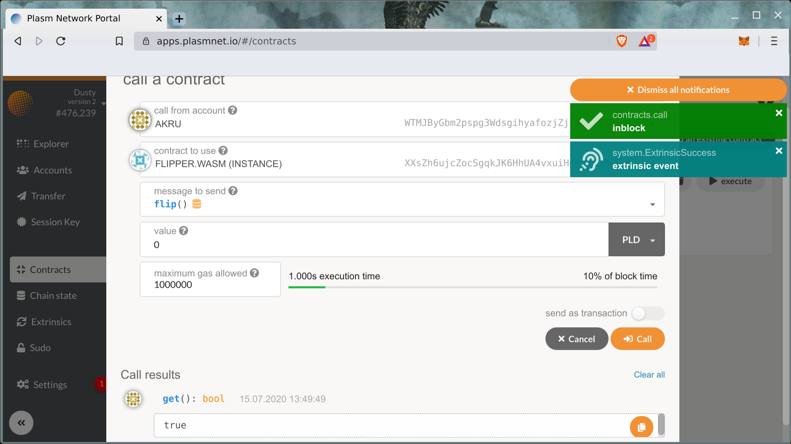

# Solidity

Plasm Networkは先述の ink!に加え、Ethereumの開発言語であるSolidityもサポートしています。Ethereumの上にスマートコントラクトを開発したことのある開発者であれば、同じコントラクトを用いてPlasm Network上にデプロイすることができます。

### インストール

このチュートリアルでは[Solang compile](https://github.com/hyperledger-labs/solang)を使用します。これはHyperledger Labによって開発されたものであり、SolidityのコントラクトをWASMベースのブロックチェーンにデプロイすることを可能にします。最初に以下のインストラクションに従ってコンパイラーをインストールしましょう。



もしくは、次のcargoコマンドを用いてインストールします。

```text
sudo apt install llvm openssl libxml2-dev
cargo install --git https://github.com/hyperledger-labs/solang --tag m8
```

 `solang` バイナリーがローカルのディレクトリーで使用可能になります。


エラーが出た場合は、[こちら](https://solang.readthedocs.io/en/latest/installing.html#installing-llvm-on-ubuntu)のディペンデンシーが全て正しくインストールできているかを確認してください。[参考記事](https://qiita.com/realtakahashi/items/cf3be58dc8bdeb814b9e)。


### コンパイル

Ethereumの開発のようにいかなるSolidityのコントラクトも書くことができます。このチュートリアルでは以下から入手可能な `flipper` コントラクトを使用します。



では、solangを使用してコンパイルしてみましょう。このコンパイルをすることによってPlasm Network上にデプロイすることができるようになります。

```text
wget https://raw.githubusercontent.com/hyperledger-labs/solang/master/examples/flipper.sol
solang flipper.sol
```

現在のディレクトリーに2つの新しいファイル、 `flipper.wasm` \(optimized WASM binary\) と `flipper.json` \(smart contract metadata\)が作成されたことを確認してください。

### デプロイ

コンパイルした `flipper.wasm` と `flipper.json` を[Plasm Portal UI](https://apps.plasmnet.io) を用いてデプロイしましょう。



次に、アップデートしたスマートコントラクトのインスタンスを作成します。



インスタンスの作成後、UI Portalを使用してスマートコントラクトとやり取りを行なうことができます。





その他のコントラクトは以下のページを参考にしてください。



質問がある方は、[Discord tech channel](https://discord.com/invite/kH3Njpr) までお問い合わせください。[  
](https://docs.plasmnet.io/workshop-and-tutorial/smart-contract/deploy-your-smart-contract-on-plasm)

