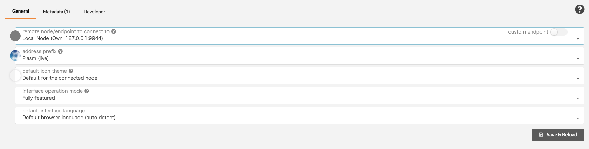

# Realtime Lockdrop

**Declaimer**: This is an experimental module. Some features don't work or work with issues. Please report problems [on GitHub](https://github.com/staketechnologies/Plasm/issues/new/choose) when you find. 

### Quick Install <a id="quick-install"></a>

1. Install dependencies according to [README](https://github.com/staketechnologies/Plasm/tree/plasm-real-time-lockdrop#building-from-source).

2. Fetch the custom lockdrop branch of plasm-node.

```text
git clone https://github.com/staketechnologies/Plasm -b plasm-real-time-lockdrop && cd Plasm
```

3. Build Plasm binary.

```text
cargo build --release
```

### Preparing for tests <a id="preparing-for-tests"></a>

1. Launch your node in your development environment:

```text
./target/release/plasm-node --dev
```

> Previous versions of db should be removed before the launch: `./target/release/plasm-node purge-chain --dev`

2. Open Plasm Portal "[Settings page](https://apps.plasmnet.io/#/settings)".

3. Choose  `Local Node` in the remote node section.

4. Check out the "Developer" tab and put the following custom types.



```text
{
  "ClaimId": "H256",
  "Lockdrop": {
    "type": "u8",
    "transaction_hash": "H256",
    "public_key": "[u8; 33]",
    "duration": "u64",
    "value": "u128"
  },
  "TickerRate": {
    "authority": "u16",
    "btc": "DollarRate",
    "eth": "DollarRate"
  },
  "DollarRate": "u128",
  "AuthorityId": "AccountId",
  "AuthorityVote": "u32",
  "ClaimVote": {
    "claim_id": "ClaimId",
    "approve": "bool",
    "authority": "u16"
  },
  "Claim": {
    "params": "Lockdrop",
    "approve": "AuthorityVote",
    "decline": "AuthorityVote",
    "amount": "u128",
    "complete": "bool"
  }
}
```

### Price Oracle

After the launch, your authority node starts to fetch and send the current USD price of BTC and ETH into your chain. By opening [explorer](https://apps.plasmnet.io/#/explorer), you can see the dollar rate extrinsics in each imported module. This dollar rate is used in Lockdrop Substrate Pallet for checking the price during the Lockdrop periods.


### Lockdrop Request <a id="lockdrop-request"></a>

We have deployed the Lockdrop smart contract on Ethereum Ropsten network just for testing purpose. You can check from [https://ropsten.etherscan.io/address/0xeed84a89675342fb04fafe06f7bb176fe35cb168](https://ropsten.etherscan.io/address/0xeed84a89675342fb04fafe06f7bb176fe35cb168)

Let's send a transaction to the lockdrop smart contract using Etherscan and Metamask!


After locking your ETH, you can make a claim on your local chain.


You can used a test data below:

```text
0x6c4364b2f5a847ffc69f787a0894191b75aa278a95020f02e4753c76119324e0
0x039360c9cbbede9ee771a55581d4a53cbcc4640953169549993a3b0e6ec7984061
2592000
100000000000000000
```


And here is the results available on chain:


