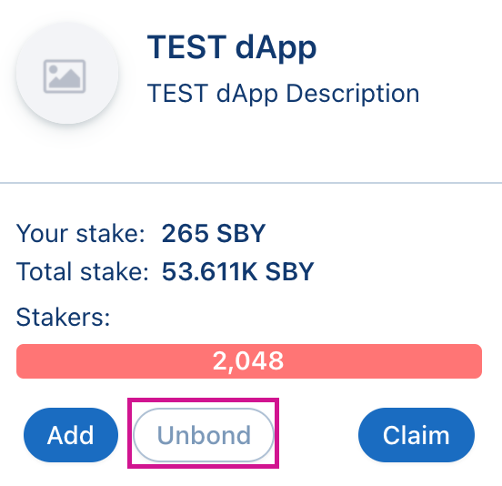
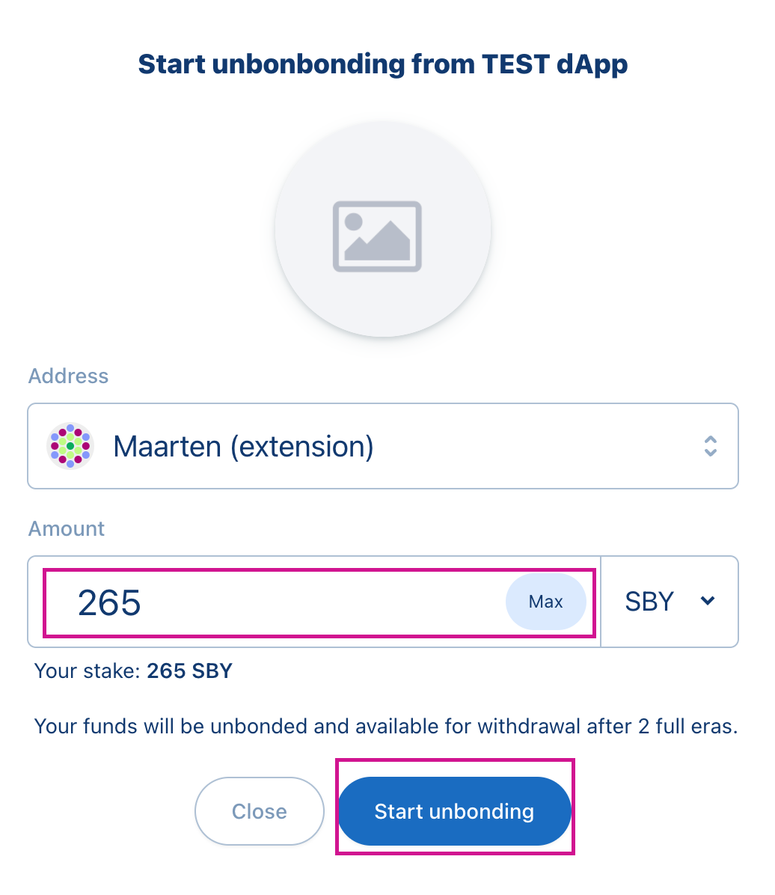

# Unbond your stake

## Overview&#x20;

Moving towards dApp Staking v2 the first new implementation is the unbonding period. In general terms, bonding is a process by which tokens are temporarily locked. Staking is one of the scenarios that require tokens to be bonded. Unbonding is the action of telling the network that you want to unlock these tokens. After the unbonding time, which is 5 days for Shiden, you can withdraw the tokens, and they become a transferable balance.



**Unbonding period**: 5 days



## Problem&#x20;

Currently, users can unstake all their funds immediately. There is no unbonding period and theoretically, users could jump between apps as much as they want during a day. There's no real weight to making the decision except for paying the transaction fee.&#x20;

Another problem is that at the moment users are rewarded for eras even though they haven't fully participated in them. Unbonding period prevents users from immediately unstaking everything in the next block.

## **How to unbond**

### **Step 1**

If you have staked on one of the dApps, you can now click on **Unbond** to make your tokens transferable.

### Step 2

Select the amount you want to **Unbond**, click on **Max** to unbond your complete stake. To sign your transaction click on **Start Unbonding**.

### Step 3

Check your **Chunks**

What's a Chunk? A chunk is the number of different ERA's you want to unbond your tokens. Chunks do not equal the amount of unbonding on dApps you requested but the amount of different ERA's you unbonded your tokens.

### Step 4

Withdraw your 'Chunks'. When your unbond period is over, you need to withdraw your funds by clicking on the withdraw button. Sign the transaction and your tokens will be made transferrable in your wallet.

