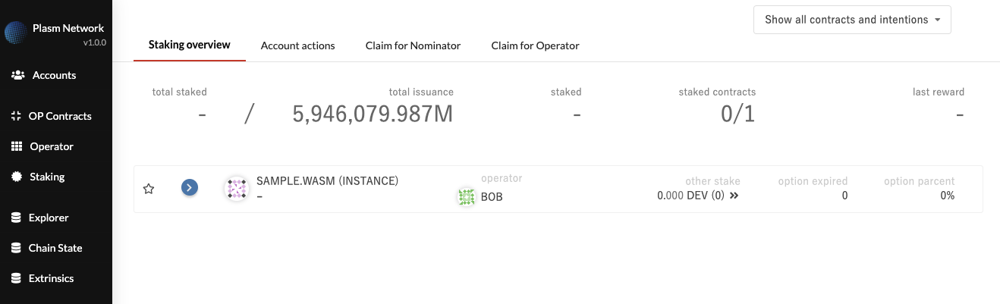
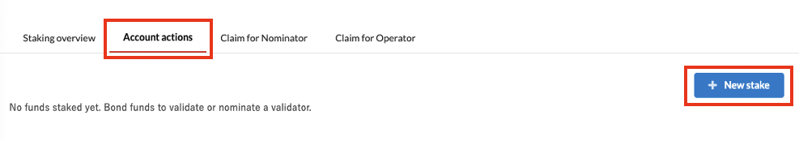
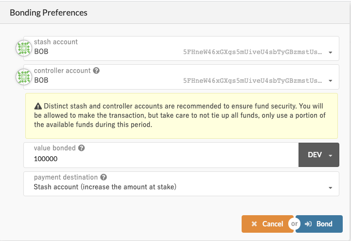
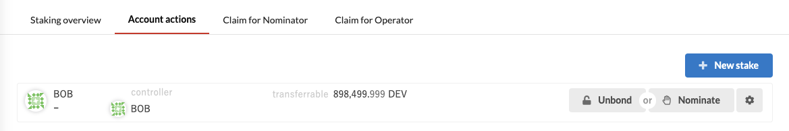
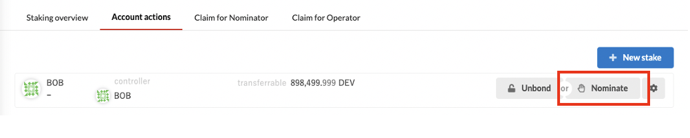
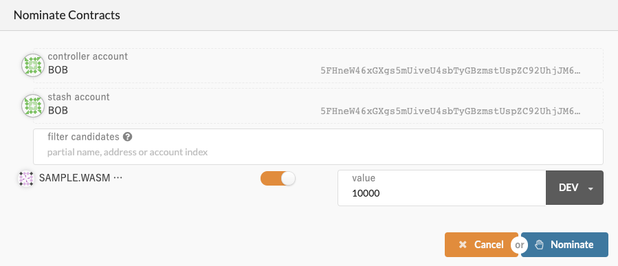
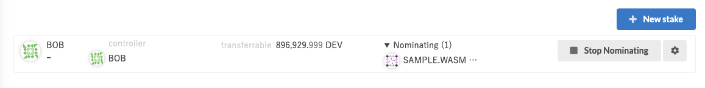
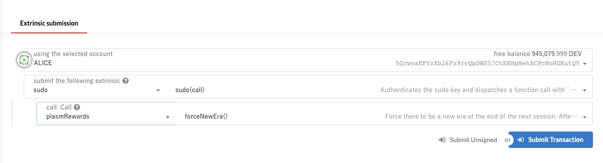
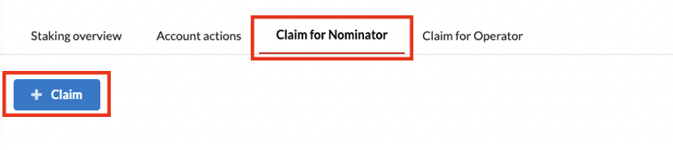
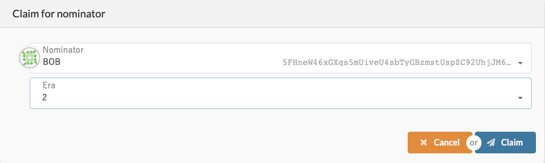

# dApp Reward 🍦

## Preparation

Like in the previous tutorial, deploy a smart contract. In the sidebar press dAppStaking; it should show like the following. 



## The concept of dApp Rewards

dApp Rewards Work Flow:

1. Select a smart contract to stake \(nominate\)   
2. The nominator and operator will receive a reward proportional to the amount that has been staked.

Try it out:

### ① Nominate a Smart Contract:

Click **dAppStaking -&gt; Account** **actions**. If you have not previously staked anything, your screen should look similar to below. Press + New stake button in the top right corner.

The following screen should appear that contains four input parameters as follows:

* **Stash account**: Specifies which account tokens to use
* **Controller account**: Specifies the account that will be controlling the nomination status. For security reasons, it is recommended to have different accounts for the Stash account and Controller account, but for this demo, Bob’s account is used for both.
* **Value bonded**: Specifies the amount of token used for staking
* **Payment destination**: Specifies the recipient of the Rewards

Enter the inputs and press Bonding -&gt; sign and Submit to issue a transaction. The following screen should appear, with a new card and the same value that was given in the Bonding Preferences menu.

Tokens have been successfully locked, but this is not enough to nominated someone. Press the Nominate button in the right side of the card to officially nominate.

Choose the Smart Contract that will be nominated. Select the demo contract named “SAMPLE.WASM” uploaded from the last article! You can only choose a Smart Contract that has the canBeNominate parameter as Yes.

Press Nominate -&gt; Sign and Submit to issue a transaction. After a few moments, as we can see in the following image:

Now we have finished nominating a Smart Contract!

### ② Let’s **receive some Dapps Rewards**!

If you nominate a smart contract on the era \(E\), you can receive rewards after the next era \(E + 1\) is finished \(The term of an era is one day and the term of a session is ten minutes at Dusty\). Actually, we need to wait until the era \(E + 2\), but we can fast-forward the era by using ForceNewEra on your local node. First, go to the sidebar and choose Extrinsics. Then with your root user \(Alice in this case\) to issue the following transaction two times. Sudo\(forceNewEra\(\)\).

Now, you can claim rewards with "Claim for Nominator" tab and "Claim for Operator" tab. Click "Claim for Nominator" tab on Staking page and click "Claim" button. Then, you can see the following modal. 

To claim rewards for nominators, select nominator address and latest era, and push "Claim" button. You can use "Claim for Operator" tab for the same way.

### Summary 

* We have played to nominate a smart contract!
* In Plasm, there is a system for incentivizing \(rewarding\) the Smart Contract owner!
* The amount being incentivized will be different from the users’ nomination!

New functionality of Plasm has been introduced through this and the previous article. As the Plasm Network is improved upon you will find updates to the documentation as well.

Any questions? Feel free  to ask us on [Discord Tech Channel](https://discord.gg/Z3nC9U4).

