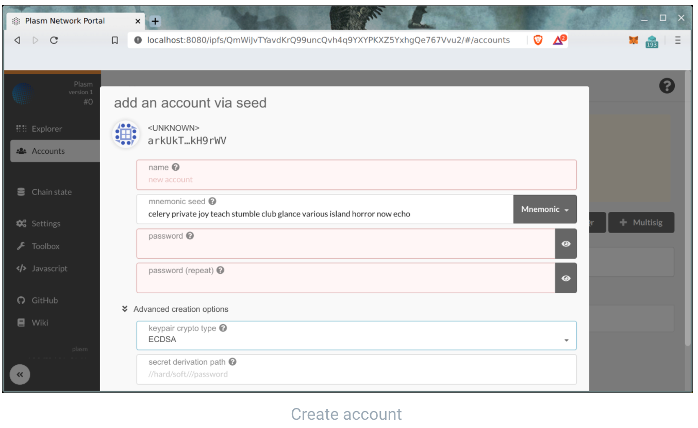
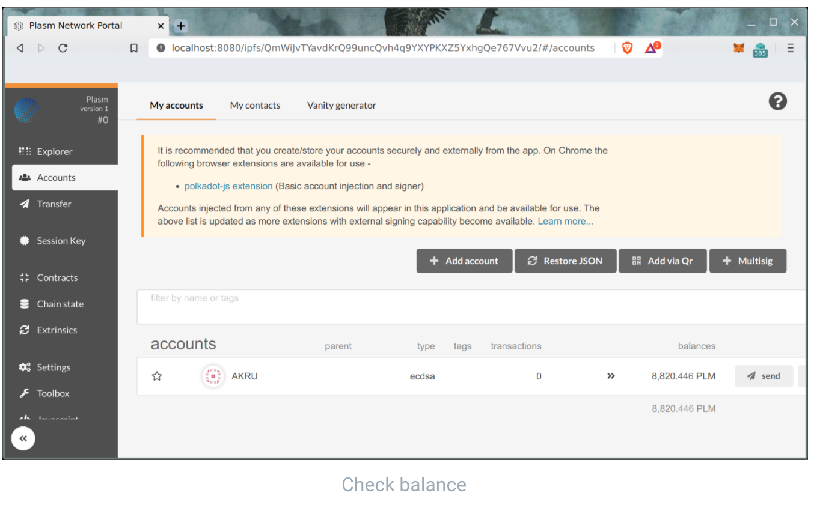

# Importing Ethereum Seed

This is a guide for importing your ECDSA key \(notably Ethereum wallets\) into [Plasm Network ](https://www.plasmnet.io/)to use it within the network. Any Ethereum private keys can be used within [Plasm Network](https://www.plasmnet.io/), however, this guide will be most helpful for Etherum lockdrop participants to access their tokens.

**Disclaimer:** Please be cautious when handling Ethereum Private key, as it may potentially compromise your Ethereum wallet when it is leaked.

## Plasm Network Portal

The first step for importing your Ethereum wallet to [Plasm Network](https://www.plasmnet.io/) is to access the Plasm Network Portal. You can use the following IPFS link.

* ​[IPFS Link](https://ipfs.io/ipfs/QmZQBwe4DeW6aruayemGXA5ysexsqJVRzF6YHHeNPzKi7d)​

> IPFS as content-oriented distributed storage is a most safe place for sensitive code. Any changes in code will change URI and makes this code unavailable.

For better performance, we recommend to use local installed [IPFS node](https://github.com/ipfs-shipyard/ipfs-desktop). And IPFS Companion extension for your browser:

* Chrome: [https://chrome.google.com/webstore/detail/ipfs-companion/nibjojkomfdiaoajekhjakgkdhaomnch](https://chrome.google.com/webstore/detail/ipfs-companion/nibjojkomfdiaoajekhjakgkdhaomnch)​
* FireFox: [https://addons.mozilla.org/ru/firefox/addon/ipfs-companion/](https://addons.mozilla.org/ru/firefox/addon/ipfs-companion/)​

You should be able to see the following page.

## Importing Ethereum Seed Key

Now prepare your Ethereum private key that you wish to import to [Plasm Network](https://www.plasmnet.io/). For lockdrop participants, it _must_ be the private key of a wallet that made the lockdrop transaction. It can either be a hex-string, or mnemonic.

> How to export your keys from [Metamask guide](https://metamask.zendesk.com/hc/en-us/articles/360015289632-How-to-Export-an-Account-Private-Key).

When you have finished exporting the keys from your Ethereum wallet, you are ready to import them to Plasm Network. Go to **Accounts** -&gt; **Add account** from the side tab.

Please choose **ECDSA** type of keypair and hex-string for seed \(if you export Metamask key by [guide](https://metamask.zendesk.com/hc/en-us/articles/360015289632-How-to-Export-an-Account-Private-Key)\).

Fill all of the fields including password. And please don't forget to add 0x in the "seed" section.

If everything went well, you should be able to see a new wallet with the type of ECDSA being imported. Additionally, for lockdrop participants, you should see that the imported address contains the PLM that you've received from the lockdrop.

Any questions? Feel free to ask us on [Discord Tech Channel](https://discord.gg/Z3nC9U4).

