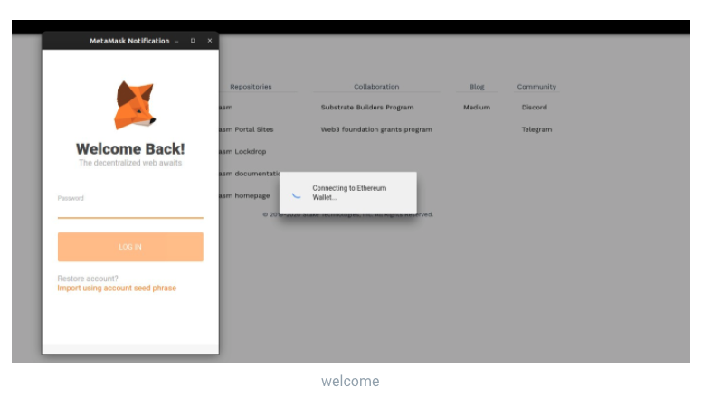
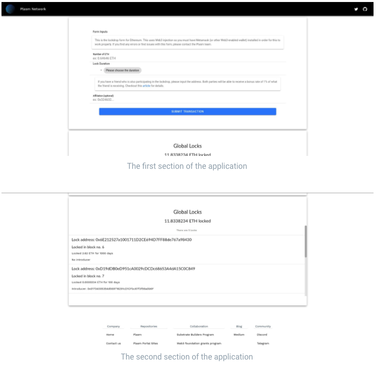
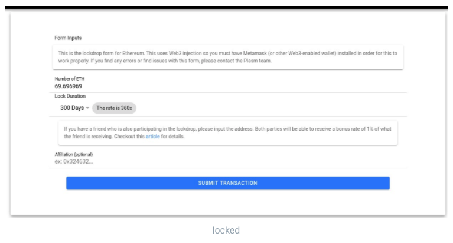
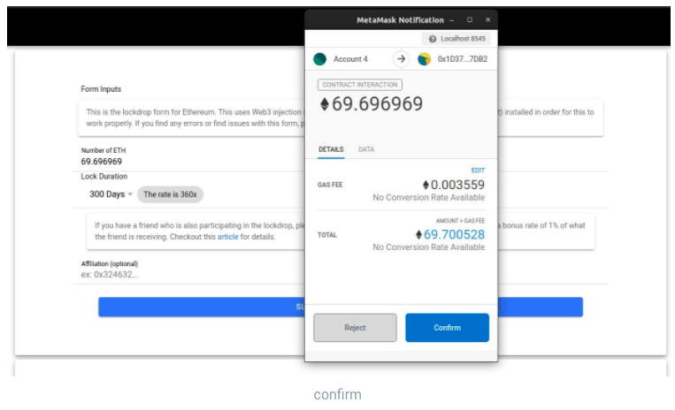
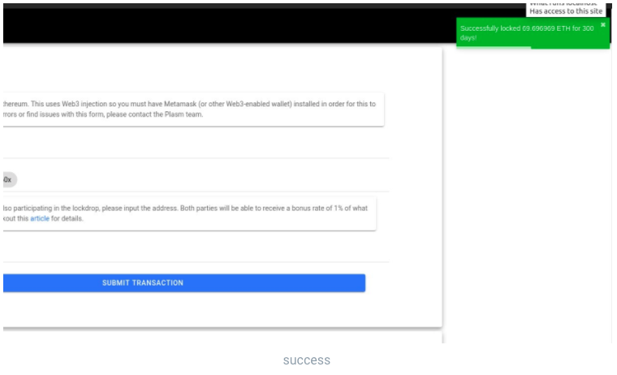
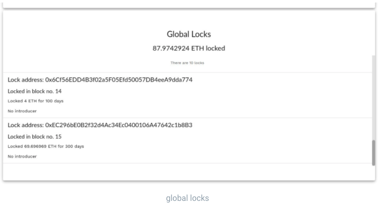
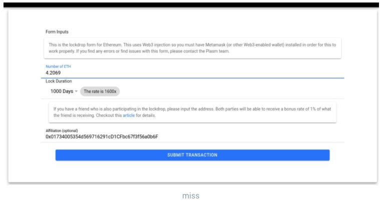
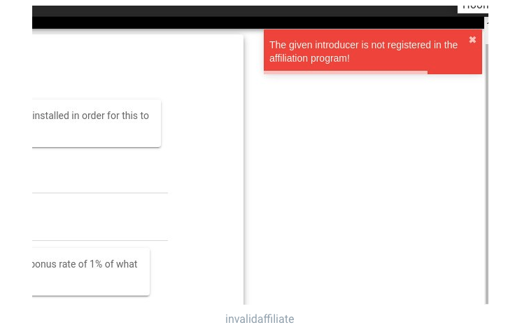
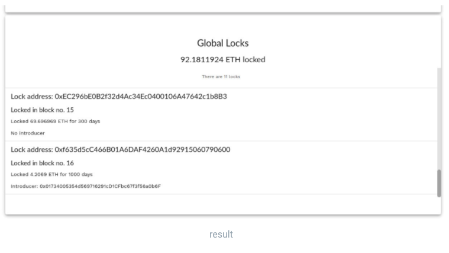
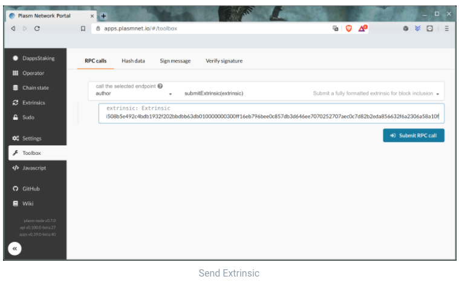

# Lockdrop Tutorial 🔒

## **Como participar do Lockdrop**

Primeiro, verifique se você tem uma extensão do navegador da carteira Web3 \(ou seja, MetaMask\) instalada no seu navegador. Sem isso, não podemos nos comunicar com o contrato por meios normais. Em seguida, acesse [https://lockdrop.plasmnet.io/](https://lockdrop.plasmnet.io/) para iniciar o aplicativo. A demonstração real abaixo é feita por meio de uma cadeia local em um servidor local, mas a da URL acima fornecerá uma versão de trabalho com o contrato implantado no Ropsten testnet. O contrato líquido principal ainda não foi implantado.




Se você instalou corretamente a extensão da sua carteira, deverá receber a seguinte tela de carregamento e um prompt da sua carteira. Certifique-se de permitir a conexão.  




A página de bloqueio será dividida em duas seções; o formulário de entrada e os bloqueios globais. O formulário é simples. Você só precisa digitar o valor que deseja bloquear no ETH, a duração que deseja bloquear \(o participante pode escolher entre 30, 100, 300 e 1000 dias\) e o endereço público do seu apresentador. A última entrada requer cuidados especiais, pois o formulário aceita apenas endereços públicos que fazem parte do programa de afiliação. Se você deixar esta parte em branco, o introdutor assumirá o padrão `0x000000000000000000000000000000000000000000000000`. Além disso, o campo de entrada do endereço do introdutor rejeitará quaisquer hashes de endereço inválidos, portanto, lembre-se disso. A seção de bloqueio global ouvirá todos os eventos bloqueados e os exibirá como uma lista, fornecendo aos participantes feedback imediato para cada bloqueio.  




Agora vamos tentar bloquear alguns tokens! Para esse bloqueio, não fornecerei nenhum introdutor ao formulário e bloqueio apenas uma certa quantia por 300 dias.  




Você pode ver que a carteira está solicitando sua permissão para interagir com o contrato. Clique em confirmar para fazer a transação.  




Dado que tudo correu bem, você pode ver uma torrada verde aparecendo anunciando que foi bloqueada com sucesso.



Você também pode ver que bloqueamos nossos tokens no blockchain com o endereço do bloqueio, olhando para o rastreador global de bloqueios. Você também pode perceber que, como não fornecemos nenhum introdutor, a lista mostra que não temos nenhum.



Desta vez, vamos tentar bloquear um token com o endereço de um apresentador. O endereço acima é um endereço afiliado simulado, para que não funcione exatamente.  





Além disso, se você tentar inserir um endereço que não seja afiliado ao programa ou seu próprio endereço público, o cliente não aceitará a entrada.



Agora podemos começar a trancar e, como você pode ver, nosso introdutor é exibido corretamente na lista.

## **Como reivindicar o PLM de bloqueio de gênese**

O utilitário de manipulação de chave privada é fornecido no repositório Plasm e pode ser instalado com o seguinte comando.

```text
cargo install --force --git https://github.com/staketechnologies/Plasm --tag v0.7.1 subkey
```

Depois de instalar o utilitário de subkey, tente usá-lo. Neste artigo, estamos principalmente interessados no comando de transferência, que possui as seguintes opções.

```bash
$ subkey transfer --help
subkey-transfer 
Author and sign a Node pallet_balances::Transfer transaction with a given (secret) keyUSAGE:
    subkey transfer <from> <to> <amount> <index> --genesis <genesis>FLAGS:
    -h, --help       Prints help information
    -V, --version    Prints version informationOPTIONS:
    -g, --genesis [genesis]    The genesis hash or a recognised chain identifier (plasm, dusty).ARGS:
    <from>      The signing secret key URI.
    <to>        The destination account public key URI.
    <amount>    The number of units to transfer.
    <index>     The signing account's transaction index.
```

### **Criando um extrinsic**

Usando o comando transfer, é possível criar RAW Extrinsics a partir de uma conta Ethereum válida, que pode ser usada para o nó RPC ou a interface do usuário. O principal benefício disso é que podemos criar extrínsecos offline, sem precisar fornecer nossa chave privada à interface do usuário do Plasm ou a qualquer outro nó.

Você pode fazer isso com o seguinte comando.

```text
subkey -k transfer 0x2F9C34E12950FC8EC9F73EBC9337CBC6EA29556EB462E8AD30B981784B9F907E 5Cakru1BpXPiezeD2LRZh3pJamHcbX9yZ13KLBxuqdTpgnYF 42000000 0
```

Antes de irmos aos resultados, permita-me dissecar esta longa sequência de comandos.

* The first hex that looks like this: `0x2F9C34E12950FC8EC9F73EBC9337CBC6EA29556EB462E8AD30B981784B9F907E` which is the lockdrop Ethereum private key.
* The next line that looks like `5Cakru1BpXPiezeD2LRZh3pJamHcbX9yZ13KLBxuqdTpgnYF` is the destination Plasm Network account.
* `42000000` is the value of tokens \(1 PLM = 10¹⁵\), this value should be followed by a `0` to show that this is the first transaction


Para o comando de Dusty network, o comando deve ser estendido por -g sentença empoeirada.


Se você copiar e colar o comando longo, deverá obter os seguintes resultados impressos no seu terminal.

```text
Using a genesis hash of ac0090073a92ae1a68c049e84d5b3671d9156833f18f30031c1066eb2f1278a6
0x310284ffe28153d70c05ebce1758dfd58356b05ff6bcb90fae903e27b00baa9bdfb9fd2f0210c5ecce7198b3adf13dece166a277890c189c05e5e061240cfacd8b9e2e9b497be46283d20ae801c784e1ec962a64644508b5e492c4bdb1932f202bbdbb63db010000000300ff16eb796bee0c857db3d646ee7070252707aec0c7d82b2eda856632f6a2306a58a10f
```

Você notará que a primeira linha de hash é familiar do que vimos antes. É o hash da gênese! Mas a parte importante é a segunda linha, que é o extrínseco bruto codificado em hexadecimal. Precisamos disso daqui a pouco. Copie-o.

### **Enviar extrinsic**

Para facilitar as coisas, use a [UI Toolbox](https://apps.plasmnet.io/#/toolbox) oficial fornecida pela Stake Technologies.

O link acima deve redirecioná-lo diretamente para a página da caixa de ferramentas mostrada na imagem a seguir.



Agora apenas copiamos a sequência hexadecimal para o campo extrínseco e pressionamos o botão Submit\(Enviar\) chamada RPC. A transação de transferência será enviada imediatamente. Você pode verificar os resultados na página de [saldos da conta.](https://apps.plasmnet.io/#/accounts)

## **Conclusão**

Analisamos como o lockdrop da Plasm Network funcionará e como usar o aplicativo de lockdrop. Dado que você tem tokens suficientes, é bastante simples de usar. Com isso, você poderá participar do cenário de bloqueio e colocar suas mãos em alguns novos PLMs!

Alguma pergunta? Não hesite em perguntar-nos no [Discord Tech Channel.](https://discord.gg/Z3nC9U4)

