# Operator Trading

## Preparation

To follow this demo on the testnet, you will need some tokens. To obtain some, please join our [Discord server](https://discord.gg/wUcQt3R) and go to **\#faucet**. If you just want to try it without any tokens, you can use the Local Developer Node as well.


The Local Node can be easily set up by using the docker image for the Plasm node, which can be done with the following commands.


```text
$ docker pull staketechnologies/plasm-node:dApps-reward
$ docker run -p 9944:9944 staketechnologies/plasm-node:dapps-reward --dev --ws-external
```

After that, go to [https://local.plasmnet.io/](https://local.plasmnet.io). It connects to your local node.

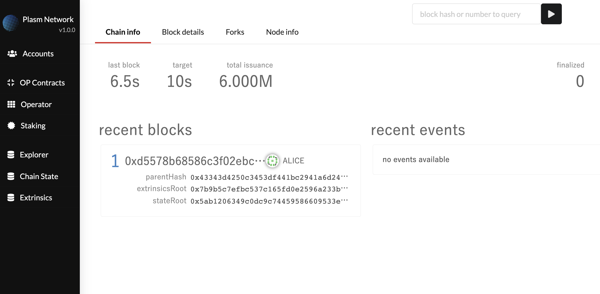

For those who want to run the node using another method, please refer to our [Readme](https://github.com/staketechnologies/Plasm). For questions and comments, please join our [Discord](https://discord.gg/Auas9qj), we will be happy to be in touch with you!

## Let’s use the Operator Trading!!

To get started, please go to [https://local.plasmnet.io/](https://local.plasmnet.io/).

### ① Upload Contract

First, upload a contract by clicking OP Contracts \(short for Operated Contracts\) from the sidebar, and click Upload WASM.

#### **Uploading the Contract by ourselves**

When there are no Contracts uploaded, the OP Contracts page will look like the following image.

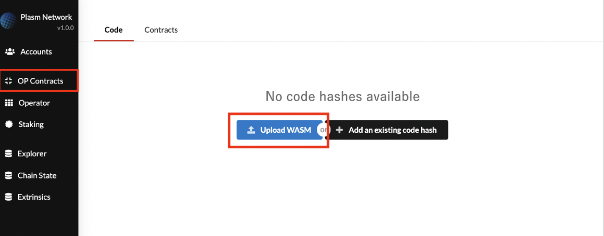

When you click the **Upload WASM** button from the page, the following modal will appear on your screen.

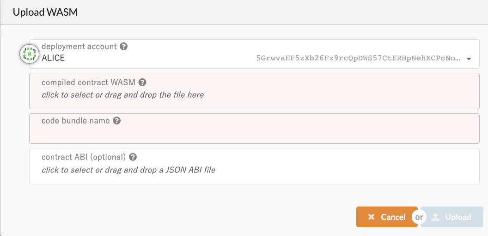

This is where we provide the WASM file and the ABI JSON that was compiled from ink! Contract. You can always create your own, but I’ve prepared a sample Smart Contract using ink-playground.

## **Download the sample contract**

First, visit [https://ink-playground.com](https://ink-playground.com/), you’ll see a pre-coded Contract in the on-screen editor. Press **COMPILE CODE** to compile the code.

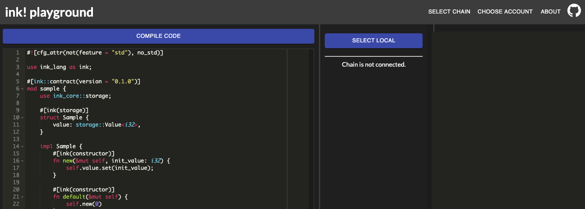

Wait for a few seconds and you’ll see the following message appear on the panel in the right-side. You can download the WASM file and the METADATA file by clicking the button of the same name. The default downloaded file names will be “sample.wasm” and “metadata.json”.

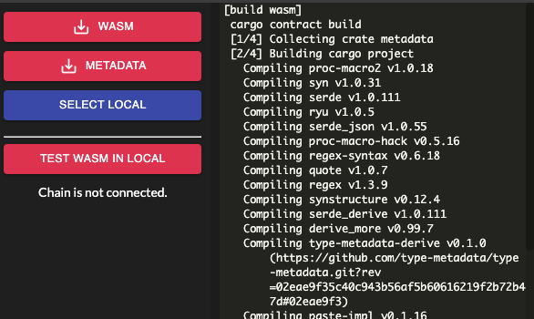

Go back to the Upload WASM modal. Next, upload the “sample.wasm” to compiled contract WASM panel, and “metadata.json” to contract ABI panel. Once finished, the following parameter will be displayed.

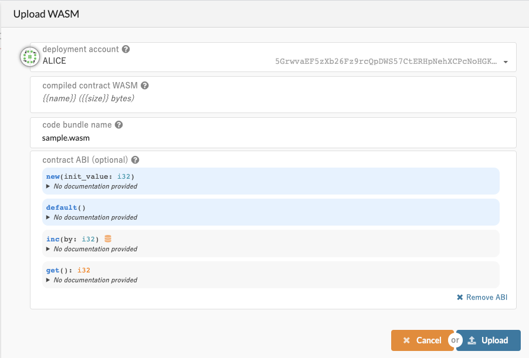

After that, **Upload -&gt; Sign and Submit**. Now you should be able to see the Contract that we’ve uploaded.

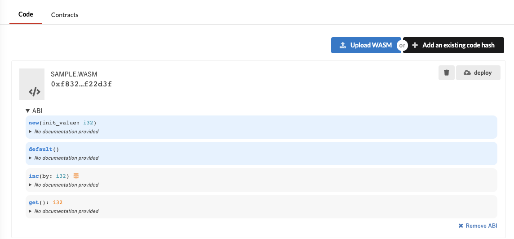

You have successfully uploaded the smart contract!

### **① Reading an existing contract**

If you’re using the Plasm Testnet v3 instead of a local node, you can make your life easier by choosing OpContracts -&gt; Add an existing code hash and copy the following hash on to the code hash panel.

```text
0x22b781155b1a9df69ea97ac5ec8f35af8e90f5dc7173439dcab50aafdcd7b5bb
```

After that, you just have to provide the “metadata.json” to the contract ABI panel to read the existing smart contract in the blockchain.


### ② Deploy the contract

In Plasm, you can’t just use the Contract by uploading it. It will only function as a proper Smart Contract once deployed on the chain. This is to increase the re-usability of the Smart Contract. Deploying the Contract is very simple. All you need to do is click the deploy button that can be found in the upper-right hand corner and fill in the values required in the preceding Deploy a new contract portal and click Deploy -&gt; Sign and Submit.

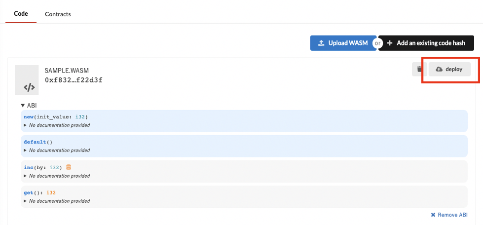

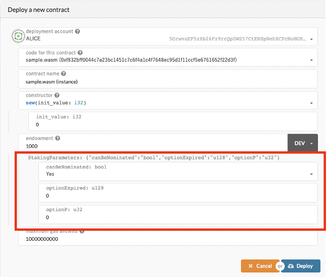

During this step, people who have uploaded a smart contract in a different Substrate-based blockchain might have noticed something different in the contract deploy portal. That is the Parameters input box, highlighted in red in the above picture. In Plasm, you can set a special parameter for every contract. This is important for the aforementioned special feature for Plasm; the dAppsRewards. But this is beyond the scope of today’s article so let’s just provide the value Yes to canBeNominated parameter and upload it. Who knows, something good might happen😉. After we finish deploying the Contract, we can see the deployed contract and the operator like the following image. The first operator is the account that deployed the Contract \(the screenshot is from a local node hence why the operator is named Alice\).


In Plasm there is a concept of ownership amongst Smart Contracts, and we call it the Operator.

### ③ Change an operator

First, click the Operator tab on the left side.

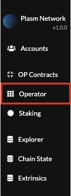

Doing that will display the following modal. Choosing an Operator from here will display a list of all the contracts that the account owns, you’ll have to choose which contract you wish to change ownership of. After that, we choose the new Operator who will have ownership of the selected Contract. For this example, ALICE will transfer BOB the ownership for SAMPLE.WASM contract.


Press Change Operator -&gt; Sign and Submit, after a few moments you can see from the following image that the Operator of the Contract has changed from ALICE to BOB.

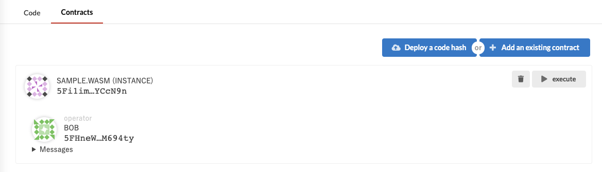

This concludes the demo for creating a Smart Contract and transferring ownership from one operator to another.

### Summary <a id="summary"></a>

* How to use the Operator Trading function
* How Plasm has a concept of ownerships in Smart Contracts
* Transfer the ownership of the Contract according to the Operator

You have explored the concept of contract ownership and the transfer of ownership, but why is it important and why should anyone care about it? The answer is simple; the ownership of the Smart Contract determines who receives the profit from the dApps Rewards. The next question would be “so how does this dApps Rewards work?” That will be discussed in the next article by going through some demos.

Any questions? Feel free to ask us on [Discord Tech Channel](https://discord.gg/Z3nC9U4).

