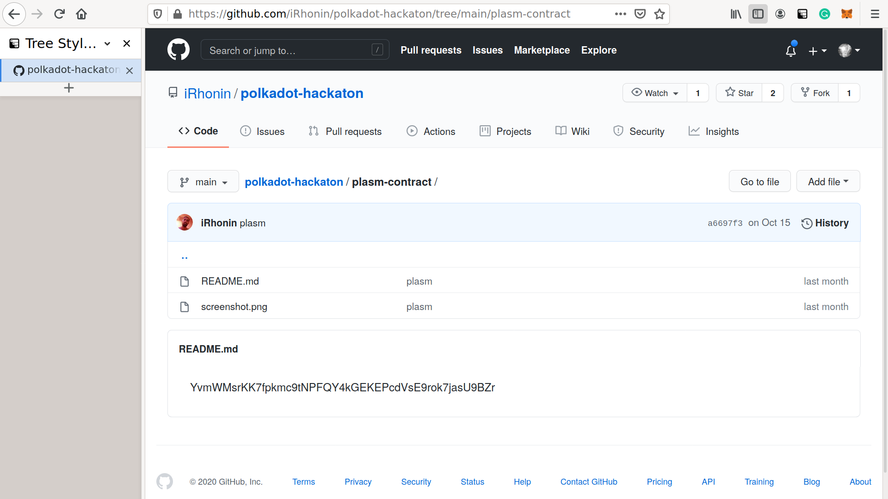
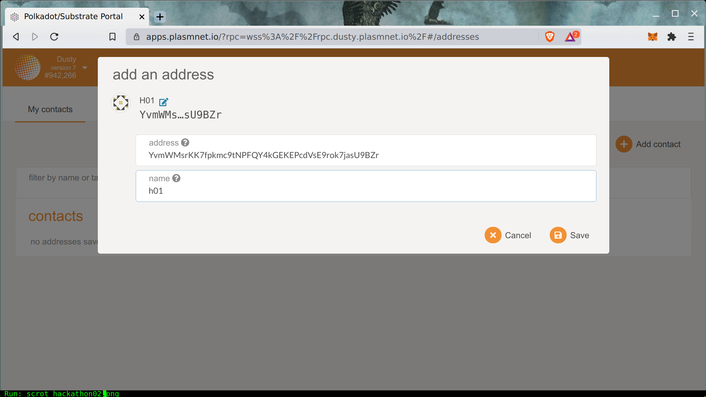
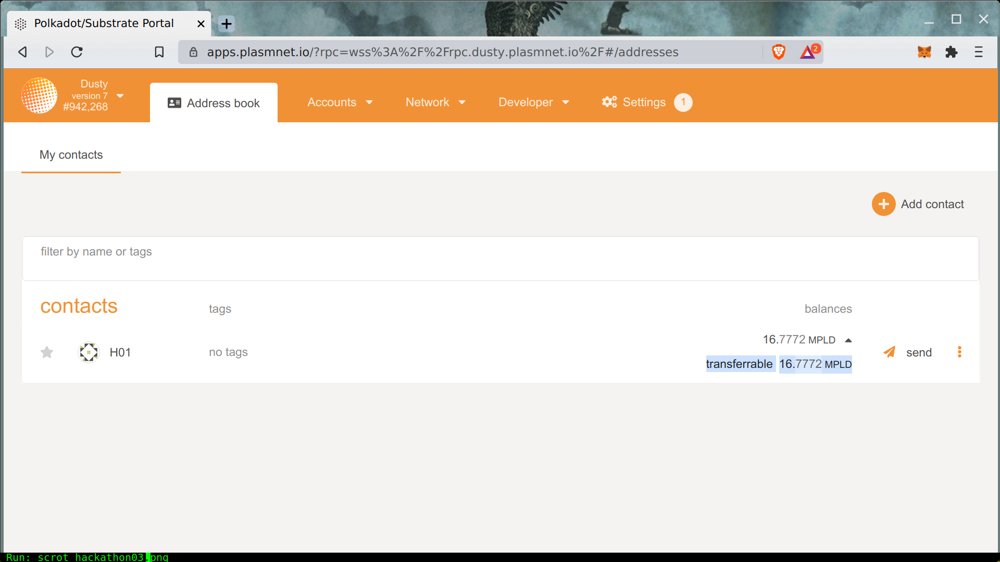
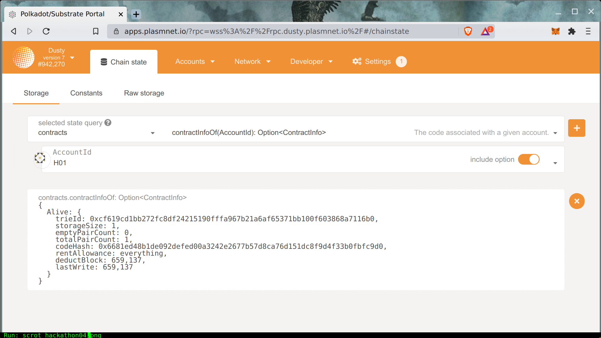

# Check Smart Contract

The first step is to extract the correct Plasm address of a deployed contract. The correct contract address looks like the following.

The address should be alphabetical and correctly imported into [Address Book](https://apps.plasmnet.io/#/addresses). 


Please connect to Dusty or Plasm's portal


If you can see a positive balance, this means that your contract was successfully deployed. 

The second step is to check whether the deployed contract is really a smart contract or not.

For this purpose, let's use a smart contract pallet like below.

Call `contractInfoOf` and it shows a lot of information about the deployed smart contract like a codeHash, deployed block, etc. If this information is not empty then the given address is a really smart contract deployed on Plasm or Dusty.

