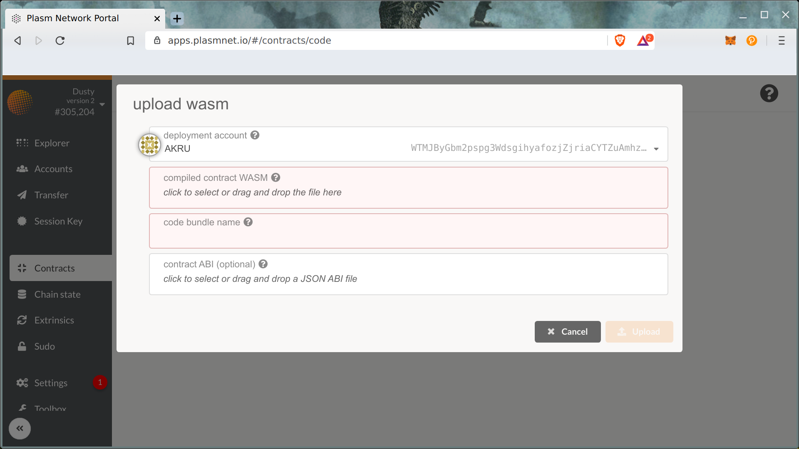
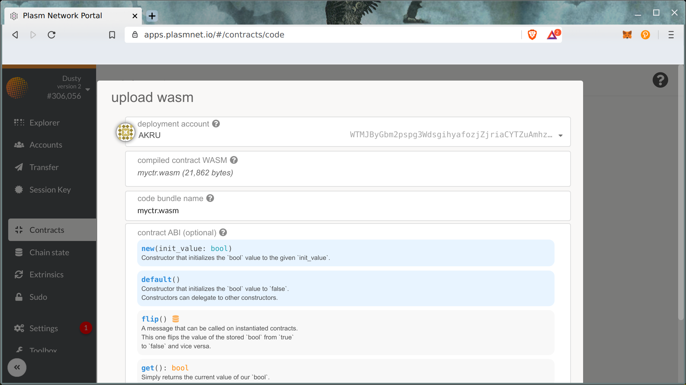
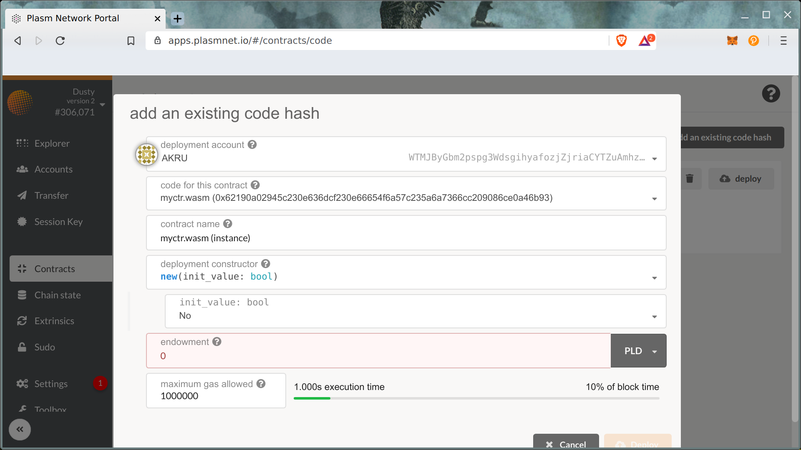
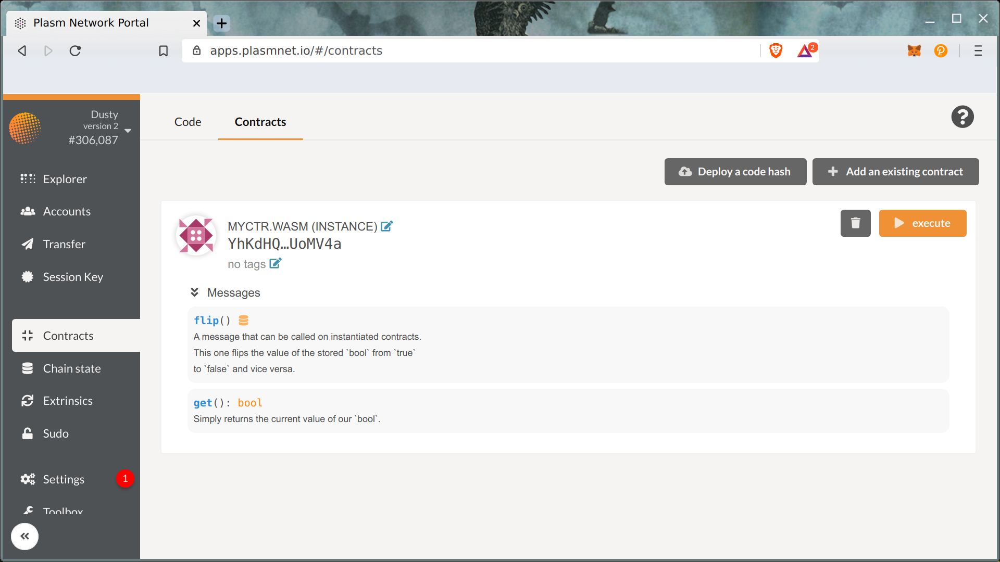

# Deploy Your Smart Contract  on Plasm

Before deploying your smart contract on the mainnet, you are recommended to deploy the contract on Dusty Network. 

### Dusty Network

Let's open Plasm Network Portal UI.



Using Dusty network on **Contracts** tab click Code -&gt; Upload WASM.

Metadata and WASM code should be filled out the form.

Uploading the code takes around 180 PLD. Example transaction below.



Congradulations with uploading on chain your first smart contract! Let's create instance of your code using **Deploy** button.

Deploy transaction fee is around 1 PLD. As result you can see instance of your smart contract.

Contract interaction will be explained in next chapter.

