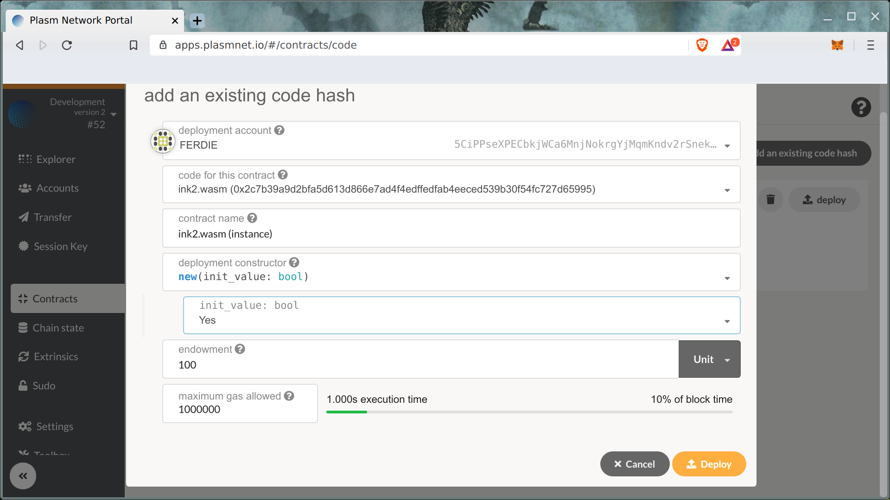

# Deploy Your Smart Contract  on Plasm

Before deploying your smart contract on the Plasm Mainnet, you are recommended to deploy the contract on you local Development chain, and after that on the [Dusty Network](https://medium.com/stake-technologies/the-dusty-plasm-93df289b3a5).

### Development Network

Try on you smart contract on local chain looks like a good idea. Let's open Plasm Network Portal UI.



The first, select **Local Node** in top left chain selection menu.

Click **Contracts** tab and choose **Code** -&gt; **Upload WASM**.

Metadata and WASM code should be filled out the form.

Uploading the code takes around 220 Unit.

Congratulations! You uploading your first L1 Smart contract! Let's create instance of your code using **Deploy** button.

Deploy transaction fee is around 1.6 unit. As result you can see instance of your smart contract.

Contract interaction will be explained in next chapter.

