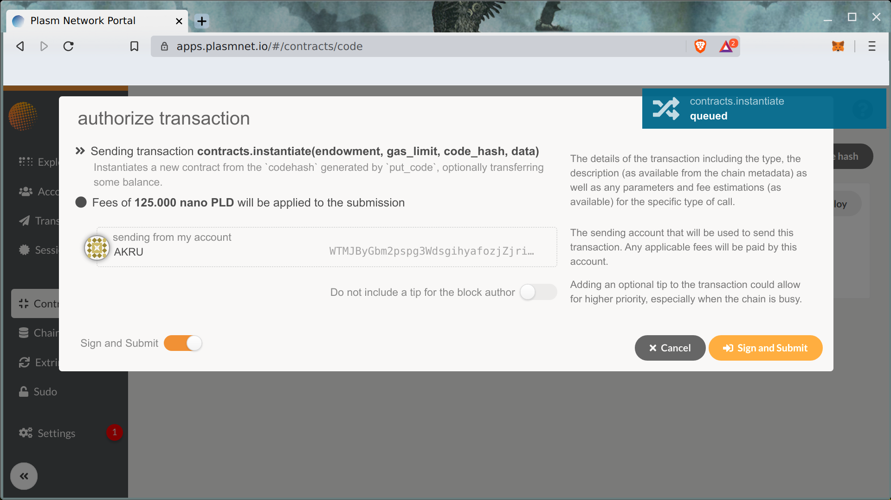

# Solidity smart contracts

## Install

In this tutorial the [Solang compiler](https://github.com/hyperledger-labs/solang) will be used. Solang is Hyperledger Labs developed compiler for Solidity language. Install compiler using original instruction below.



Or using Cargo command:

```text
sudo apt install llvm openssl libxml2-dev
cargo install --git https://github.com/hyperledger-labs/solang --tag m8
```

The `solang` binary should be available in your environment.

## Compile

The Solidity written analog of `flipper` contract source code available below.



Let's compile it using `substrate` target that makes it compatible with Plasm Network smart contracts.

```text
wget https://raw.githubusercontent.com/hyperledger-labs/solang/master/examples/flipper.sol
solang flipper.sol
```

As result in your current directory should be available two files: `flipper.wasm` \(optimized WASM binary\) and `flipper.json` \(smart contract metadata\).

## Deploy

Let's deploy compiled `flipper.wasm` and `flipper.json` using standard [Plasm Portal UI](https://apps.plasmnet.io)Plasm Portal UI.


Next step is creating an instance of uploaded smart contract WASM code.



As result we can interact with smart contract using UI as same as in case with Ink! smart contract described some sections above.


More examples available in Solang repository:



Have fun and good luck!


