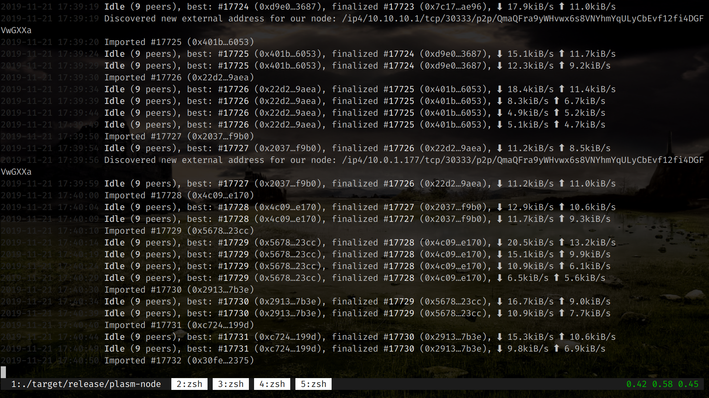

# Validator Guide


If you are using Microsoft Azure, please follow the video 👇





This short guide explains how to become a Dusty Network validator step by step.


* Install node **v1.7.0-dusty** using [binaries](https://github.com/PlasmNetwork/Plasm/releases/tag/v1.7.0-dusty) or [building from source code](https://github.com/staketechnologies/Plasm#building-from-source).
* Launch node `plasm-node --validator --name node-name --rpc-cors all`
* Wait for syncing up.



* Open "[Setting](https://apps.plasmnet.io/#/settings)" and select "local node".


* Open "[Accounts](https://apps.plasmnet.io/#/accounts)" and create a new account.


* Share your validator account address with **Stake Technologies** team via [Google Form](https://docs.google.com/forms/d/e/1FAIpQLSday0ckkK43TzJgKtQmJdzkudQNFDXspZAuUGi5Y5vfjkis3Q/viewform).
* [Claim tokens](https://medium.com/stake-technologies/dusty-lockdrop-how-to-claim-def048fa353) for transactions or request them on [the Discord](https://discord.gg/Z3nC9U4) **\#faucet** channel.
* Open Toolbox window and call `rotateKeys()` RPC call or use curl command:

```bash
curl -H "Content-Type: application/json" -d '{"id":1, "jsonrpc":"2.0", "method": "author_rotateKeys", "params":[]}' http://localhost:9933
```


* Save the result for the next steps.
* Click the "Session Key" button and paste the result for the validator account.

## Conclusion

When you finish this tutorial, please wait a bit while **Stake Technologies** team approves your account as a validator. Thank you for Plasm Network contribution and let's make Plasm better together!

If you have already participated in testnet V3 as a validator, you could be interested in migration. Please copy your session keys from **testnet v3 keystore** into **dusty keystore** by following commands before launch node:exit: Ctrl+↩

```text
mkdir .local/share/plasm-node/chains/dustycp -r .local/share/plasm-node/chains/plasm_testnet_v3/keystore .local/share/plasm-node/chains/dusty
```

Any questions? Feel free to ask us on [Discord Tech Channel](https://discord.gg/Z3nC9U4).

